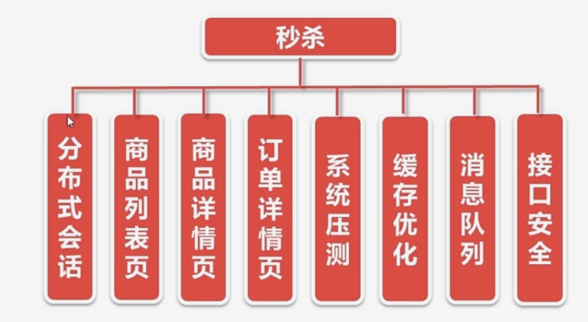
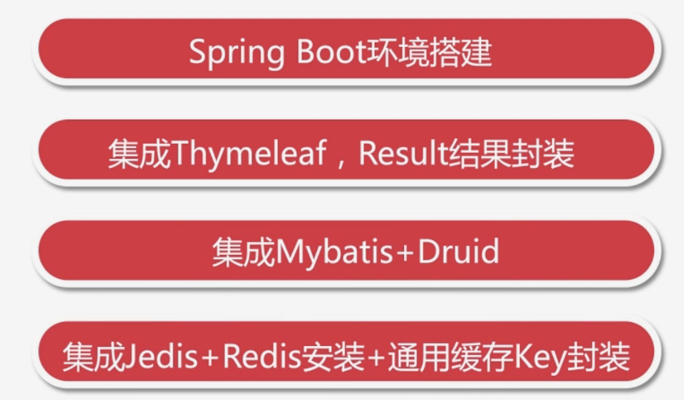
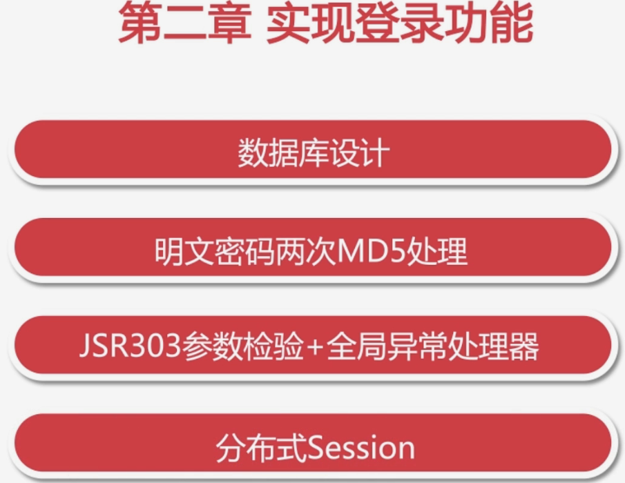
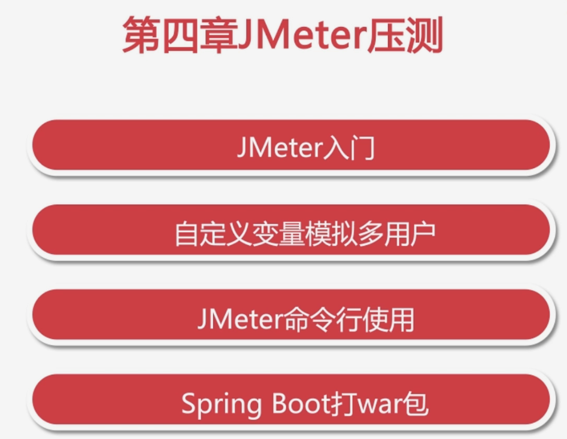
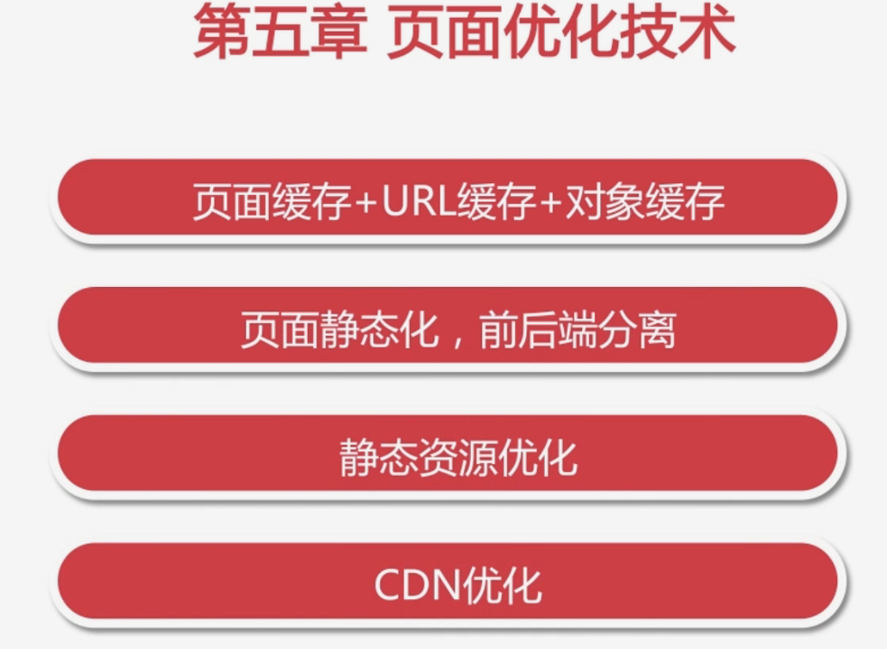
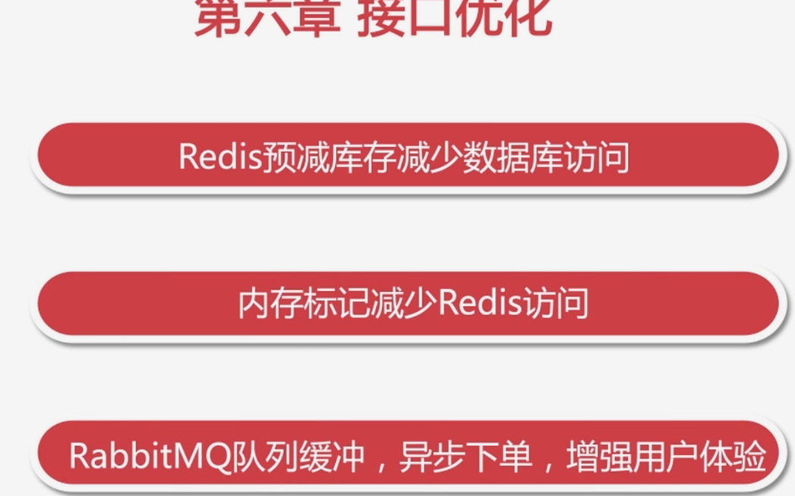

# 秒杀项目课程笔记

## 

## 技术重点：

## SpringBoot

@Component 表示这是一个

## MyBatis

## JSR303

## 服务端校验框架

## RabbitMQ

​	异步队列

## Redis 与memcache区别

### 	缓存优化,因为高并发瓶颈再数据库

### 	数据一致化

## Druid(数据源，数据库连接池)

## 分布式session

## 系统压测

## 安全优化

秒杀接口地址隐藏（防止机器人）

数学公式验证码

接口防刷，限流

redis 压测

redis-benchmark -h 127.0.0.1 -p 6379 -c 100 -n 100000

100个并发连接。100000个请求

redis-benchmark -h 127.0.0.1 -p 6379 -q -d 100

存取大小为100字节的数据包

0