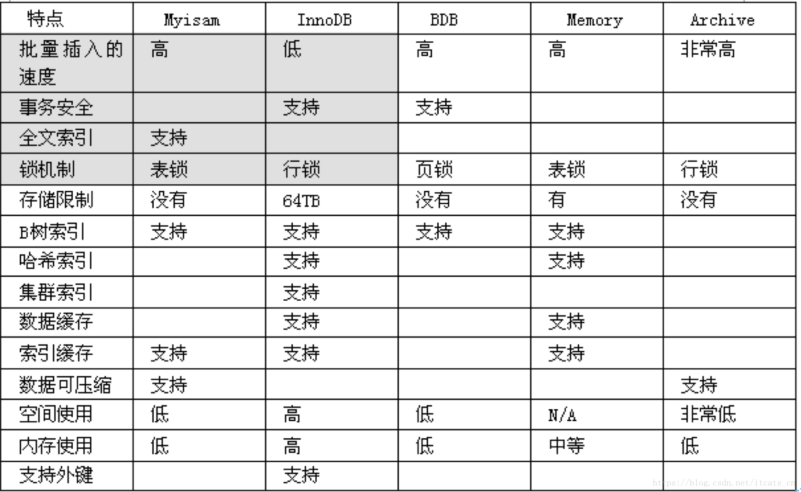
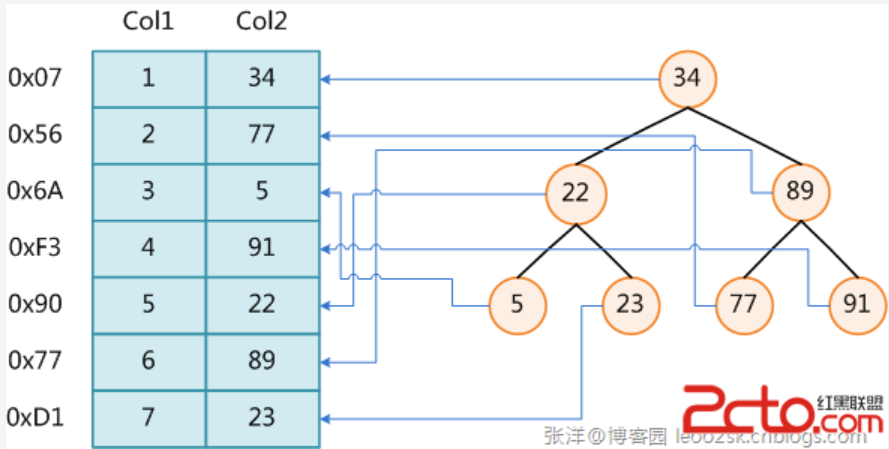

# Mysql知识点汇总

## 一、InnoDB存储引擎


## 二、索引与算法

### 	B+树

### 	哈希算法

### 	全文检索

### 	倒排索引

## 三、锁

独占锁（排他锁）只允许一个事务访问数据

共享锁 允许其他事务继续使用锁定的资源

更新锁

锁就是保护指定的资源，不被其他事务操作，锁定的资源包括行、页、簇、表和数据库。为了最小化锁的成本，SQL Server自动地以与任务相应等级的锁来锁定资源对象。锁定比较小的对象，例如锁定行，虽然可以提高并发性，但是却有较高的开支，因为如果锁定许多行，那么需要占有更多的锁。锁定比较大的对象，例如锁定表，会大大降低并发性，因为锁定整个表就限制了其他事务访问该表的其他部分，但是成本开支比较低，因为只需维护比较少的锁。

## 四、事务

**1. 事务的四个特性**

数据库事务（Transaction）是指作为单个逻辑工作单元执行的一系列操作，要么完全地执行，要么完全地不执行。一方面，当多个应用程序并发访问数据库时，事务可以在应用程序间提供一个隔离方法，防止互相干扰。另一方面，事务为数据库操作序列提供了一个从失败恢复正常的方法。

事务具有四个特性：原子性（Atomicity）、一致性（Consistency）、隔离型（Isolation）、持久性（Durability），简称ACID。

**1.1 原子性（Atomicity）**

事务的原子性是指事务中的操作不可拆分，只允许全部执行或者全部不执行。

**1.2 一致性（Consistency）**

事务的一致性是指事务的执行不能破坏数据库的一致性，一致性也称为完整性。一个事务在执行后，数据库必须从一个一致性状态转变为另一个一致性状态。

**1.3 隔离型（Isolation）**

事务的隔离型是指并发的事务相互隔离，不能互相干扰。

**1.4 持久性（Durability）**

事务的持久性是指事务一旦提交，对数据的状态变更应该被永久保存。

## **二、数据库事务隔离级别**

**原文链接：**[**数据库事务隔离级别**](http://singo107.iteye.com/blog/1175084)

数据库事务的隔离级别有4个，由低到高依次为Read uncommitted 、Read committed 、Repeatable read 、Serializable ，这四个级别可以逐个解决脏读 、不可重复读 、幻读 这几类问题。

√: 可能出现    ×: 不会出现

|                  | 脏读 | 不可重复读 | 幻读 |
| ---------------- | ---- | ---------- | ---- |
| Read uncommitted | √    | √          | √    |
| Read committed   | ×    | √          | √    |
| Repeatable read  | ×    | ×          | √    |
| Serializable     | ×    | ×          | ×    |

注意：我们讨论隔离级别的场景，主要是在多个事务并发 的情况下，因此，接下来的讲解都围绕事务并发。

**Read uncommitted 读未提交**

公司发工资了，领导把5000元打到singo的账号上，但是该事务并未提交，而singo正好去查看账户，发现工资已经到账，是5000元整，非常高 兴。可是不幸的是，领导发现发给singo的工资金额不对，是2000元，于是迅速回滚了事务，修改金额后，将事务提交，最后singo实际的工资只有 2000元，singo空欢喜一场。

述情况，即我们所说的脏读 ，两个并发的事务，“事务A：领导给singo发工资”、“事务B：singo查询工资账户”，事务B读取了事务A尚未提交的数据。

当隔离级别设置为Read uncommitted 时，就可能出现脏读，如何避免脏读，请看下一个隔离级别。

**Read committed 读提交**

singo拿着工资卡去消费，系统读取到卡里确实有2000元，而此时她的老婆也正好在网上转账，把singo工资卡的2000元转到另一账户，并在 singo之前提交了事务，当singo扣款时，系统检查到singo的工资卡已经没有钱，扣款失败，singo十分纳闷，明明卡里有钱，为 何......

出现上述情况，即我们所说的不可重复读 ，两个并发的事务，“事务A：singo消费”、“事务B：singo的老婆网上转账”，事务A事先读取了数据，事务B紧接了更新了数据，并提交了事务，而事务A再次读取该数据时，数据已经发生了改变。

当隔离级别设置为Read committed 时，避免了脏读，但是可能会造成不可重复读。

大多数数据库的默认级别就是Read committed，比如Sql Server , Oracle。如何解决不可重复读这一问题，请看下一个隔离级别。

**Repeatable read 重复读**

当隔离级别设置为Repeatable read 时，可以避免不可重复读。当singo拿着工资卡去消费时，一旦系统开始读取工资卡信息（即事务开始），singo的老婆就不可能对该记录进行修改，也就是singo的老婆不能在此时转账。

虽然Repeatable read避免了不可重复读，但还有可能出现幻读 。

singo的老婆工作在银行部门，她时常通过银行内部系统查看singo的信用卡消费记录。有一天，她正在查询到singo当月信用卡的总消费金额 （select sum(amount) from transaction where month = 本月）为80元，而singo此时正好在外面胡吃海塞后在收银台买单，消费1000元，即新增了一条1000元的消费记录（insert transaction ... ），并提交了事务，随后singo的老婆将singo当月信用卡消费的明细打印到A4纸上，却发现消费总额为1080元，singo的老婆很诧异，以为出 现了幻觉，幻读就这样产生了。

注：Mysql的默认隔离级别就是Repeatable read。

**Serializable 序列化**

Serializable 是最高的事务隔离级别，同时代价也花费最高，性能很低，一般很少使用，在该级别下，事务顺序执行，不仅可以避免脏读、不可重复读，还避免了幻像读。

## 五、复制

### 	主从复制


# MyISAM 和 INNODB的区别是什么?

MyISAM存储: 如果表对事务要求不高，同时是以查询和添加为主的，我们考虑使用myisam存储引擎,比如bbs 中的 发帖表，回复表，还有批量添加MyISAM效率高

INNODB 存储: 对事务要求高，保存的数据都是重要数据，我们建议使用INNODB,比如订单表，账号表。

【面试重点】MyISAM 和 INNODB的区别？

1. 事务安全（MyISAM不支持事务，INNODB支持事务）

2. 外键  MyISAM 不支持外键， INNODB支持外键. 

3. 锁机制（MyISAM表锁，innodb是行锁）

4. 查询和添加速度（MyISAM批量插入速度快）

5. 支持全文索引（MyISAM支持全文索引，INNODB不支持全文索引）

6.MyISAM内存空间使用率比InnoDB低

Memory 存储，比如我们数据变化频繁，不需要入库，同时又频繁的查询和修改，我们考虑使用memory, 速度极快. （如果mysql重启的话，数据就不存在了）



注意事项
如果你的数据库的存储引擎是myisam,请一定记住要定时进行碎片整理

举例说明:

create table test100(id int unsigned ,name varchar(32))engine=myisam;

insert into test100 values(1,'aaaaa');

insert into test100 values(2,'bbbb');

insert into test100 values(3,'ccccc');

insert into test100 select id,name from test100;
我们应该定义对myisam进行整理

```sql
      optimize table test100;
```


# 1. 主键 超键 候选键 外键

**主 键：**

[数据库](http://www.2cto.com/database/)表中对储存数据对象予以唯一和完整标识的数据列或属性的组合。**一个数据列只能有一个主键**，且主键的取值不能缺失，即不能为空值（Null）。

**超 键：**

在关系中能唯一标识元组的属性集称为关系模式的超键。一个属性可以为作为一个超键，多个属性组合在一起也可以作为一个超键。**超键包含候选键和主键。**

**候选键：**

是**最小超键**，即没有冗余元素的超键。

**外 键：**

在一个表中存在的**另一个表的主键**称此表的外键。

# 3.视图的作用，视图可以更改么？

视图是虚拟的表，与包含数据的表不一样，视图只包含使用时动态检索数据的查询；不包含任何列或数据。使用视图可以简化复杂的sql操作，隐藏具体的细节，保护数据；视图创建后，可以使用与表相同的方式利用它们。
视图不能被索引，也不能有关联的触发器或默认值，如果视图本身内有order by 则对视图再次order by将被覆盖。
创建视图：create view XXX as XXXXXXXXXXXXXX;
对于某些视图比如未使用联结子查询分组聚集函数Distinct Union等，是可以对其更新的，对视图的更新将对基表进行更新；但是视图主要用于简化检索，保护数据，并不用于更新，而且大部分视图都不可以更新。

# 4.drop,delete与truncate的区别

drop直接删掉表 truncate删除表中数据，再插入时自增长id又从1开始 delete删除表中数据，可以加where字句。

（1） DELETE语句执行删除的过程是每次从表中删除一行，并且同时将该行的删除操作作为事务记录在日志中保存以便进行进行回滚操作。TRUNCATE TABLE 则一次性地从表中删除所有的数据并不把单独的删除操作记录记入日志保存，删除行是不能恢复的。并且在删除的过程中不会激活与表有关的删除触发器。执行速度快。

（2） 表和索引所占空间。当表被TRUNCATE 后，这个表和索引所占用的空间会恢复到初始大小，而DELETE操作不会减少表或索引所占用的空间。drop语句将表所占用的空间全释放掉。

（3） 一般而言，drop > truncate > delete

（4） 应用范围。TRUNCATE 只能对TABLE；DELETE可以是table和view

（5） TRUNCATE 和DELETE只删除数据，而DROP则删除整个表（结构和数据）。

（6） truncate与不带where的delete ：只删除数据，而不删除表的结构（定义）drop语句将删除表的结构被依赖的约束（constrain),触发器（trigger)索引（index);依赖于该表的存储过程/函数将被保留，但其状态会变为：invalid。

（7） delete语句为DML（data maintain Language),这个操作会被放到 rollback segment中,事务提交后才生效。如果有相应的 tigger,执行的时候将被触发。

（8） truncate、drop是DLL（data define language),操作立即生效，原数据不放到 rollback segment中，不能回滚

（9） 在没有备份情况下，谨慎使用 drop 与 truncate。要删除部分数据行采用delete且注意结合where来约束影响范围。回滚段要足够大。要删除表用drop;若想保留表而将表中数据删除，如果于事务无关，用truncate即可实现。如果和事务有关，或老师想触发trigger,还是用delete。

（10） Truncate table 表名 速度快,而且效率高,因为:
truncate table 在功能上与不带 WHERE 子句的 DELETE 语句相同：二者均删除表中的全部行。但 TRUNCATE TABLE 比 DELETE 速度快，且使用的系统和事务日志资源少。DELETE 语句每次删除一行，并在事务日志中为所删除的每行记录一项。TRUNCATE TABLE 通过释放存储表数据所用的数据页来删除数据，并且只在事务日志中记录页的释放。

（11） TRUNCATE TABLE 删除表中的所有行，但表结构及其列、约束、索引等保持不变。新行标识所用的计数值重置为该列的种子。如果想保留标识计数值，请改用 DELETE。如果要删除表定义及其数据，请使用 DROP TABLE 语句。

（12） 对于由 FOREIGN KEY 约束引用的表，不能使用 TRUNCATE TABLE，而应使用不带 WHERE 子句的 DELETE 语句。由于 TRUNCATE TABLE 不记录在日志中，所以它不能激活触发器。

# 7.数据库范式

**1 第一范式（1NF）**

在任何一个关系数据库中，第一范式（1NF）是对关系模式的基本要求，不满足第一范式（1NF）的数据库就不是关系数据库。
所谓第一范式（1NF）是指数据库表的每一列都是不可分割的基本数据项，同一列中不能有多个值，即实体中的某个属性不能有多个值或者不能有重复的属性。如果出现重复的属性，就可能需要定义一个新的实体，新的实体由重复的属性构成，新实体与原实体之间为一对多关系。在第一范式（1NF）中表的每一行只包含一个实例的信息。简而言之，**第一范式就是无重复的列。**

**2 第二范式（2NF）**

第二范式（2NF）是在第一范式（1NF）的基础上建立起来的，即满足第二范式（2NF）必须先满足第一范式（1NF）。第二范式（2NF）要求数据库表中的每个实例或行必须可以被惟一地区分。为实现区分通常需要为表加上一个列，以存储各个实例的惟一标识。这个惟一属性列被称为主关键字或主键、主码。
第二范式（2NF）要求实体的属性完全依赖于主关键字。所谓完全依赖是指不能存在仅依赖主关键字一部分的属性，如果存在，那么这个属性和主关键字的这一部分应该分离出来形成一个新的实体，新实体与原实体之间是一对多的关系。为实现区分通常需要为表加上一个列，以存储各个实例的惟一标识。简而言之，**第二范式就是非主属性非部分依赖于主关键字。**

**3 第三范式（3NF）**

满足第三范式（3NF）必须先满足第二范式（2NF）。简而言之，第三范式（3NF）要求一个数据库表中不包含已在其它表中已包含的非主关键字信息。例如，存在一个部门信息表，其中每个部门有部门编号（dept_id）、部门名称、部门简介等信息。那么在员工信息表中列出部门编号后就不能再将部门名称、部门简介等与部门有关的信息再加入员工信息表中。如果不存在部门信息表，则根据第三范式（3NF）也应该构建它，否则就会有大量的数据冗余。简而言之，**第三范式就是属性不依赖于其它非主属性。（我的理解是消除冗余）**

# 9.存储过程与触发器的区别

触发器与存储过程非常相似，触发器也是SQL语句集，**两者唯一的区别是触发器不能用EXECUTE语句调用，而是在用户执行Transact-SQL语句时自动触发（激活）执行。触发器是在一个修改了指定表中的数据时执行的存储过程。**通**常通过创建触发器来强制实现不同表中的逻辑相关数据的引用完整性和一致性。**由于用户不能绕过触发器，所以可以用它来强制实施复杂的业务规则，以确保数据的完整性。触发器不同于存储过程，**触发器主要是通过事件执行触发而被执行的**，而**存储过程可以通过存储过程名称名字而直接调用**。当对某一表进行诸如UPDATE、INSERT、DELETE这些操作时，SQLSERVER就会自动执行触发器所定义的SQL语句，从而确保对数据的处理必须符合这些SQL语句所定义的规则。


# 5.索引的工作原理及其种类

**数据库索引**，是数据库管理系统中一个排序的数据结构，以协助快速查询、更新数据库表中数据。**索引的实现通常使用B树及其变种B+树**。

在数据之外，数据库系统还维护着满足特定查找算法的数据结构，这些数据结构以某种方式引用（指向）数据，这样就可以在这些数据结构上实现高级查找算法。这种数据结构，就是索引。

为表设置索引要付出代价的：一是增加了数据库的存储空间，二是在插入和修改数据时要花费较多的时间(因为索引也要随之变动)。



 

图展示了一种可能的索引方式。左边是数据表，一共有两列七条记录，最左边的是数据记录的物理地址（注意逻辑上相邻的记录在磁盘上也并不是一定物理相邻的）。为了加快Col2的查找，可以维护一个右边所示的二叉查找树，每个节点分别包含索引键值和一个指向对应数据记录物理地址的指针，这样就可以运用二叉查找在O(log2n)的复杂度内获取到相应数据。

创建索引可以大大提高系统的性能。

第一，通过创建唯一性索引，可以保证数据库表中每一行数据的唯一性。

第二，可以大大加快数据的检索速度，这也是创建索引的最主要的原因。

第三，可以加速表和表之间的连接，特别是在实现数据的参考完整性方面特别有意义。

第四，在使用分组和排序子句进行数据检索时，同样可以显著减少查询中分组和排序的时间。

第五，通过使用索引，可以在查询的过程中，使用优化隐藏器，提高系统的性能。

也许会有人要问：增加索引有如此多的优点，为什么不对表中的每一个列创建一个索引呢？因为，增加索引也有许多不利的方面。

第一，创建索引和维护索引要耗费时间，这种时间随着数据量的增加而增加。

第二，索引需要占物理空间，除了数据表占数据空间之外，每一个索引还要占一定的物理空间，如果要建立聚簇索引，那么需要的空间就会更大。

第三，当对表中的数据进行增加、删除和修改的时候，索引也要动态的维护，这样就降低了数据的维护速度。

索引是建立在数据库表中的某些列的上面。在创建索引的时候，应该考虑在哪些列上可以创建索引，在哪些列上不能创建索引。**一般来说，应该在这些列上创建索引：**在经常需要搜索的列上，可以加快搜索的速度；在作为主键的列上，强制该列的唯一性和组织表中数据的排列结构；在经常用在连接的列上，这些列主要是一些外键，可以加快连接的速度；在经常需要根据范围进行搜索的列上创建索引，因为索引已经排序，其指定的范围是连续的；在经常需要排序的列上创建索引，因为索引已经排序，这样查询可以利用索引的排序，加快排序查询时间；在经常使用在WHERE子句中的列上面创建索引，加快条件的判断速度。

同样，对于有些列不应该创建索引。**一般来说，不应该创建索引的的这些列具有下列特点：**

第一，对于那些在查询中很少使用或者参考的列不应该创建索引。这是因为，既然这些列很少使用到，因此有索引或者无索引，并不能提高查询速度。相反，由于增加了索引，反而降低了系统的维护速度和增大了空间需求。

第二，对于那些只有很少数据值的列也不应该增加索引。这是因为，由于这些列的取值很少，例如人事表的性别列，在查询的结果中，结果集的数据行占了表中数据行的很大比例，即需要在表中搜索的数据行的比例很大。增加索引，并不能明显加快检索速度。

第三，对于那些定义为text, image和bit数据类型的列不应该增加索引。这是因为，这些列的数据量要么相当大，要么取值很少。

第四，当修改性能远远大于检索性能时，不应该创建索引。这是因为，**修改性能和检索性能是互相矛盾的**。当增加索引时，会提高检索性能，但是会降低修改性能。当减少索引时，会提高修改性能，降低检索性能。因此，当修改性能远远大于检索性能时，不应该创建索引。

根据数据库的功能，可以在[数据库设计](http://www.2cto.com/database/)器中创建三种索引：**唯一索引、主键索引和聚集索引**。

**唯一索引**

唯一索引是不允许其中任何两行具有相同索引值的索引。

当现有数据中存在重复的键值时，大多数数据库不允许将新创建的唯一索引与表一起保存。数据库还可能防止添加将在表中创建重复键值的新数据。例如，如果在employee表中职员的姓(lname)上创建了唯一索引，则任何两个员工都不能同姓。 **主键索引** 数据库表经常有一列或列组合，其值唯一标识表中的每一行。该列称为表的主键。 在数据库关系图中为表定义主键将自动创建主键索引，主键索引是唯一索引的特定类型。该索引要求主键中的每个值都唯一。当在查询中使用主键索引时，它还允许对数据的快速访问。 **聚集索引** 在聚集索引中，表中行的物理顺序与键值的逻辑（索引）顺序相同。**一个表只能包含一个聚集索引。**

如果某索引不是聚集索引，则表中行的物理顺序与键值的逻辑顺序不匹配。**与非聚集索引相比，聚集索引通常提供更快的数据访问速度。**

# 8.数据库优化的思路

## 1.SQL语句优化

1）应尽量避免在 where 子句中使用!=或<>操作符，否则将引擎放弃使用索引而进行全表扫描。
2）应尽量避免在 where 子句中对字段进行 null 值判断，否则将导致引擎放弃使用索引而进行全表扫描，如：
select id from t where num is null
**可以在num上设置默认值0，确保表中num列没有null值**，然后这样查询：
select id from t where num=0
3）很多时候用 exists 代替 in 是一个好的选择
4）用Where子句替换HAVING 子句 因为HAVING 只会在检索出所有记录之后才对结果集进行过滤

## 2.索引优化

### B-/+Tree索引的性能分析

到这里终于可以分析B-/+Tree索引的性能了。

上文说过一般使用磁盘I/O次数评价索引结构的优劣。先从B-Tree分析，根据B-Tree的定义，可知检索一次最多需要访问h个节点。数据库系统的设计者巧妙利用了磁盘预读原理，将一个节点的大小设为等于一个页，这样每个节点只需要一次I/O就可以完全载入。为了达到这个目的，在实际实现B-Tree还需要使用如下技巧：

每次新建节点时，直接申请一个页的空间，这样就保证一个节点物理上也存储在一个页里，加之计算机存储分配都是按页对齐的，就实现了一个node只需一次I/O。

**B-Tree中一次检索最多需要h-1次I/O（根节点常驻内存），渐进复杂度为O(h)=O(logdN)。**一般实际应用中，出度d是非常大的数字，通常超过100，因此h非常小（通常不超过3）。

而红黑树这种结构，h明显要深的多。由于逻辑上很近的节点（父子）物理上可能很远，无法利用局部性，所以红黑树的I/O渐进复杂度也为O(h)，效率明显比B-Tree差很多。

**综上所述，用B-Tree作为索引结构效率是非常高的。**

## 3.数据库结构优化

1）范式优化： 比如消除冗余（节省空间。。） 2）反范式优化：比如适当加冗余等（减少join） 3）拆分表： 分区将数据在物理上分隔开，不同分区的数据可以制定保存在处于不同磁盘上的数据文件里。这样，当对这个表进行查询时，只需要在表分区中进行扫描，而不必进行全表扫描，明显缩短了查询时间，另外处于不同磁盘的分区也将对这个表的数据传输分散在不同的磁盘I/O，一个精心设置的分区可以将数据传输对磁盘I/O竞争均匀地分散开。对数据量大的时时表可采取此方法。可按月自动建表分区。
4）拆分其实又分垂直拆分和水平拆分： 案例： 简单购物系统暂设涉及如下表： 1.产品表（数据量10w，稳定） 2.订单表（数据量200w，且有增长趋势） 3.用户表 （数据量100w，且有增长趋势） 以[mysql](http://www.2cto.com/database/MySQL/)为例讲述下水平拆分和垂直拆分，mysql能容忍的数量级在百万静态数据可以到千万 **垂直拆分：**解决问题：表与表之间的io竞争 不解决问题：单表中数据量增长出现的压力 方案： 把产品表和用户表放到一个server上 订单表单独放到一个server上 **水平拆分：** 解决问题：单表中数据量增长出现的压力 不解决问题：表与表之间的io争夺
方案： 用户表通过性别拆分为男用户表和女用户表 订单表通过已完成和完成中拆分为已完成订单和未完成订单 产品表 未完成订单放一个server上 已完成订单表盒男用户表放一个server上 女用户表放一个server上(女的爱购物 哈哈)


