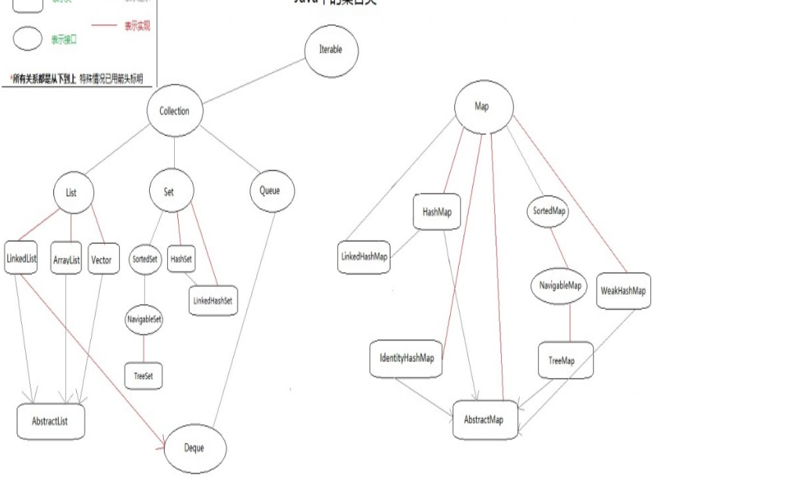

一面（40+分钟）：

1、自我介绍

2、直接开始基础，java容器 Collection下面有几个接口？分别有哪些实现类？

3、ArrayList 和LinkedList的区别？插入删除复杂度？

4、并发编程相关，线程池（Executors 和ThreadpoolExecutor,一下参数。ThreadpoolExecutor处理的具体过程），JUC包那些常用的。内存模型。Volatile关键字。容器。

5、jVM相关，Java内存区域，GC算法。

6、为什么新生代要使用复制算法？老年代使用标记清楚/整理算法。

7、类加载机制，以及类加载过程。

11、linux常用命令？其中top命令看什么参数？ load average?

12、怎么看磁盘IO和网络IO?

8、Redis数据结构，里面的编码（没回答好）？

9、List 数据结构底层是什么数据结构？ZipList什么时候使用？为什么？

10、Mysql主从复制。binlog（不知道）？

13、Redis集群介绍下？

14、访问网页的过程？

15、负载均衡算法？

16、负载均衡算法场景题（平均分配算法如果有一个服务器出故障，处理很慢会造成什么影响）。

16、有什么问题要问我的？

二面（20分钟）：

1、自我介绍

2、Spring DI和AOP详解(没回答好，有点伤)。

3、抹灰机器人你的主要工作？难点？怎么解决的？

4、秒杀系统核心是什么？

5、接口层怎么处理这个高并发？nginx分流？负载均衡算法。

6、netty介绍下，线程模型。

7、netty 、Nginx、Tomcat线程模型了解过没、Netty和Nginx对比一下，优缺点？

