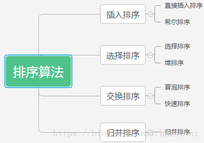
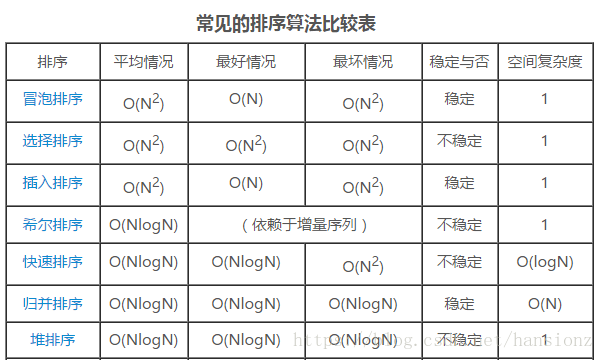

面试差不多35分钟：

1、自我介绍

2、项目介绍及问题

3、有没有加班经历

4、扮演的角色，那些工作是自己做的，哪些是和 别人合作的

5、数据库知道吗？怎么查询一个表里面的字段信息（有哪些字段）？

6、一个APP已经关掉了，为什么还能收到推送？

6、偶尔遇到一个不可重现的bug，你怎么处理？

7、那个语言比较熟?

8、java GC说一下？

9、为什么要分代？

10、排序算法了解么？那些是稳定的？解释一下稳定的含义。

一.常见排序算法有哪些




二. 插入排序
1.直接插入排序
基本思想：插入排序是每次将一个待排序的记录，按照大小，插入到前面已经排好的有序区中适当的位置，直到将所有记录插入完位置。大概思想是将待排序记录放在数组R[0..N]中，R[0]是有序区，R[1..N]为无序区，无序区从R[1]开始按照大小插入到有序区中。

代码实现：

```C++
//直接插入排序
int InsertSort(int *num,int len)
{
    assert(num);
    int i = 0;
    //第一个元素已经为有序序列，所以要进行len-1次排序
    for (; i < len - 1; i++)
    {
        int end = i;
        int tmp = num[i + 1];//保存非有序区间第一个元素，否则在后边的移动中会改变
        //比较后移
        while (end >= 0 && num[end]>tmp)
        {
            num[end+1] = num[end];
            --end;
        }
        //插入到适当位置
        num[end + 1] = tmp;
    }
}
```

单独总结于我的另一篇博客：直接插入排序及优化

2.希尔排序
基本思想：希尔排序是对直接插入排序的优化，它先进行预排序，使得待排序列基本有序，在进行一次直接插入排序，使得待排序列完全有序。

.什么是希尔排序？
希尔排序又叫缩小增量排序，它实质上是一种插入排序。一方面，它的发现者DL.Shell是基于在我们进行直接插入排序的过程中有的记录移动的太慢了而且移动的次数很大，那能不能想办法让它移动的快一点呢？于是DL.Shell想到让记录按下标的一定增量分组，对每组使用直接插入排序算法排序，最后在进行一次直接插入排序。另一方面，希尔排序是对直接插入排序的优化，它先进行预排序，使得待排序列基本有序，在进行直接插入排序O(N)，所以它主要分为两步：

预排序(预排序之后使得要排序序列接近于有序)

它让记录中大的数字较快的移动到后边，主要是基于这样的想法，让整个记录序列基本有序。
注：图片借用Prepare_y博主博客中的图片
直接插入排序：最后一次排序gap必须等于1，基本有序的记录序列进行一次直接排序得到最终排序结果
2.代码实现

~~~C++
//希尔排序(缩小增量排序)
/*最好步长序列是由Sedgewick提出的(1, 5, 19, 41, 109,...)*/
int ShellSort(int *num, int len)
{
	assert(num);

```
int gap = 5;//步长

//最后一次步长必须为1
while (gap >= 0)
{
	//1.gap>1时预排序
	for (int i = 0; i < len - gap; i++)
	{
		int end = i;
		int tmp = num[end + gap];
		while (end >= 0 && num[end] > tmp)
		{
			num[end + gap] = num[end];
			end -= gap;
		}
		num[end + gap] = tmp;
	}
	gap -= 2;
}
//2.gap为1时直接插入排序(这时要排序序列已经接近有序)
```

}
~~~


3.效率分析

希尔排序是基于多次预排序让记录中大的数字较快的移动到后边，使得记录序列基本有序，而不是像直接排序中一个一个往后移动。总的来说希尔排序的效率肯定比直接插入排序要高。因为希尔排序的时间复杂度和它的步长选择有关系，它的平均时间复杂度为n*log(n)。另外，由于排序序列中数据的相对位置可能变化，所以希尔排序是一种不稳定的排序。

三.选择排序
1.直接选择排序
基本思想：刚开始的时候，有序区没有元素，每一趟在无序区中选出来一个最小的元素，然后与无序区第一个元素交换，则此时有序区多一个元素，而无序区少一个元素，直到无序区剩下一个元素结束。 既第一趟排序在R[0…n]中选出一个最小的元素与R[0]交换，第二趟在R[1…n]中选择最小元素，与第一个与R[1]交换，直到无序区的元素只剩下一个排序完成。
代码实现：

```c++
//选择排序
void SelectSort(int* num, int len)
{
	 if (num == NULL || len <= 0)
	  return;
	 int i = 0;
	 //1.确定循环躺数
	 for (; i < len - 1; i++)
	 {
	  int minindex = i;
	  int j = i + 1;
	  //2.找到无序区的最小值
	  for (; j < len; j++)
	  {
		   if (num[minindex] > num[j])
		   {
		    minindex = j;
		   }
		  }
		  //与无序区第一个元素交换
		  if (minindex != i)
		   Swap(&num[minindex], &num[i]);
		 }
}
```


直接排序优化：同时在无序区找出最大值和最小值下标，先后分别和无序区最左边最右边交换(一次确定两个值)
具体实现方法见我的另一篇博客：直接插入排序优化
2.堆排序
基本思想：堆排序本质上是一种树形选择排序。它也是对直接选择排序的一种优化，堆结构在物理存储上也是一种数组，但是它在逻辑上是一棵完全二叉树，在进行堆排序(升序)时，我们可以先建一个大堆，最大的元素在堆顶上，我们可以以O(1)的时间找到最大的元素，然后和最后一个元素交换。此时，这个堆的左右子树仍然是一个堆，我们只要把[n-1]个数向下调整一次重新建个大堆即可，直到堆中剩下一个元素，既排序完成。

排升序–>建大堆 && 排降序–>建小堆

具体实现见我的另一篇博客：堆排序实现

代码实现：

```C++
//向下调堆
void  AdjustDown(int* num, int n, int parent)
{
	 if (num == NULL || n <= 0)
	  return;
	 int child = 2 * parent + 1;
	 while (child < n)
	 {
		  //处理让child指向左右孩子中较大的哪一个
		  if ((child + 1 < n) && (num[child] < num[child + 1]))
		   child++;
		  //比较交换并调整
		  if (num[child]>num[parent])
		  {
		   Swap(&num[child], &num[parent]);
		   parent = child;
		   child = 2 * parent + 1;
		  }
		  else
		  {
		   break;
		  }
	 }
}
//堆排序
void HeapSort(int* num, int len)
{
	 if (num == NULL || len <= 0)
	  return;
	 //1.建堆(升序->大堆,降序->小堆)
	 for (int i = (len - 2) / 2; i >= 0; i--)
	 {
	  AdjustDown(num, len, i);
	 }
	 //2.交换最后一个元素和第一个元素
	 int end = len - 1;
	 while (end > 0)
	 {
		  Swap(&num[0], &num[end]);
		  AdjustDown(num, end, 0);
		  --end;
	 }
}
```

四.交换排序
1.冒泡排序
基本思想：一次确定一个最大值或者最小值，两两比较，将最大值或者最小交换到最右边或者最左边，N个元素需要N-1趟排序。
代码实现:

```C++
//冒泡排序
void BubbleSort(int* num, int len)
{
	 if (num == NULL || len <= 0)
	  return;
	 //确定循环躺数
	 for (int i = 0; i < len - 1; i++)
	 {
		  //确定比较次数
		  for (int j = 0; j < len - 1 - i; j++)
		  {
		   if (num[j]>num[j + 1])
		    Swap(&num[j], &num[j + 1]);
	  	  }
	 }
}

```

冒泡排序还存在几种优化方法：见我的另一篇博客冒泡排序的三种优化方法  

2.快速排序
基本思想：在待排序序列中任意取一个元素作为基准元素，按照该基准元素将待排序序列分为两个子序列，左边子序列的值都小于基准值，右边子序列的值都大于基准值。然后把左右子序列当做一个子问题，以同样的方法处理左右子序列，直到所有的元素都排列在相对应的位置上为止。快排是一个递归问题，它是按照二叉递归树的前序路线去划分的。
关于快速排序，我详细将快排的细节总结于我的另一篇博客：快排总结

五.归并排序
1.归并排序
基本思想：归并排序是一个外排序，它可以对磁盘的文件进行排序。它将待排序的元素序列分成两个长度相等的子序列，对每一个子序列排序，然后在将他们合并为一个序列。合并两个子序列的过程称为二路归并。归并排序主要分为两步分组和归并。
代码实现：

```C++
//归并排序
void MergeSort(int* num, int len)
{
	 if (num == NULL || len <= 0)
	  return;
	 //开辟临时空间，用来存放每次合并后的子序列
	 int* tmp = (int*)malloc(sizeof(int)*len);
	 _MergeSort(num, 0, len - 1, tmp);
	 //释放空间
	 free(tmp);
 	 tmp = NULL;
}
//归并排序分开过程(递归树按照前序路线展开)
void _MergeSort(int* num, int begin, int end,int* tmp)
{
	 assert(num&&tmp);
	 int mid = begin + (end - begin) / 2;
	 //只有一个元素，说明这个序列已经有序
	 if (begin == end)
	  return;
	 //子问题划分左子序列
	 _MergeSort(num, begin, mid, tmp);
	 //子问题划分右子序列
	 _MergeSort(num, mid + 1, end, tmp);
	 //合并两个有序数组
	 Merge(num, begin, mid, mid + 1, end, tmp);
}
//归并排序合并过程
void Merge(int* num, int start1, int end1, int start2, int end2, int* tmp)
{
	 assert(num&&tmp);
	 int begin = start1;
	 int index = start1;//从start1的地方合并
	 //和两条有序单链表的合并的过程类似
	 while ((start1 <= end1) && (start2 <= end2))
	 {
		  if (num[start1] < num[start2])
		  {
		  	 tmp[index++] = num[start1++];
		  }
		  else
		  {
		 	  tmp[index++] = num[start2++];
		  }
	 }
	 //把剩余的合并到tmp上
	 while (start1 <= end1)
	 	 tmp[index++] = num[start1++];
	 while (start2 <= end2)
	  	tmp[index++] = num[start2++];
	 //tmp是个临时空间，最后到把合并的内容拷贝到num上
 	memcpy(num + begin, tmp + begin, sizeof(int)*(end2 - begin + 1));
}
```


六.各算法性能比较



11、手撕代码（随机数映射区间）

12、对互联网行业加班怎么看？对 github上面 996 - ICU了解过么？

13、有女朋友么？如果她怪你总是加班闹矛盾怎么解决？

结束。

评价：

我自己的评价：

1、因为不太上心，没有准备充分；所以自我介绍不太好，需要改正，认真准备每一场面试。

2、有些实际应用的知识不太了解。

3、说话需要简介明了。

面试官的评价：

不太专业。

原因：

1、不问简历，不问项目，也不问简历里面写了的的各种技术。一个劲的天马行空各种问题问一个，没有连贯性。

2、问的问题都不深入，没有那种大公司抓住一种技术往死里问的风格。

3、一直都是面无表情。很死板，

总结：

也提出了几个我没有考虑过（遇到过）的问题。所以还是满感谢的。至少让我这次面试有所收获。


