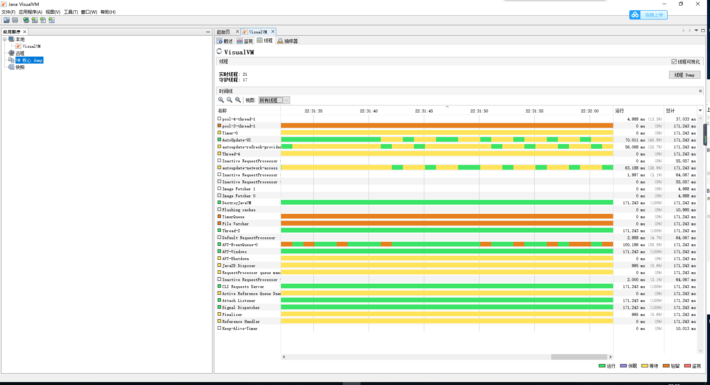
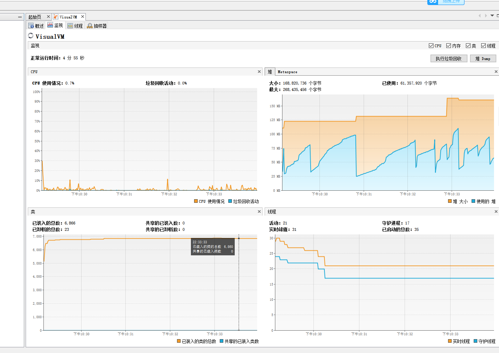
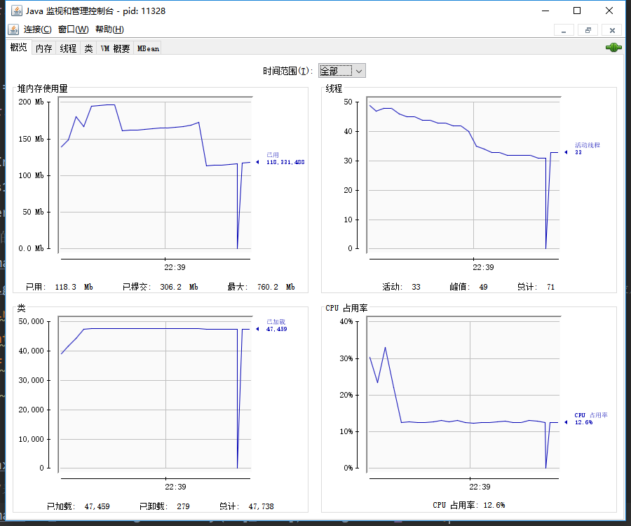
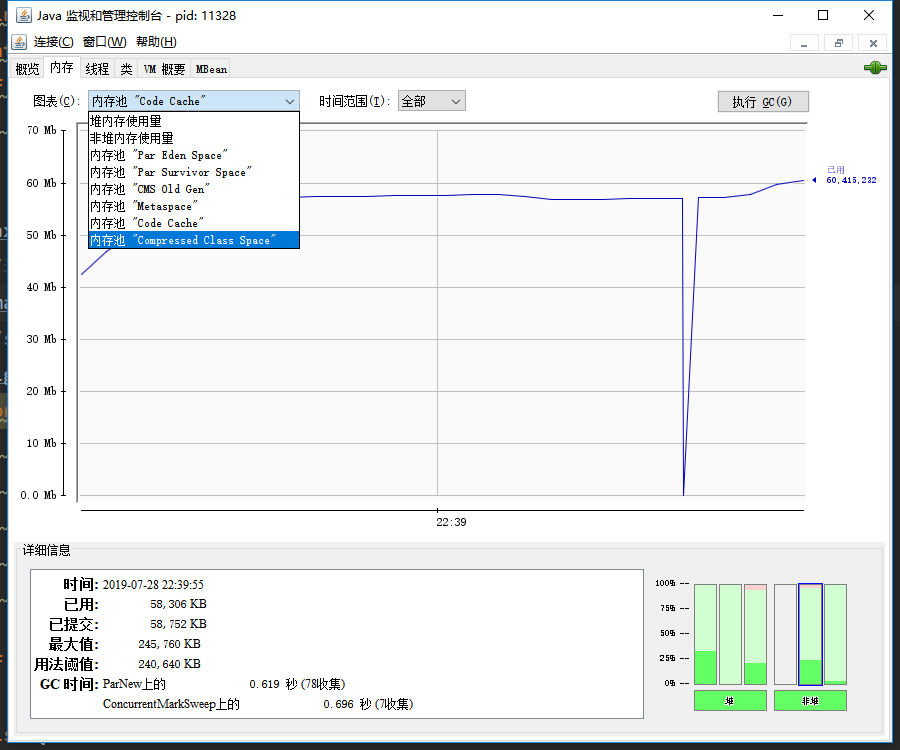
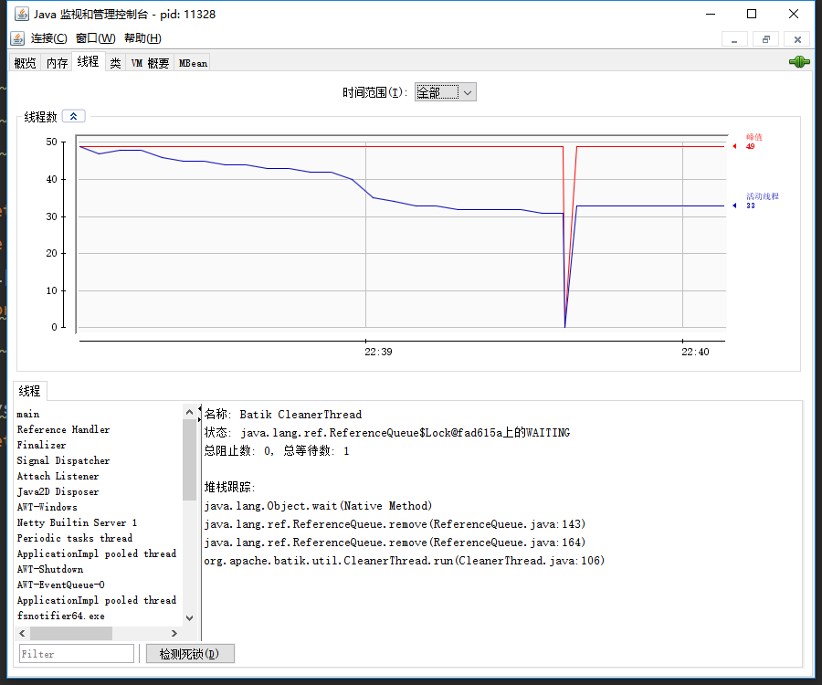
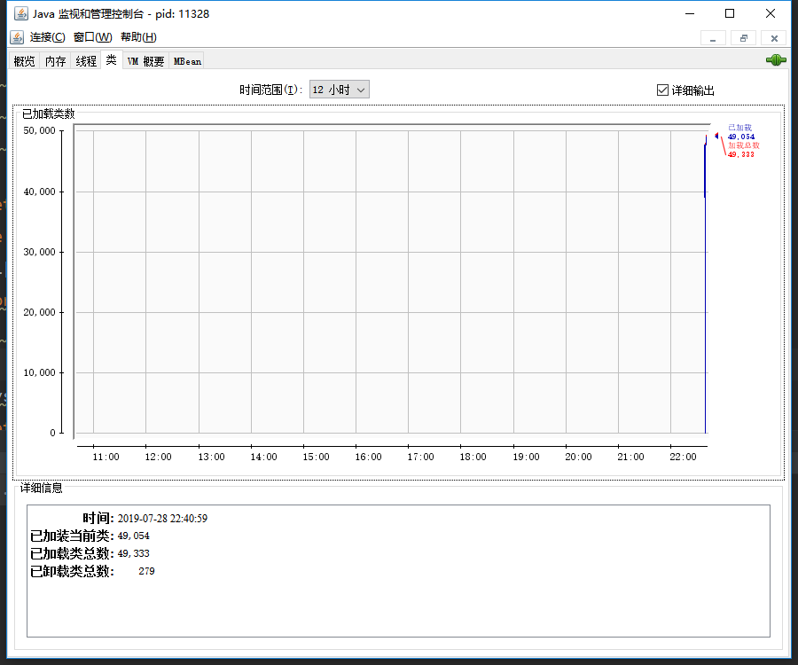
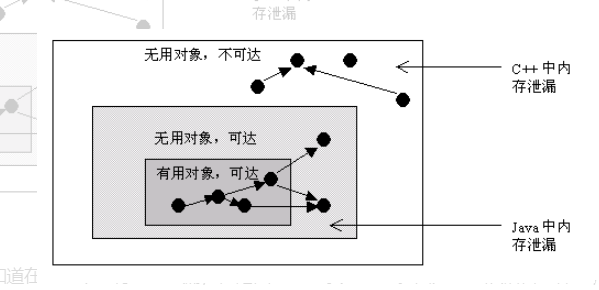

## 设计模式六大原则

//单一责任原则

//接口分离原则

//开放封闭原则

//迪米特法则

//依赖倒置原则

//里氏替换原则


以下代码的输出结果是？

```java
public class B
{
public static B t1 = new B();
public static B t2 = new B();
{
    System.out.println("构造块");
}
static
{
    System.out.println("静态块");
}
public static void main(String[] args)
{
    B t = new B();
}
}
```

正确答案: C

1. 静态块 构造块 构造块 构造块
2. 构造块 静态块 构造块 构造块
3. 构造块 构造块 静态块 构造块
4. 构造块 构造块 构造块 静态块

```
开始时JVM加载B.class，对所有的静态成员进行声明，t1 t2被初始化为默认值，为null，又因为t1 t2需要被显式初始化，所以对t1进行显式初始化，初始化代码块→构造函数（没有就是调用默认的构造函数），咦！静态代码块咋不初始化？因为在开始时已经对static部分进行了初始化，虽然只对static变量进行了初始化，但在初始化t1时也不会再执行static块了，因为JVM认为这是第二次加载类B了，所以static会在t1初始化时被忽略掉，所以直接初始化非static部分，也就是构造块部分（输出''构造块''）接着构造函数（无输出）。接着对t2进行初始化过程同t1相同（输出'构造块'），此时就对所有的static变量都完成了初始化，接着就执行static块部分（输出'静态块'），接着执行，main方法，同样也，new了对象，调用构造函数输出（'构造块'）

之前我一直有一个误区!就是认为静态块一定是最先初始化的!但是,阿里爸爸今天又用一记重拳猛击我的脸,额,好疼....当时的情况是这样的:
我在牛客网找虐中,碰到了这样的一道题,心中充满了鄙夷,心想"这tm还用看吗,肯定先是静态块,再接着三个构造块,弱鸡题",但是 = = ,答案却是"构造块 构造块 静态块 构造块".
......[黑线|||||||||]
于是总结了一下,以警后世 - -
正确的理解是这样的:
并不是静态块最先初始化,而是静态域.(BM：啊!多么痛的领悟!)
而静态域中包含静态变量、静态块和静态方法,其中需要初始化的是静态变量和静态块.而他们两个的初始化顺序是靠他们俩的位置决定的!
So！
初始化顺序是 t1 t2 静态块
```


## 类加载过程：

1、加载

​		通过类的权限顶名获取定义此类的二进制字节流

​		把静态存储结构转化为方法区的运行时数据结构（运行时常量池）

​		在内存中生成一个类的Class对象（堆中），作为方法区这个类的各种数据的访问入口。

2、验证

​		确保被导入的类型的正确性

3、准备

​		为类变量分配内存，并将其初始化为默认值（零值）。final ，直接初始化。

4、解析

​		把常量池里面的符号引用替换为直接引用的过程

5、初始化

​		执行类构造器 <clinit>()。对静态字段进行赋值。

运行时栈帧结构：

​	

| 局部变量表 |
| ---------- |
| 操作数栈   |
| 动态链接   |
| 返回地址   |


动态链接：

每个栈帧都包含一个指向运行时常量池中栈帧所属方法的引用。持有这个引用是为了支持方法调用过程中的动态链接。

具体而言：Class文件的常量池中存在大量的符号引用，字节码中的方法调用指令就以常量池中指向方法的符号引用为参数。

静态链接：常量池中的一部分会在类加载阶段转化为直接引用。

动态链接：另一部分会在运行期间转化为直接引用。

## 对象创建过程：

1、首先区常量池中定位到一个类的饿符号引用，并检查符号引用代表的类是否被加载。没有的话就加载类。

2、为新对象分配内存，（所需内存大小在类加载完成后便可确定）

内存规整-->指针碰撞

内存不规整-->空闲列表

（cas修改引用，防止并发错误）

3、内存分配完成后，初始化为零值（不包括对象头）。

4、设置对象头

5、<init>方法，按照程序员的意愿初始化。

## 内存溢出：

有几种情况：

1、虚拟机栈：

原因很简单：操作系统分配给每一个进程的内存是有限制的，比如每个对进程的限制为2GB，虚拟机提供了参数来控制java堆和方法区的这两部分内存的最大值。则剩余的内存为：2GB（操作系统限制的大小）-Xmx（最大堆容量）-MaxPermSize（最大方法区容量）。程序计数器消耗的内存很小基本可以忽略。如果虚拟机进程本身消耗的内存不计算在内，那么剩下的内存就由虚拟机的虚拟机栈和本地方法栈“瓜分”了。每个线程分配到的内存容量越大，可以建立的线程数量自然就越少，建立线程时就越容易将剩下的内存耗尽。

栈溢出：深度超过限制

内存溢出：扩展时无法申请足够的内存

使用 -Xss 减小线程堆栈大小

减少 Java 堆空间

2、本地方法栈

栈溢出：深度超过限制

内存溢出：扩展时无法申请足够的内存

3、堆

物理上不连续，逻辑上连续即可。可扩展或固定

无法扩展时，发生内存溢出

运行时常量池无法扩展，也会溢出

发生这种问题的原因是java虚拟机创建的对象太多，在进行垃圾回收之间，虚拟机分配的到堆内存空间已经用满了，与Heap space有关。解决这类问题有两种思路：

\1. 检查程序，看是否有死循环或不必要地重复创建大量对象。找到原因后，修改程序和算法。(如果找不到原因，参考5.如何利用工具检查内存泄露)

\2. 增加Java虚拟机中Xms（初始堆大小）和Xmx（最大堆大小）参数的大小

修复应用程序中的内存泄漏

请求的数组大小超过虚拟机限制：应用程序试图分配一个超过堆大小的数组

4、方法区

物理上不连续，逻辑上连续即可。可扩展或固定，无法满足内存分配时，也会抛出异常。

也可以选择不进行GC,因为GC主要是对常量池的回收和对类型的卸载。但是对类型的卸载条件泰国苛刻。所以效果不好。

卸载一个类需要满足以下3个条件才能算是“无用的类”

 1. 该类所有的实例已经被回收

 2. 加载该类的ClassLoder已经被回收

 3. 该类对应的java.lang.Class对象没有任何对方被引用

第2个条件有一些费解。

可能是因为ClassLoder保存了类加载到jvm方法区的位置信息，保存了类的引用。但是ClassLoader又不具备主动卸载类的功能，所以类加载后，引用就一直保持。

 为什么ClassLoader不实现主动卸载类的功能？因为ClassLoader是负责加载类的，并不会去关心加载的类会被谁使用，既然不知道加载的类会被谁使用，也就不知道类是不是没有任何其他引用了。


发生这种问题的原意是程序中使用了大量的jar或class，使java虚拟机装载类的空间不够，与Permanent Generation space有关。解决这类问题有以下两种办法：

1. 增加java虚拟机中的XX:PermSize和XX:MaxPermSize参数的大小，其中XX:PermSize是初始永久保存区域大小，XX:MaxPermSize是最大永久保存区域大小。

5、元空间

动态扩展时，会出现OOM异常，因为虽然并不是运行时数据区的一部分，是直接内存，不会受到Java对大小的限制，但是既然是内存，会受到本机总内存的限制，以及处理起寻址空间的限制。如果Java堆分配太大，直接内存不够用，还是会抛出异常。

通过命令行设置 -XX: MaxMetaSpaceSize 增加 metaspace 大小

减小 Java 堆大小,为 MetaSpace 提供更多的可用空间


## 用什么工具查看：

jvisualVM





jconsol









## Java中的内存泄露

在Java中，内存泄漏就是存在一些被分配的对象，这些对象有下面两个特点，首先，这些对象是可达的，即在有向图中，存在通路可以与其相连；其次，这些对象是无用的，即程序以后不会再使用这些对象。如果对象满足这两个条件，这些对象就可以判定为Java中的内存泄漏，这些对象不会被GC所回收，然而它却占用内存。

在C++中，内存泄漏的范围更大一些。有些对象被分配了内存空间，然后却不可达，由于C++中没有GC，这些内存将永远收不回来。在Java中，这些不可达的对象都由GC负责回收，因此程序员不需要考虑这部分的内存泄露。

通过分析，我们得知，对于C++，程序员需要自己管理边和顶点，而对于Java程序员只需要管理边就可以了(不需要管理顶点的释放)。通过这种方式，Java提高了编程的效率。



因此，通过以上分析，我们知道在Java中也有内存泄漏，但范围比C++要小一些。因为Java从语言上保证，任何对象都是可达的，所有的不可达对象都由GC管理。

对于程序员来说，GC基本是透明的，不可见的。虽然，我们只有几个函数可以访问GC，例如运行GC的函数System.gc()，但是根据Java语言规范定义， 该函数不保证JVM的垃圾收集器一定会执行。因为，不同的JVM实现者可能使用不同的算法管理GC。通常，GC的线程的优先级别较低。JVM调用GC的策略也有很多种，有的是内存使用到达一定程度时，GC才开始工作，也有定时执行的，有的是平缓执行GC，有的是中断式执行GC。但通常来说，我们不需要关心这些。除非在一些特定的场合，GC的执行影响应用程序的性能，例如对于基于Web的实时系统，如网络游戏等，用户不希望GC突然中断应用程序执行而进行垃圾回收，那么我们需要调整GC的参数，让GC能够通过平缓的方式释放内存，例如将垃圾回收分解为一系列的小步骤执行，Sun提供的HotSpot JVM就支持这一特性。

同样给出一个 Java 内存泄漏的典型例子，

```java
Vector v = new Vector(10);
for (int i = 1; i < 100; i++) {
    Object o = new Object();
    v.add(o);
    o = null;   
}
```


在这个例子中，我们循环申请Object对象，并将所申请的对象放入一个 Vector 中，如果我们仅仅释放引用本身，那么 Vector 仍然引用该对象，所以这个对象对 GC 来说是不可回收的。因此，如果对象加入到Vector 后，还必须从 Vector 中删除，最简单的方法就是将 Vector 对象设置为 null。

详细Java中的内存泄漏

1.Java内存回收机制

不论哪种语言的内存分配方式，都需要返回所分配内存的真实地址，也就是返回一个指针到内存块的首地址。Java中对象是采用new或者反射的方法创建的，这些对象的创建都是在堆（Heap）中分配的，所有对象的回收都是由Java虚拟机通过垃圾回收机制完成的。GC为了能够正确释放对象，会监控每个对象的运行状况，对他们的申请、引用、被引用、赋值等状况进行监控，Java会使用有向图的方法进行管理内存，实时监控对象是否可以达到，如果不可到达，则就将其回收，这样也可以消除引用循环的问题。在Java语言中，判断一个内存空间是否符合垃圾收集标准有两个：一个是给对象赋予了空值null，以下再没有调用过，另一个是给对象赋予了新值，这样重新分配了内存空间。

2.Java内存泄漏引起的原因

内存泄漏是指无用对象（不再使用的对象）持续占有内存或无用对象的内存得不到及时释放，从而造成内存空间的浪费称为内存泄漏。内存泄露有时不严重且不易察觉，这样开发者就不知道存在内存泄露，但有时也会很严重，会提示你Out of memory。j

Java内存泄漏的根本原因是什么呢？长生命周期的对象持有短生命周期对象的引用就很可能发生内存泄漏，尽管短生命周期对象已经不再需要，但是因为长生命周期持有它的引用而导致不能被回收，这就是Java中内存泄漏的发生场景。具体主要有如下几大类：

1、静态集合类引起内存泄漏：

像HashMap、Vector等的使用最容易出现内存泄露，这些静态变量的生命周期和应用程序一致，他们所引用的所有的对象Object也不能被释放，因为他们也将一直被Vector等引用着。

例如

```java
Static Vector v = new Vector(10);
for (int i = 1; i<100; i++)
{
Object o = new Object();
v.add(o);
o = null;
}
```


在这个例子中，循环申请Object 对象，并将所申请的对象放入一个Vector 中，如果仅仅释放引用本身（o=null），那么Vector 仍然引用该对象，所以这个对象对GC 来说是不可回收的。因此，如果对象加入到Vector 后，还必须从Vector 中删除，最简单的方法就是将Vector对象设置为null。

2、当集合里面的对象属性被修改后，再调用remove()方法时不起作用。

例如：

```java
public static void main(String[] args)
{
Set<Person> set = new HashSet<Person>();
Person p1 = new Person("唐僧","pwd1",25);
Person p2 = new Person("孙悟空","pwd2",26);
Person p3 = new Person("猪八戒","pwd3",27);
set.add(p1);
set.add(p2);
set.add(p3);
System.out.println("总共有:"+set.size()+" 个元素!"); //结果：总共有:3 个元素!
p3.setAge(2); //修改p3的年龄,此时p3元素对应的hashcode值发生改变

set.remove(p3); //此时remove不掉，造成内存泄漏

set.add(p3); //重新添加，居然添加成功
System.out.println("总共有:"+set.size()+" 个元素!"); //结果：总共有:4 个元素!
for (Person person : set)
{
System.out.println(person);
}
}

```

3、监听器

在java 编程中，我们都需要和监听器打交道，通常一个应用当中会用到很多监听器，我们会调用一个控件的诸如addXXXListener()等方法来增加监听器，但往往在释放对象的时候却没有记住去删除这些监听器，从而增加了内存泄漏的机会。

4、各种连接

比如数据库连接（dataSourse.getConnection()），网络连接(socket)和io连接，除非其显式的调用了其close（）方法将其连接关闭，否则是不会自动被GC 回收的。对于Resultset 和Statement 对象可以不进行显式回收，但Connection 一定要显式回收，因为Connection 在任何时候都无法自动回收，而Connection一旦回收，Resultset 和Statement 对象就会立即为NULL。但是如果使用连接池，情况就不一样了，除了要显式地关闭连接，还必须显式地关闭Resultset Statement 对象（关闭其中一个，另外一个也会关闭），否则就会造成大量的Statement 对象无法释放，从而引起内存泄漏。这种情况下一般都会在try里面去的连接，在finally里面释放连接。

5、内部类和外部模块的引用

内部类的引用是比较容易遗忘的一种，而且一旦没释放可能导致一系列的后继类对象没有释放。此外程序员还要小心外部模块不经意的引用，例如程序员A 负责A 模块，调用了B 模块的一个方法如： 
public void registerMsg(Object b); 
这种调用就要非常小心了，传入了一个对象，很可能模块B就保持了对该对象的引用，这时候就需要注意模块B 是否提供相应的操作去除引用。

6、单例模式

不正确使用单例模式是引起内存泄漏的一个常见问题，单例对象在初始化后将在JVM的整个生命周期中存在（以静态变量的方式），如果单例对象持有外部的引用，那么这个对象将不能被JVM正常回收，导致内存泄漏，考虑下面的例子：

```java
class A{
public A(){
B.getInstance().setA(this);
}
....
}
//B类采用单例模式
class B{
private A a;
private static B instance=new B();
public B(){}
public static B getInstance(){
return instance;
}
public void setA(A a){
this.a=a;
}
//getter...
} 
```

显然B采用singleton模式，它持有一个A对象的引用，而这个A类的对象将不能被回收。想象下如果A是个比较复杂的对象或者集合类型会发生什么情况

fullGC频繁发生的原因。

1、对内存设置太小，比如使用默认值，这个时候可以调整堆的大小。

Full GC频繁发生，意味着你的内存分配机制存在问题，也许是内存泄露，有大量内存垃圾不断在老年代产生；也许是你的大对象（缓存）过多；也有可能是你的参数设置不好，minor GC清理不掉内存，导致每次minor GC都会触发Full GC；还有可能是你的老年代大小参数设置错误，老年代过小等等原因。

代码中一次获取了大量的对象，导致内存溢出；

内存占用不高，但是Full GC次数还是比较多，此时可能是显示的System.gc调用，导致GC次数过多，这可以通过添加-XX:+DisableExplicitGC来禁用JVM对显示GC的响应

说一下你对JVM的了解。

## 常用的GC收集器

serial:新生代，基于复制算法。单线程，会stop the word

serial old :老年代，基于标记整理算法，就是serial 收集器的老年代版本。单线程，运行时stop the world.其他线程等待。

parNew收集器：其实就是serial 的多线程版本，新生代收集使用多线程，不过还是需要停止其他线程。STW

parallel Scavenge收集器:复制算法，新生代并行多线程，目标在于控制吞吐量。

parallel old ：parallel Scavenge收集器 的老年代版本。使用多线程和标记整理算法。注重吞吐量。


CMS(并发标记清楚):老年代，标记清楚，目的在于经可能的缩短垃圾收集时用户线程的停顿时间。

过程主要有：

初始标记：很快，标记一下GCroots能直接关联到的对象，STW

并发标记：标记一下GC roots trace(追踪到的)对象，可达性分析。

重新标记：并发标记期间因用户程序运行而产生变动的部分对象，STW

并发清楚：和用户线程一起运行。

缺点：空间碎片，无法处理浮动垃圾，可能失败并产生另一次full GC.


G1收集器：（可控制时间？）

它将整个堆分为多个大小相等的Region，从整体上来看是使用的标记整理算法，从局部来看是复制算法。

并且进行全区域的垃圾收集，G1跟踪各个Region里面的垃圾堆积的价值大小。根据u后台维护的优先列表。优先收集。

这样保证了它可以再有限的实践内经可能高的收集效率。

初始标记：很快，标记一下GCroots能直接关联到的对象，STW

并发标记：标记一下GC roots trace(追踪到的)对象，可达性分析。

最终标记：并发标记期间因用户程序运行而产生变动的部分对象，STW 

筛选回收。在用户期望的停顿时间内，尽可能的收集高价值的区域。

# JVM 运行机制及其原理

# JVM

JVM是Java Virtual Machine（Java虚拟机）的缩写，是一个虚构出来的计算机，是通过在实际的计算机上仿真模拟各种计算机功能来实现的。本质上是一个进程。Java虚拟机主要由基于栈的字节码指令集、堆、栈、垃圾回收内存管理，类加载机制，java内存模型等构成。 JVM屏蔽了与具体操作系统平台相关的信息，使Java程序只需生成在Java虚拟机上运行的目标代码（字节码）,就可以在多种平台上不加修改地运行。JVM在执行字节码时，实际上最终还是把字节码解释成具体平台上的机器指令执行。把java源代码编译成字节码，把字节码解释成具体的机器指令，（解释器各个平台不同，编译器相同），基于栈的字节码指令集比一般的基于寄存器的指令集要慢一些。

# JVM生命周期

JVM伴随Java程序的开始而开始，程序的结束而停止。一个Java程序会开启一个JVM进程，一台计算机上可以运行多个程序，也就可以运行多个JVM进程。

JVM将线程分为两种：守护线程和普通线程。守护线程是JVM自己使用的线程，比如垃圾回收（GC）就是一个守护线程。普通线程一般是Java程序的线程，只要JVM中有普通线程在执行，那么JVM就不会停止。

# JVM内存模型组成

JVM内存模型主要由堆内存、方法区、程序计数器、虚拟机栈和本地方法栈组成，其组成的结构如下图所示。 


其中，堆和方法区是所有线程共有的，而虚拟机栈，本地方法栈和程序计数器则是线程私有的。

## 堆内存

堆内存是所有线程共有的，可以分为两个部分：年轻代和老年代。下图中的Perm代表的是永久代，但是注意永久代并不属于堆内存中的一部分，同时jdk1.8之后永久代也将被移除。 


堆内存是我们在生产环境中进行内存性能调优中的一个重要的内容，而内存回收的一些机制和算法也是常见的考点，大家可以访问下面的链接：[Java性能优化之JVM GC](https://zhuanlan.zhihu.com/p/25539690)

## 方法区

方法区与Java堆一样，是各个线程共享的区域，它用于存储已被虚拟机加载的类信息，常量，静态变量，即时编译(JIT)后的代码等数据。

由于程序中所有的线程共享一个方法区，所以访问方法区的信息必须确保**线程是安全的**。如果有两个线程同时去加载一个类，那么只能有一个线程被允许去加载这个类，另一个必须等待。

在程序运行时，方法区的大小是可以改变的，程序在运行时可以扩展。同时，方法区里面的对象也可以被垃圾回收，但条件非常严苛，必须在该类没有任何引用的情况下才能被GC回收。

## 程序计数器

在JVM的概念模型里，字节码解释器工作时就是通过改变这个计数器的值来选取下一条需要执行的字节码指令。分支、循环、跳转、异常处理、线程恢复等基础功能都需要依赖这个计数器来完成。

JVM的多线程是通过线程轮流切换并分配处理器执行时间的方式来实现的，为了各条线程之间的切换后计数器能恢复到正确的执行位置，所以**每条线程都会有一个独立的程序计数器**。

当线程正在执行一个Java方法，程序计数器记录的是正在执行的JVM字节码指令的地址；如果正在执行的是一个Natvie（本地方法），那么这个计数器的值则为空（Underfined）。

程序计数器占用的内存空间很少，也是唯一一个在JVM规范中没有规定任何OutOfMemoryError（内存不足错误）的区域。

## Java虚拟机栈

与程序计数器一样，Java虚拟机栈也是线程私有的，用通俗的话将它就是我们常常听说到堆栈中的那个“栈内存”。虚拟机栈描述的是Java方法执行的内存模型：每个方法在执行的同时都会创建一个栈帧(Stack Frame)用于存储局部变量表（局部变量表需要的内存在编译期间就确定了，所以在方法运行期间不会改变大小），操作数栈，动态链接，方法出口等信息。每一个方法从调用至出栈的过程，就对应着栈帧在虚拟机中从入栈到出栈的过程。

## 本地方法栈

栈作为一种线性的管道结构，遵循先进后出的原则。主要用于存储本地方法的局部变量表，本地方法的操作数栈等信息。当栈内的数据在超出其作用域后，会被自动释放掉。

本地方法栈是在程序调用或JVM调用本地方法接口（Native）时候启用。

# Java类加载机制

## 什么是类加载

众所周知，JVM加载的是.class文件。其实，类的加载指的是将类的.class文件中的二进制数据读入到内存中，将其放在运行时数据区的方法区内，然后在堆区创建一个java.lang.Class对象，用来封装类在方法区内的数据结构。类的加载的最终产品是位于堆区中的Class对象，Class对象封装了类在方法区内的数据结构，并且向Java程序员提供了访问方法区内的数据结构的接口。

同时，JVM规范允许类加载器在预料某个类将要被使用时就预先加载它，如果在预先加载的过程中遇到了.class文件缺失或存在错误，类加载器会在程序首次主动使用该类时会生成错误报告（LinkageError错误），如果这个类一直没有被程序主动使用，那么类加载器就不会报告错误。

## 类的加载过程

JVM将类的加载分为3个步骤： 
1、装载（Load）

2、链接（Link）

3、初始化（Initialize）

而链接（Link）又分3个步骤： 
1，验证

2，准备

3，解析 
可以使用下面的图像表示。 


### 1，装载

加载是类加载过程的第一个阶段，在加载阶段，虚拟机需要完成以下三件事情： 
1、通过一个类的全限定名来获取其定义的二进制字节流。

2、将这个字节流所代表的静态存储结构转化为方法区的运行时数据结构。

3、在Java堆中生成一个代表这个类的java.lang.Class对象，作为对方法区中这些数据的访问入口。

相对于类加载的其他阶段而言，加载阶段是获取类的二进制字节流的最佳阶段，因为开发人员既可以使用系统提供的类加载器来完成加载，也可以自定义自己的类加载器来完成加载。

加载阶段完成后，虚拟机外部的 二进制字节流就按照虚拟机所需的格式存储在方法区之中，而且在Java堆中也创建一个java.lang.Class类的对象，这样便可以通过该对象访问方法区中的这些数据。

### 2，链接

链接阶段分为三个步骤：验证、准备和解析。

- **验证**：确保被加载的类的正确性；
- **准备**：为类的静态变量分配内存，并将其初始化为默认值；
- **解析**：把类中的符号引用转换为直接引用。

#### 验证

验证是链接第一步，这一阶段的目的是为了确保Class文件的字节流中包含的信息符合当前虚拟机的要求，并且不会危害虚拟机自身的安全。验证阶段大致会完成4个阶段的检验动作：

- **文件格式验证**：验证字节流是否符合Class文件格式的规范；例如：是否以0xCAFEBABE开头、主次版本号是否在当前虚拟机的处理范围之内、常量池中的常量是否有不被支持的类型。
- **元数据验证**：对字节码描述的信息进行语义分析（注意：对比javac编译阶段的语义分析），以保证其描述的信息符合Java语言规范的要求；例如：这个类是否有父类，除了java.lang.Object之外。
- **字节码验证**：通过数据流和控制流分析，确定程序语义是合法的、符合逻辑的。
- **符号引用验证**：确保解析动作能正确执行。

验证阶段是非常重要的，但不是必须的，它对程序运行期没有影响，如果不需要验证，那么可以考虑采用-Xverifynone参数来关闭大部分的类验证措施，以缩短虚拟机类加载的时间。

#### 准备

准备阶段是正式为类变量分配内存并设置类变量初始值的阶段，这些内存都将在方法区中分配。对于该阶段有以下几点需要注意：

1、这时候进行内存分配的仅包括类变量（static），而不包括实例变量，实例变量会在对象实例化时随着对象一块分配在Java堆中。

2、这里所设置的初始值通常情况下是数据类型默认的零值（如0、0L、null、false等），而不是被在Java代码中被显式地赋予的值。

#### 解析

解析阶段是虚拟机将常量池内的符号引用替换为直接引用的过程，解析动作主要针对类或接口、字段、类方法、接口方法、方法类型、方法句柄和调用限定符7类符号引用进行。符号引用就是一组符号来描述目标，可以是任何字面量。 
直接引用就是直接指向目标的指针、相对偏移量或一个间接定位到目标的句柄。

### 3，初始化

初始化，为类的静态变量赋予正确的初始值，JVM负责对类进行初始化，主要对类变量进行初始化。在Java中对类变量进行初始值设定有两种方式：

1，声明类变量是指定初始值。

2，使用静态代码块为类变量指定初始值。

类的初始化步骤或JVM初始化的步骤如下： 
1）如果这个类还没有被加载和链接，那先进行加载和链接 ；

2）假如这个类存在直接父类，并且这个类还没有被初始化（注意：在一个类加载器中，类只能初始化一次），那就初始化直接的父类（不适用于接口）；

3 ) 假如类中存在初始化语句（如static变量和static块），那就依次执行这些初始化语句。

## Class加载器

JVM的类加载是通过ClassLoader及其子类来完成的，类的层次关系和加载顺序可以由下图来描述。 


### Bootstrap ClassLoader

负责加载$JAVA_HOME中 jre/lib/rt.jar 里所有的class或Xbootclassoath选项指定的jar包。由C++实现，不是ClassLoader子类。

### Extension ClassLoader

负责加载java平台中扩展功能的一些jar包，包括$JAVA_HOME中jre/lib/*.jar 或 -Djava.ext.dirs指定目录下的jar包。

### App ClassLoader

负责加载classpath中指定的jar包及 Djava.class.path 所指定目录下的类和jar包。

### Custom ClassLoader

通过java.lang.ClassLoader的子类自定义加载class，属于应用程序根据自身需要自定义的ClassLoader，如tomcat、jboss都会根据j2ee规范自行实现ClassLoader。

双亲委派模型的破坏：

有两个原因：

1、父加载器请求子类加载器去完成类加载的动作。实际上就是使用线程上下文加载器去加载一些所需要的SPI代码，本质便是上层父加载器加载的一些基础的通用类又需要回调用户的代码。这个时候就会打破双清委派模型。

2、用户对于程序动态性的追求，主要是类似的热部署，热替换之类的新功能。这个主要就是OSGI。他是业界事实上的java模块化标准。而OSGI实现模块化模块化热部署的关键，则是他自定义的类加载机制的实现。把双亲委派模型中的树状结构发展为复杂的网状结构。

只要又足够的理由和意义。那么突破已有的原则就是一种创新。

## 重载和重写：

重载：同一个类中：普通方法和构造方法可以重载：编译时多态。

函数名相同（实现某个功能，但是具体实现不一样），参数个数，类型顺序不同。

重写：子类和父类之间：普通方法和重写，构造方法不可以。

重写一般是子类重写父类的方法，必须是返回值类型和函数名，参数列表都一样才行。

用法：

Father f = new Son1();

Father f = new Son2();

编译看左边，运行看右边。

编译的时候只看这个类是什么，是否加载。是否有对象引用。

具体使用的时候调用的是传入的对象的具体方法。

为何构造函数不能重写？

因为子类不能和父类同名。所以首先函数名（类名）就不同，当然不能重写。语义上也不符合。

还有就是构造函数的的执行时机，子类的构造函数的执行的时候。默认第一行会调用父类的构造函数，

静态域中包含静态变量、静态块和静态方法,其中需要初始化的是静态变量和静态块.而他们两个的初始化顺序是靠他们俩的位置决定的!