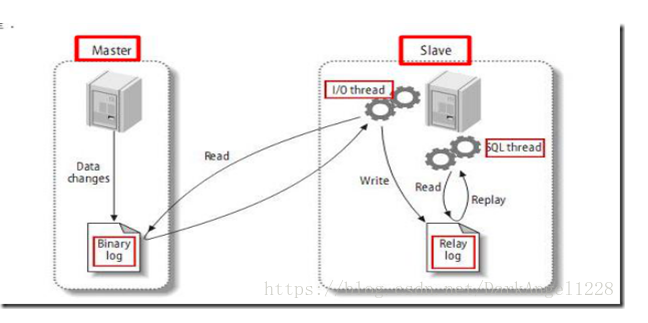
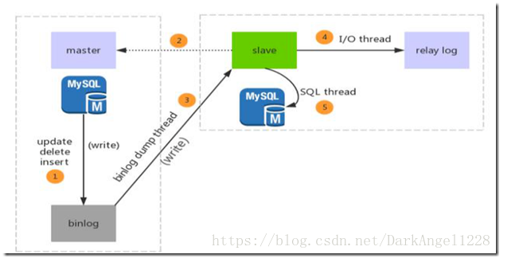
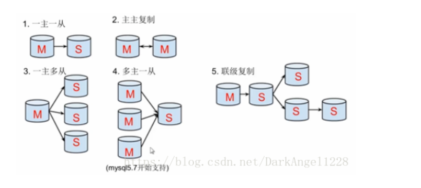
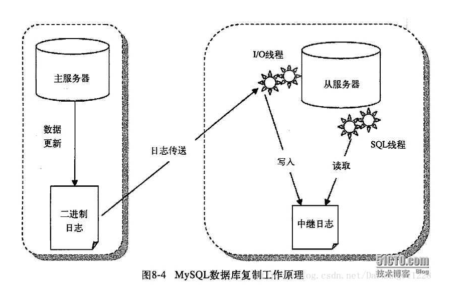
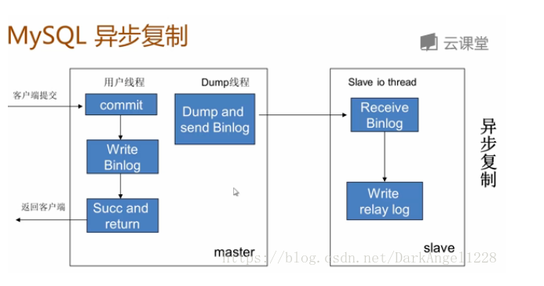
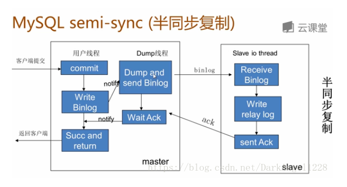

# Mysql知识点汇总

## 一、InnoDB存储引擎


## 二、索引与算法

### B+树

### 哈希算法

### 全文检索

### 倒排索引

## 三、锁

独占锁（排他锁）只允许一个事务访问数据

共享锁 允许其他事务继续使用锁定的资源

更新锁

锁就是保护指定的资源，不被其他事务操作，锁定的资源包括行、页、簇、表和数据库。为了最小化锁的成本，SQL Server自动地以与任务相应等级的锁来锁定资源对象。锁定比较小的对象，例如锁定行，虽然可以提高并发性，但是却有较高的开支，因为如果锁定许多行，那么需要占有更多的锁。锁定比较大的对象，例如锁定表，会大大降低并发性，因为锁定整个表就限制了其他事务访问该表的其他部分，但是成本开支比较低，因为只需维护比较少的锁。

## 四、事务

**1. 事务的四个特性**

数据库事务（Transaction）是指作为单个逻辑工作单元执行的一系列操作，要么完全地执行，要么完全地不执行。一方面，当多个应用程序并发访问数据库时，事务可以在应用程序间提供一个隔离方法，防止互相干扰。另一方面，事务为数据库操作序列提供了一个从失败恢复正常的方法。

事务具有四个特性：原子性（Atomicity）、一致性（Consistency）、隔离型（Isolation）、持久性（Durability），简称ACID。

**1.1 原子性（Atomicity）**

事务的原子性是指事务中的操作不可拆分，只允许全部执行或者全部不执行。

**1.2 一致性（Consistency）**

事务的一致性是指事务的执行不能破坏数据库的一致性，一致性也称为完整性。一个事务在执行后，数据库必须从一个一致性状态转变为另一个一致性状态。

**1.3 隔离型（Isolation）**

事务的隔离型是指并发的事务相互隔离，不能互相干扰。

**1.4 持久性（Durability）**

事务的持久性是指事务一旦提交，对数据的状态变更应该被永久保存。

## **二、数据库事务隔离级别**

**原文链接：**[**数据库事务隔离级别**](http://singo107.iteye.com/blog/1175084)

数据库事务的隔离级别有4个，由低到高依次为Read uncommitted 、Read committed 、Repeatable read 、Serializable ，这四个级别可以逐个解决脏读 、不可重复读 、幻读 这几类问题。

√: 可能出现    ×: 不会出现

|                  | 脏读 | 不可重复读 | 幻读 |
| ---------------- | ---- | ---------- | ---- |
| Read uncommitted | √    | √          | √    |
| Read committed   | ×    | √          | √    |
| Repeatable read  | ×    | ×          | √    |
| Serializable     | ×    | ×          | ×    |

注意：我们讨论隔离级别的场景，主要是在多个事务并发 的情况下，因此，接下来的讲解都围绕事务并发。

**Read uncommitted 读未提交**

公司发工资了，领导把5000元打到singo的账号上，但是该事务并未提交，而singo正好去查看账户，发现工资已经到账，是5000元整，非常高 兴。可是不幸的是，领导发现发给singo的工资金额不对，是2000元，于是迅速回滚了事务，修改金额后，将事务提交，最后singo实际的工资只有 2000元，singo空欢喜一场。

述情况，即我们所说的脏读 ，两个并发的事务，“事务A：领导给singo发工资”、“事务B：singo查询工资账户”，事务B读取了事务A尚未提交的数据。

当隔离级别设置为Read uncommitted 时，就可能出现脏读，如何避免脏读，请看下一个隔离级别。

**Read committed 读提交**

singo拿着工资卡去消费，系统读取到卡里确实有2000元，而此时她的老婆也正好在网上转账，把singo工资卡的2000元转到另一账户，并在 singo之前提交了事务，当singo扣款时，系统检查到singo的工资卡已经没有钱，扣款失败，singo十分纳闷，明明卡里有钱，为 何......

出现上述情况，即我们所说的不可重复读 ，两个并发的事务，“事务A：singo消费”、“事务B：singo的老婆网上转账”，事务A事先读取了数据，事务B紧接了更新了数据，并提交了事务，而事务A再次读取该数据时，数据已经发生了改变。

当隔离级别设置为Read committed 时，避免了脏读，但是可能会造成不可重复读。

大多数数据库的默认级别就是Read committed，比如Sql Server , Oracle。如何解决不可重复读这一问题，请看下一个隔离级别。

**Repeatable read 重复读**

当隔离级别设置为Repeatable read 时，可以避免不可重复读。当singo拿着工资卡去消费时，一旦系统开始读取工资卡信息（即事务开始），singo的老婆就不可能对该记录进行修改，也就是singo的老婆不能在此时转账。

虽然Repeatable read避免了不可重复读，但还有可能出现幻读 。

singo的老婆工作在银行部门，她时常通过银行内部系统查看singo的信用卡消费记录。有一天，她正在查询到singo当月信用卡的总消费金额 （select sum(amount) from transaction where month = 本月）为80元，而singo此时正好在外面胡吃海塞后在收银台买单，消费1000元，即新增了一条1000元的消费记录（insert transaction ... ），并提交了事务，随后singo的老婆将singo当月信用卡消费的明细打印到A4纸上，却发现消费总额为1080元，singo的老婆很诧异，以为出 现了幻觉，幻读就这样产生了。

注：Mysql的默认隔离级别就是Repeatable read。

**Serializable 序列化**

Serializable 是最高的事务隔离级别，同时代价也花费最高，性能很低，一般很少使用，在该级别下，事务顺序执行，不仅可以避免脏读、不可重复读，还避免了幻像读。

## 五、复制

一、什么是主从复制?

主从复制，是用来建立一个和主数据库完全一样的数据库环境，称为从数据库；主数据库一般是准实时的业务数据库。

二、主从复制的作用（好处，或者说为什么要做主从）重点!

​		1、做数据的热备，作为后备数据库，主数据库服务器故障后，可切换到从数据库继续工作，避免数据丢失。
​		2、架构的扩展。业务量越来越大，I/O访问频率过高，单机无法满足，此时做多库的存储，降低磁盘I/O访问的频		率，提高单个机器的I/O性能。
​		3、读写分离，使数据库能支撑更大的并发。在报表中尤其重要。由于部分报表sql语句非常的慢，导致锁表，影响前		台服务。如果前台使用master，报表使用slave，那么报表sql将不会造成前台锁，保证了前台速度。

三、主从复制的原理（重中之重，面试必问）：

1.数据库有个bin-log二进制文件，记录了所有sql语句。
2.我们的目标就是把主数据库的bin-log文件的sql语句复制过来。
3.让其在从数据库的relay-log重做日志文件中再执行一次这些sql语句即可。
4.下面的主从配置就是围绕这个原理配置
5.具体需要三个线程来操作：

​		1.binlog输出线程:每当有从库连接到主库的时候，主库都会创建一个线程然后发送binlog内容到从库。

​		在从库里，当复制开始的时候，从库就会创建两个线程进行处理：

​		2.从库I/O线程:当START SLAVE语句在从库开始执行之后，从库创建一个I/O线程，该线程连接到主库并请求主库发		送binlog里面的更新记录到从库上。从库I/O线程读取主库的binlog输出线程发送的更新并拷贝这些更新到本地文件，		其中包括relay log（转发/中继日志）文件。

​		3.从库的SQL线程:从库创建一个SQL线程，这个线程读取从库I/O线程写到relay log的更新事件( sql ) 并执行。

可以知道，对于每一个主从复制的连接，都有三个线程。拥有多个从库的主库为每一个连接到主库的从库创建一个binlog输出线程，每一个从库都有它自己的I/O线程和SQL线程。
主从复制如图：



原理图2,帮助理解! 



步骤一：主库db的更新事件(update、insert、delete)被写到binlog
步骤二：从库发起连接，连接到主库
步骤三：此时主库创建一个binlog dump thread线程，把binlog的内容发送到从库
步骤四：从库启动之后，创建一个I/O线程，读取主库传过来的binlog内容并写入到relay log.

步骤五：还会创建一个SQL线程，从relay log里面读取内容，从Exec_Master_Log_Pos位置开始执行读取到的更新事件，将更新内容写入到slave的db.

主从复制的方式
一主一从
主主复制
一主多从—扩展系统读取的性能，因为读是在从库读取的；
多主一从—5.7开始支持
联级复制— 



二.用途及条件
1.mysql主从复制用途
实时灾备，用于故障切换
读写分离，提供查询服务
备份，避免影响业务

2.主从部署必要条件：
主库开启binlog日志（设置log-bin参数）
主从server-id不同
从库服务器能连通主库

三.主从原理
mysql主从复制原理




- 从库生成两个线程，一个I/O线程，一个SQL线程；

i/o线程去请求主库的binlog，并将得到的binlog日志写到relay log（中继日志） 文件中；

主库会生成一个 log dump 线程，用来给从库 i/o线程传binlog；

SQL 线程，会读取relay log文件中的日志，并解析成具体操作，来实现主从的操作一致，而最终数据一致；

四.问题及解决方法
mysql主从复制存在的问题：
		主库宕机后，数据可能丢失
		从库只有一个sql Thread，主库写压力大，复制很可能延时

解决方法：
		半同步复制—解决数据丢失的问题
		并行复制—-解决从库复制延迟的问题

五.半同步复制

mysql semi-sync（半同步复制）
半同步复制： 

- 5.5集成到mysql，以插件的形式存在，需要单独安装 
- 确保事务提交后binlog至少传输到一个从库 
- 不保证从库应用完这个事务的binlog 
- 性能有一定的降低，响应时间会更长 
- 网络异常或从库宕机，卡主主库，直到超时或从库恢复

主从复制–异步复制原理



半同步复制原理：
		事务在主库写完binlog后需要从库返回一个已接受，才放回给客户端；
		5.5集成到mysql，以插件的形式存在，需要单独安装
		确保事务提交后binlog至少传输到一个从库
		不保证从库应用完成这个事务的binlog
		性能有一定的降低
		网络异常或从库宕机，卡主库，直到超时或从库恢复 



六.并行复制
mysql并行复制
	社区版5.6中新增
	并行是指从库多线程apply binlog库级别并行应用binlog，同一个库数据更改还是串行的(5.7版并行复制基于事务组)设置
	设置sql线程数为10

```sql
set global slave_parallel_workers=10;
```

七.其他
部分数据复制
主库添加参数：

```
binlog_do_db=db1
binlog_ignore_db=db1
binlog_ignore_db=db2
```


或从库添加参数

```
replicate_do_db=db1
replicate_ignore_db=db1
replicate_do_table=db1.t1
replicate_wild_do_table=db%.%
replicate_wild_ignore_table=db1.%
```

联级复制（常用）
A->B->C
B中添加参数：

```
log_slave_updates
```

B将把A的binlog记录到自己的binlog日志中

复制的监控：

```
show  slave status \G
```

复制出错处理
常见：1062（主键冲突），1032（记录不存在） 

解决： 
手动处理 

- 跳过复制错误：set global sql_slave_skip_counter=1

mysql主从复制是mysql高可用性，高性能（负载均衡）的基础

简单，灵活，部署方式多样，可以根据不同业务场景部署不同复制结构

复制过程中应该时刻监控复制状态，复制出错或延时可能给系统造成影响

mysql主从复制目前也存在一些问题，可以根据需要部署复制增强功能

# MyISAM 和 INNODB的区别是什么?

MyISAM存储: 如果表对事务要求不高，同时是以查询和添加为主的，我们考虑使用myisam存储引擎,比如bbs 中的 发帖表，回复表，还有批量添加MyISAM效率高

INNODB 存储: 对事务要求高，保存的数据都是重要数据，我们建议使用INNODB,比如订单表，账号表。

【面试重点】MyISAM 和 INNODB的区别？

1. 事务安全（MyISAM不支持事务，INNODB支持事务）
2. 外键  MyISAM 不支持外键， INNODB支持外键. 
3. 锁机制（MyISAM表锁，innodb是行锁）
4. 查询和添加速度（MyISAM批量插入速度快）
5. 支持全文索引（MyISAM支持全文索引，INNODB不支持全文索引）

6.MyISAM内存空间使用率比InnoDB低

Memory 存储，比如我们数据变化频繁，不需要入库，同时又频繁的查询和修改，我们考虑使用memory, 速度极快. （如果mysql重启的话，数据就不存在了）


注意事项
如果你的数据库的存储引擎是myisam,请一定记住要定时进行碎片整理

举例说明:

create table test100(id int unsigned ,name varchar(32))engine=myisam;

insert into test100 values(1,'aaaaa');

insert into test100 values(2,'bbbb');

insert into test100 values(3,'ccccc');

insert into test100 select id,name from test100;
我们应该定义对myisam进行整理

optimize table test100;

# 1. 主键 超键 候选键 外键

**主 键：**

[数据库](http://www.2cto.com/database/)表中对储存数据对象予以唯一和完整标识的数据列或属性的组合。**一个数据列只能有一个主键**，且主键的取值不能缺失，即不能为空值（Null）。

**超 键：**

在关系中能唯一标识元组的属性集称为关系模式的超键。一个属性可以为作为一个超键，多个属性组合在一起也可以作为一个超键。**超键包含候选键和主键。**

**候选键：**

是**最小超键**，即没有冗余元素的超键。

**外 键：**

在一个表中存在的**另一个表的主键**称此表的外键。

# 3.视图的作用，视图可以更改么？

视图是虚拟的表，与包含数据的表不一样，视图只包含使用时动态检索数据的查询；不包含任何列或数据。使用视图可以简化复杂的sql操作，隐藏具体的细节，保护数据；视图创建后，可以使用与表相同的方式利用它们。
视图不能被索引，也不能有关联的触发器或默认值，如果视图本身内有order by 则对视图再次order by将被覆盖。
创建视图：create view XXX as XXXXXXXXXXXXXX;
对于某些视图比如未使用联结子查询分组聚集函数Distinct Union等，是可以对其更新的，对视图的更新将对基表进行更新；但是视图主要用于简化检索，保护数据，并不用于更新，而且大部分视图都不可以更新。

# 4.drop,delete与truncate的区别

drop直接删掉表 truncate删除表中数据，再插入时自增长id又从1开始 delete删除表中数据，可以加where字句。

（1） DELETE语句执行删除的过程是每次从表中删除一行，并且同时将该行的删除操作作为事务记录在日志中保存以便进行进行回滚操作。TRUNCATE TABLE 则一次性地从表中删除所有的数据并不把单独的删除操作记录记入日志保存，删除行是不能恢复的。并且在删除的过程中不会激活与表有关的删除触发器。执行速度快。

（2） 表和索引所占空间。当表被TRUNCATE 后，这个表和索引所占用的空间会恢复到初始大小，而DELETE操作不会减少表或索引所占用的空间。drop语句将表所占用的空间全释放掉。

（3） 一般而言，drop > truncate > delete

（4） 应用范围。TRUNCATE 只能对TABLE；DELETE可以是table和view

（5） TRUNCATE 和DELETE只删除数据，而DROP则删除整个表（结构和数据）。

（6） truncate与不带where的delete ：只删除数据，而不删除表的结构（定义）drop语句将删除表的结构被依赖的约束（constrain),触发器（trigger)索引（index);依赖于该表的存储过程/函数将被保留，但其状态会变为：invalid。

（7） delete语句为DML（data maintain Language),这个操作会被放到 rollback segment中,事务提交后才生效。如果有相应的 tigger,执行的时候将被触发。

（8） truncate、drop是DLL（data define language),操作立即生效，原数据不放到 rollback segment中，不能回滚

（9） 在没有备份情况下，谨慎使用 drop 与 truncate。要删除部分数据行采用delete且注意结合where来约束影响范围。回滚段要足够大。要删除表用drop;若想保留表而将表中数据删除，如果于事务无关，用truncate即可实现。如果和事务有关，或老师想触发trigger,还是用delete。

（10） Truncate table 表名 速度快,而且效率高,因为:
truncate table 在功能上与不带 WHERE 子句的 DELETE 语句相同：二者均删除表中的全部行。但 TRUNCATE TABLE 比 DELETE 速度快，且使用的系统和事务日志资源少。DELETE 语句每次删除一行，并在事务日志中为所删除的每行记录一项。TRUNCATE TABLE 通过释放存储表数据所用的数据页来删除数据，并且只在事务日志中记录页的释放。

（11） TRUNCATE TABLE 删除表中的所有行，但表结构及其列、约束、索引等保持不变。新行标识所用的计数值重置为该列的种子。如果想保留标识计数值，请改用 DELETE。如果要删除表定义及其数据，请使用 DROP TABLE 语句。

（12） 对于由 FOREIGN KEY 约束引用的表，不能使用 TRUNCATE TABLE，而应使用不带 WHERE 子句的 DELETE 语句。由于 TRUNCATE TABLE 不记录在日志中，所以它不能激活触发器。

# 7.数据库范式

**1 第一范式（1NF）**

在任何一个关系数据库中，第一范式（1NF）是对关系模式的基本要求，不满足第一范式（1NF）的数据库就不是关系数据库。
所谓第一范式（1NF）是指数据库表的每一列都是不可分割的基本数据项，同一列中不能有多个值，即实体中的某个属性不能有多个值或者不能有重复的属性。如果出现重复的属性，就可能需要定义一个新的实体，新的实体由重复的属性构成，新实体与原实体之间为一对多关系。在第一范式（1NF）中表的每一行只包含一个实例的信息。简而言之，**第一范式就是无重复的列。**

**2 第二范式（2NF）**

第二范式（2NF）是在第一范式（1NF）的基础上建立起来的，即满足第二范式（2NF）必须先满足第一范式（1NF）。第二范式（2NF）要求数据库表中的每个实例或行必须可以被惟一地区分。为实现区分通常需要为表加上一个列，以存储各个实例的惟一标识。这个惟一属性列被称为主关键字或主键、主码。
第二范式（2NF）要求实体的属性完全依赖于主关键字。所谓完全依赖是指不能存在仅依赖主关键字一部分的属性，如果存在，那么这个属性和主关键字的这一部分应该分离出来形成一个新的实体，新实体与原实体之间是一对多的关系。为实现区分通常需要为表加上一个列，以存储各个实例的惟一标识。简而言之，**第二范式就是非主属性非部分依赖于主关键字。**

**3 第三范式（3NF）**

满足第三范式（3NF）必须先满足第二范式（2NF）。简而言之，第三范式（3NF）要求一个数据库表中不包含已在其它表中已包含的非主关键字信息。例如，存在一个部门信息表，其中每个部门有部门编号（dept_id）、部门名称、部门简介等信息。那么在员工信息表中列出部门编号后就不能再将部门名称、部门简介等与部门有关的信息再加入员工信息表中。如果不存在部门信息表，则根据第三范式（3NF）也应该构建它，否则就会有大量的数据冗余。简而言之，**第三范式就是属性不依赖于其它非主属性。（我的理解是消除冗余）**

# 9.存储过程与触发器的区别

触发器与存储过程非常相似，触发器也是SQL语句集，**两者唯一的区别是触发器不能用EXECUTE语句调用，而是在用户执行Transact-SQL语句时自动触发（激活）执行。触发器是在一个修改了指定表中的数据时执行的存储过程。**通**常通过创建触发器来强制实现不同表中的逻辑相关数据的引用完整性和一致性。**由于用户不能绕过触发器，所以可以用它来强制实施复杂的业务规则，以确保数据的完整性。触发器不同于存储过程，**触发器主要是通过事件执行触发而被执行的**，而**存储过程可以通过存储过程名称名字而直接调用**。当对某一表进行诸如UPDATE、INSERT、DELETE这些操作时，SQLSERVER就会自动执行触发器所定义的SQL语句，从而确保对数据的处理必须符合这些SQL语句所定义的规则。


# 5.索引的工作原理及其种类

**数据库索引**，是数据库管理系统中一个排序的数据结构，以协助快速查询、更新数据库表中数据。**索引的实现通常使用B树及其变种B+树**。

在数据之外，数据库系统还维护着满足特定查找算法的数据结构，这些数据结构以某种方式引用（指向）数据，这样就可以在这些数据结构上实现高级查找算法。这种数据结构，就是索引。

为表设置索引要付出代价的：一是增加了数据库的存储空间，二是在插入和修改数据时要花费较多的时间(因为索引也要随之变动)。


 

图展示了一种可能的索引方式。左边是数据表，一共有两列七条记录，最左边的是数据记录的物理地址（注意逻辑上相邻的记录在磁盘上也并不是一定物理相邻的）。为了加快Col2的查找，可以维护一个右边所示的二叉查找树，每个节点分别包含索引键值和一个指向对应数据记录物理地址的指针，这样就可以运用二叉查找在O(log2n)的复杂度内获取到相应数据。

创建索引可以大大提高系统的性能。

第一，通过创建唯一性索引，可以保证数据库表中每一行数据的唯一性。

第二，可以大大加快数据的检索速度，这也是创建索引的最主要的原因。

第三，可以加速表和表之间的连接，特别是在实现数据的参考完整性方面特别有意义。

第四，在使用分组和排序子句进行数据检索时，同样可以显著减少查询中分组和排序的时间。

第五，通过使用索引，可以在查询的过程中，使用优化隐藏器，提高系统的性能。

也许会有人要问：增加索引有如此多的优点，为什么不对表中的每一个列创建一个索引呢？因为，增加索引也有许多不利的方面。

第一，创建索引和维护索引要耗费时间，这种时间随着数据量的增加而增加。

第二，索引需要占物理空间，除了数据表占数据空间之外，每一个索引还要占一定的物理空间，如果要建立聚簇索引，那么需要的空间就会更大。

第三，当对表中的数据进行增加、删除和修改的时候，索引也要动态的维护，这样就降低了数据的维护速度。

索引是建立在数据库表中的某些列的上面。在创建索引的时候，应该考虑在哪些列上可以创建索引，在哪些列上不能创建索引。**一般来说，应该在这些列上创建索引：**在经常需要搜索的列上，可以加快搜索的速度；在作为主键的列上，强制该列的唯一性和组织表中数据的排列结构；在经常用在连接的列上，这些列主要是一些外键，可以加快连接的速度；在经常需要根据范围进行搜索的列上创建索引，因为索引已经排序，其指定的范围是连续的；在经常需要排序的列上创建索引，因为索引已经排序，这样查询可以利用索引的排序，加快排序查询时间；在经常使用在WHERE子句中的列上面创建索引，加快条件的判断速度。

同样，对于有些列不应该创建索引。**一般来说，不应该创建索引的的这些列具有下列特点：**

第一，对于那些在查询中很少使用或者参考的列不应该创建索引。这是因为，既然这些列很少使用到，因此有索引或者无索引，并不能提高查询速度。相反，由于增加了索引，反而降低了系统的维护速度和增大了空间需求。

第二，对于那些只有很少数据值的列也不应该增加索引。这是因为，由于这些列的取值很少，例如人事表的性别列，在查询的结果中，结果集的数据行占了表中数据行的很大比例，即需要在表中搜索的数据行的比例很大。增加索引，并不能明显加快检索速度。

第三，对于那些定义为text, image和bit数据类型的列不应该增加索引。这是因为，这些列的数据量要么相当大，要么取值很少。

第四，当修改性能远远大于检索性能时，不应该创建索引。这是因为，**修改性能和检索性能是互相矛盾的**。当增加索引时，会提高检索性能，但是会降低修改性能。当减少索引时，会提高修改性能，降低检索性能。因此，当修改性能远远大于检索性能时，不应该创建索引。

根据数据库的功能，可以在[数据库设计](http://www.2cto.com/database/)器中创建三种索引：**唯一索引、主键索引和聚集索引**。

**唯一索引**

唯一索引是不允许其中任何两行具有相同索引值的索引。

当现有数据中存在重复的键值时，大多数数据库不允许将新创建的唯一索引与表一起保存。数据库还可能防止添加将在表中创建重复键值的新数据。例如，如果在employee表中职员的姓(lname)上创建了唯一索引，则任何两个员工都不能同姓。 **主键索引** 数据库表经常有一列或列组合，其值唯一标识表中的每一行。该列称为表的主键。 在数据库关系图中为表定义主键将自动创建主键索引，主键索引是唯一索引的特定类型。该索引要求主键中的每个值都唯一。当在查询中使用主键索引时，它还允许对数据的快速访问。 **聚集索引** 在聚集索引中，表中行的物理顺序与键值的逻辑（索引）顺序相同。**一个表只能包含一个聚集索引。**

如果某索引不是聚集索引，则表中行的物理顺序与键值的逻辑顺序不匹配。**与非聚集索引相比，聚集索引通常提供更快的数据访问速度。**

# 8.数据库优化的思路

## 1.SQL语句优化

1）应尽量避免在 where 子句中使用!=或<>操作符，否则将引擎放弃使用索引而进行全表扫描。
2）应尽量避免在 where 子句中对字段进行 null 值判断，否则将导致引擎放弃使用索引而进行全表扫描，如：
select id from t where num is null
**可以在num上设置默认值0，确保表中num列没有null值**，然后这样查询：
select id from t where num=0
3）很多时候用 exists 代替 in 是一个好的选择
4）用Where子句替换HAVING 子句 因为HAVING 只会在检索出所有记录之后才对结果集进行过滤

## 2.索引优化

### B-/+Tree索引的性能分析

到这里终于可以分析B-/+Tree索引的性能了。

上文说过一般使用磁盘I/O次数评价索引结构的优劣。先从B-Tree分析，根据B-Tree的定义，可知检索一次最多需要访问h个节点。数据库系统的设计者巧妙利用了磁盘预读原理，将一个节点的大小设为等于一个页，这样每个节点只需要一次I/O就可以完全载入。为了达到这个目的，在实际实现B-Tree还需要使用如下技巧：

每次新建节点时，直接申请一个页的空间，这样就保证一个节点物理上也存储在一个页里，加之计算机存储分配都是按页对齐的，就实现了一个node只需一次I/O。

**B-Tree中一次检索最多需要h-1次I/O（根节点常驻内存），渐进复杂度为O(h)=O(logdN)。**一般实际应用中，出度d是非常大的数字，通常超过100，因此h非常小（通常不超过3）。

而红黑树这种结构，h明显要深的多。由于逻辑上很近的节点（父子）物理上可能很远，无法利用局部性，所以红黑树的I/O渐进复杂度也为O(h)，效率明显比B-Tree差很多。

**综上所述，用B-Tree作为索引结构效率是非常高的。**

## 3.数据库结构优化

1）范式优化： 比如消除冗余（节省空间。。） 2）反范式优化：比如适当加冗余等（减少join） 3）拆分表： 分区将数据在物理上分隔开，不同分区的数据可以制定保存在处于不同磁盘上的数据文件里。这样，当对这个表进行查询时，只需要在表分区中进行扫描，而不必进行全表扫描，明显缩短了查询时间，另外处于不同磁盘的分区也将对这个表的数据传输分散在不同的磁盘I/O，一个精心设置的分区可以将数据传输对磁盘I/O竞争均匀地分散开。对数据量大的时时表可采取此方法。可按月自动建表分区。
4）拆分其实又分垂直拆分和水平拆分： 案例： 简单购物系统暂设涉及如下表： 1.产品表（数据量10w，稳定） 2.订单表（数据量200w，且有增长趋势） 3.用户表 （数据量100w，且有增长趋势） 以[mysql](http://www.2cto.com/database/MySQL/)为例讲述下水平拆分和垂直拆分，mysql能容忍的数量级在百万静态数据可以到千万 **垂直拆分：**解决问题：表与表之间的io竞争 不解决问题：单表中数据量增长出现的压力 方案： 把产品表和用户表放到一个server上 订单表单独放到一个server上 **水平拆分：** 解决问题：单表中数据量增长出现的压力 不解决问题：表与表之间的io争夺
方案： 用户表通过性别拆分为男用户表和女用户表 订单表通过已完成和完成中拆分为已完成订单和未完成订单 产品表 未完成订单放一个server上 已完成订单表盒男用户表放一个server上 女用户表放一个server上(女的爱购物 哈哈)

# 一、Mysql分库分表方案

## 1.为什么要分表：

当一张表的数据达到几千万时，你查询一次所花的时间会变多，如果有联合查询的话，我想有可能会死在那儿了。分表的目的就在于此，减小数据库的负担，缩短查询时间。

mysql中有一种机制是表锁定和行锁定，是为了保证数据的完整性。表锁定表示你们都不能对这张表进行操作，必须等我对表操作完才行。行锁定也一样，别的sql必须等我对这条数据操作完了，才能对这条数据进行操作。

## 2. mysql proxy：amoeba

做mysql集群,利用amoeba。

从上层的java程序来讲，不需要知道主服务器和从服务器的来源，即主从数据库服务器对于上层来讲是透明的。可以通过amoeba来配置。

## 3.大数据量并且访问频繁的表，将其分为若干个表

比如对于某网站平台的数据库表-公司表，数据量很大，这种能预估出来的大数据量表，我们就事先分出个N个表，这个N是多少，根据实际情况而定。

​     某网站现在的数据量至多是5000万条，可以设计每张表容纳的数据量是500万条，也就是拆分成10张表，

那么如何判断某张表的数据是否容量已满呢？可以在程序段对于要新增数据的表，在插入前先做统计表记录数量的操作，当<500万条数据，就直接插入，当已经到达阀值，可以在程序段新创建数据库表（或者已经事先创建好），再执行插入操作。

## 4. 利用merge存储引擎来实现分表

如果要把已有的大数据量表分开比较痛苦，最痛苦的事就是改代码，因为程序里面的sql语句已经写好了。用merge存储引擎来实现分表, 这种方法比较适合.

举例子：

 [](http://static.oschina.net/uploads/img/201402/13104102_slb1.jpg)

------

# 二、数据库架构

## 1、简单的MySQL主从复制:

MySQL的主从复制解决了数据库的读写分离，并很好的提升了读的性能，其图如下：

 [](http://static.oschina.net/uploads/img/201402/13104102_nxBO.jpg)

其主从复制的过程如下图所示：

 [](http://static.oschina.net/uploads/img/201402/13104103_7YzJ.jpg)

但是，主从复制也带来其他一系列性能瓶颈问题：

1. 写入无法扩展
2. 写入无法缓存
3. 复制延时
4. 锁表率上升
5. 表变大，缓存率下降

那问题产生总得解决的，这就产生下面的优化方案，一起来看看。

## 2、MySQL垂直分区

   如果把业务切割得足够独立，那把不同业务的数据放到不同的数据库服务器将是一个不错的方案，而且万一其中一个业务崩溃了也不会影响其他业务的正常进行，并且也起到了负载分流的作用，大大提升了数据库的吞吐能力。经过垂直分区后的数据库架构图如下：

 [](http://static.oschina.net/uploads/img/201402/13104103_CHZw.jpg)

然而，尽管业务之间已经足够独立了，但是有些业务之间或多或少总会有点联系，如用户，基本上都会和每个业务相关联，况且这种分区方式，也不能解决单张表数据量暴涨的问题，因此为何不试试水平分割呢？

## 3、MySQL水平分片（Sharding）

这是一个非常好的思路，将用户按一定规则（按id哈希）分组，并把该组用户的数据存储到一个数据库分片中，即一个sharding，这样随着用户数量的增加，只要简单地配置一台服务器即可，原理图如下：

 [](http://static.oschina.net/uploads/img/201402/13104104_2qZP.jpg)

如何来确定某个用户所在的shard呢，可以建一张用户和shard对应的数据表，每次请求先从这张表找用户的shard id，再从对应shard中查询相关数据，如下图所示：

 [](http://static.oschina.net/uploads/img/201402/13104105_7oa0.jpg)

### ①单库单表 

单库单表是最常见的数据库设计，例如，有一张用户(user)表放在数据库db中，所有的用户都可以在db库中的user表中查到。 

### ②单库多表 

随着用户数量的增加，user表的数据量会越来越大，当数据量达到一定程度的时候对user表的查询会渐渐的变慢，从而影响整个DB的性能。如果使用mysql, 还有一个更严重的问题是，当需要添加一列的时候，mysql会锁表，期间所有的读写操作只能等待。 

可以通过某种方式将user进行水平的切分，产生两个表结构完全一样的user_0000,user_0001等表，user_0000 + user_0001 + …的数据刚好是一份完整的数据。 

### ③多库多表

随着数据量增加也许单台DB的存储空间不够，随着查询量的增加单台数据库服务器已经没办法支撑。这个时候可以再对数据库进行水平区分。 

------

 四、分库分表规则 

设计表的时候需要确定此表按照什么样的规则进行分库分表。例如，当有新用户时，程序得确定将此用户信息添加到哪个表中；同理，当登录的时候我们得通过用户的账号找到数据库中对应的记录，所有的这些都需要按照某一规则进行。 
路由 

通过分库分表规则查找到对应的表和库的过程。如分库分表的规则是user_id mod 4的方式，当用户新注册了一个账号，账号id的123,我们可以通过id mod 4的方式确定此账号应该保存到User_0003表中。当用户123登录的时候，我们通过123 mod 4后确定记录在User_0003中。 
分库分表产生的问题，及注意事项 

## 1.   分库分表维度的问题 

假如用户购买了商品,需要将交易记录保存取来，如果按照用户的纬度分表，则每个用户的交易记录都保存在同一表中，所以很快很方便的查找到某用户的 购买情况，但是某商品被购买的情况则很有可能分布在多张表中，查找起来比较麻烦。反之，按照商品维度分表，可以很方便的查找到此商品的购买情况，但要查找 到买人的交易记录比较麻烦。 

所以常见的解决方式有： 

- 通过扫表的方式解决，此方法基本不可能，效率太低了。
- 记录两份数据，一份按照用户纬度分表，一份按照商品维度分表。
- 通过搜索引擎解决，但如果实时性要求很高，又得关系到实时搜索。 

## 2.   联合查询的问题 

联合查询基本不可能，因为关联的表有可能不在同一数据库中。 

## 3.   避免跨库事务

避免在一个事务中修改db0中的表的时候同时修改db1中的表，一个是操作起来更复杂，效率也会有一定影响。 

## 4.   尽量把同一组数据放到同一DB服务器上

例如将卖家a的商品和交易信息都放到db0中，当db1挂了的时候，卖家a相关的东西可以正常使用。也就是说避免数据库中的数据依赖另一数据库中的数据。 

## 5.一主多备

在实际的应用中，绝大部分情况都是读远大于写。Mysql提供了读写分离的机制，所有的写操作都必须对应到Master，读操作可以在 Master和Slave机器上进行，Slave与Master的结构完全一样，一个Master可以有多个Slave,甚至Slave下还可以挂 Slave,通过此方式可以有效的提高DB集群的 QPS.                                                       

所有的写操作都是先在Master上操作，然后同步更新到Slave上，所以从Master同步到Slave机器有一定的延迟，当系统很繁忙的时候，延迟问题会更加严重，Slave机器数量的增加也会使这个问题更加严重。 
此外，可以看出Master是集群的瓶颈，当写操作过多，会严重影响到Master的稳定性，如果Master挂掉，整个集群都将不能正常工作。 
所以

- 当读压力很大的时候，可以考虑添加Slave机器的分式解决，但是当Slave机器达到一定的数量就得考虑分库了。
- 当写压力很大的时候，就必须得进行分库操作。 

 

------

# 五、MySQL使用为什么要分库分表

可以用说用到MySQL的地方,只要数据量一大, 马上就会遇到一个问题,要分库分表. 这里引用一个问题为什么要分库分表呢?MySQL处理不了大的表吗? 其实是可以处理的大表的.我所经历的项目中单表物理上文件大小在80G多,单表记录数在5亿以上,而且这个表 属于一个非常核用的表:朋友关系表. 

但这种方式可以说不是一个最佳方式. 因为面临文件系统如Ext3文件系统对大于大文件处理上也有许多问题. 这个层面可以用xfs文件系统进行替换.但MySQL单表太大后有一个问题是不好解决: 表结构调整相关的操作基 
本不在可能.所以大项在使用中都会面监着分库分表的应用. 

从Innodb本身来讲数据文件的Btree上只有两个锁, 叶子节点锁和子节点锁,可以想而知道,当发生页拆分或是添加新叶时都会造成表里不能写入数据.所以分库分表还就是一个比较好的选择了. 

**那么分库分表多少合适呢?** 
经测试在单表1000万条记录一下,写入读取性能是比较好的. 这样在留点buffer,那么单表全是数据字型的保持在800万条记录以下, 有字符型的单表保持在500万以下. 

如果按 100库100表来规划,如用户业务: 500万*100*100 = 50000000万 = 5000亿记录. 

心里有一个数了,按业务做规划还是比较容易的.

分布式数据库架构--排序、分页、分组、实现

【设计题】

今日头条会根据用户的浏览行为、内容偏好等信息，为每个用户抽象出一个标签化的用户画像，用于内容推荐。用户画像的存储、高并发访问，是推荐系统的重要环节之一。现在请你给出一个用户画像存储、访问方案，设计的时候请考虑一下几个方面：

1. 用户画像如何存储
2. 如何保证在线高并发、低延迟地访问
3. 机器宕机、负载均衡问题
4. 如果用户增长很快，在你的方案下，该如何做扩容

答案：

1、根据用户的ID进行分组。比如有1000万用户成为一个组。这个组里面又根据需要分成几个数据库，比如三个库，容量分别是400w,300w,300w。每个数据库根据具体情况分成几张表，比如这里，第一个库分成4张表，每个100w。然后根据对ID取模。得到的值就表示这个ID被路由到那个表里面，可以解决热点问题。也方便扩容。

2、使用redis缓存。利用redis缓存的高性能和高并发特性，可以实现在线高并发高延迟的访问。

3、面对这种问题，我们首先应该把我们的服务器布置成集群的模式。然后使用zookeeper来解决自动切换的功能。

负载均衡的话。可以使用Nginx反向代理做负载均衡。这个主要是IP路由到不同的服务器，缓解一台服务器的压力，对于数据库和缓存的话，一般根据用户的ID进行路由，使热点数据尽量均匀分布在多个库和表中，不要出现大量请求都往同一个数据库中的情况。

4、根据我的方案。如果用户增长很快。那么只需要按照第一题的描述。新增一个组来存储即可，因为前1000万会被路由到第一组。第1000万到2000万会被路由到第二组。以此类推。可以水平扩展，也不用做数据迁移。

