## 一、Netty概述

1.1 netty是什么？
官方解释：

Netty is a NIO client server framework which enables quick and easy development of network applications such as protocol servers and clients. It greatly simplifies and streamlines network programming such as TCP and UDP socket server.

Netty is an asynchronous event-driven network application framework 

解释一下就是：

Netty是一个NIO网络编程框架，快速开发高性能、高可靠性的网络服务器/客户端程序。 极大地简化了TCP和UDP等网络编程。是一个异步事件驱动的网络框架。

重点是NIO、快速、高性能。

哪些中间件用到了netty？

RPC（pigeon、dubbo、HSF）

Hadoop、Spark

MQ（swallow、RocketMQ）

Zookeeper等

几乎所有的基于java的分布式中间件都是采用netty作为通信工具的，

（ps：redis是用c写的单进程单线程，采用了跟netty相同的epoll模型）

epoll 是在Linux操作系统上才能使用并且推荐的方法。

其他系统推荐使用NIO(JDK提供)。

## 1.2 netty的架构

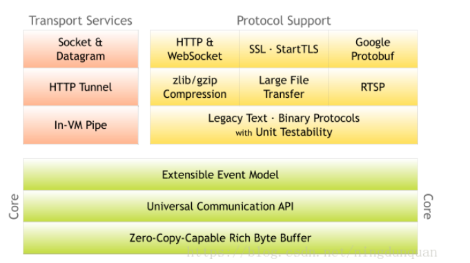


最核心的三大组件

缓冲（Buffer）

通道（Channel）

事件模型（Event Model）

## 1.3 netty的组件

Bootstrap：netty的辅助启动器，netty客户端和服务器的入口，Bootstrap是创建客户端连接的启动器，ServerBootstrap是监听服务端端口的启动器，跟tomcat的Bootstrap类似，程序的入口。

Channel：关联jdk原生socket的组件，常用的是NioServerSocketChannel和NioSocketChannel，NioServerSocketChannel负责监听一个tcp端口，有连接进来通过boss reactor创建一个NioSocketChannel将其绑定到worker reactor，然后worker reactor负责这个NioSocketChannel的读写等io事件。

EventLoop：netty最核心的几大组件之一，就是我们常说的reactor，人为划分为boss reactor和worker reactor。通过EventLoopGroup（Bootstrap启动时会设置EventLoopGroup）生成，最常用的是nio的NioEventLoop，就如同EventLoop的名字，EventLoop内部有一个无限循环，维护了一个selector，处理所有注册到selector上的Channel的io操作，在这里实现了一个线程维护多条连接的工作。

ChannelPipeline：netty最核心的几大组件之一，ChannelHandler的容器，netty处理io操作的通道，与ChannelHandler组成责任链。write、read、connect等所有的io操作都会通过这个ChannelPipeline，依次通过ChannelPipeline上面的ChannelHandler处理，这就是netty事件模型的核心。ChannelPipeline内部有两个节点，head和tail，分别对应着ChannelHandler链的头和尾。

ChannelHandler：netty最核心的几大组件之一，netty处理io事件真正的处理单元，开发者可以创建自己的ChannelHandler来处理自己的逻辑，完全控制事件的处理方式。ChannelHandler和ChannelPipeline组成责任链，使得一组ChannelHandler像一条链一样执行下去。ChannelHandler分为inBound和outBound，分别对应io的read和write的执行链。ChannelHandler用ChannelHandlerContext包裹着，有prev和next节点，可以获取前后ChannelHandler，read时从ChannelPipeline的head执行到tail，write时从tail执行到head，所以head既是read事件的起点也是write事件的终点，与io交互最紧密。

Unsafe：顾名思义这个类就是不安全的意思，但并不是说这个类本身不安全，而是不要在应用程序里面直接使用Unsafe以及他的衍生类对象，实际上Unsafe操作都是在reactor线程中被执行。Unsafe是Channel的内部类，并且是protected修饰的，所以在类的设计上已经保证了不被用户代码调用。Unsafe的操作都是和jdk底层相关。EventLoop轮询到read或accept事件时，会调用unsafe.read()，unsafe再调用ChannelPipeline去处理事件；当发生write事件时，所有写事件都会放在EventLoop的task中，然后从ChannelPipeline的tail传播到head，通过Unsafe写到网络中。

## 二、NIO相关

2.1 nio的基本概念
对于一次IO访问（以read举例），数据会先被拷贝到操作系统内核的缓冲区中，然后才会从操作系统内核的缓冲区拷贝到应用程序的地址空间。所以说，当一个read操作发生时，它会经历两个阶段：

等待数据准备 (Waiting for the data to be ready)

将数据从内核拷贝到进程中 (Copying the data from the kernel to the process)

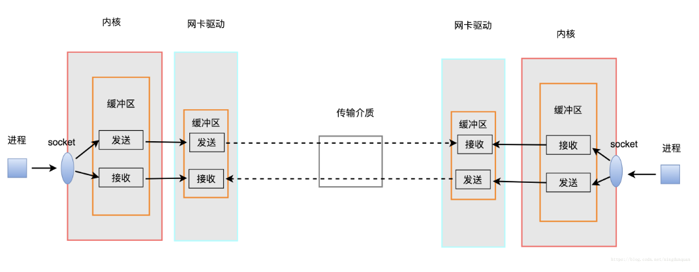

一个阶段是操作系统从网卡缓冲区中拉取数据，另一个阶段是将数据从内核copy到用户进程中。

当有报文进入网卡就会触发中断，kernel把报文送入linux协议栈，报文在协议栈里由下至上经过链路层、ip层、传输层，一直送到socket的内核缓冲区，用户进程调用recv等读接口把报文读出来。

linux下，可以通过设置socket使其变为non-blocking。当对一个non-blocking socket执行读操作时

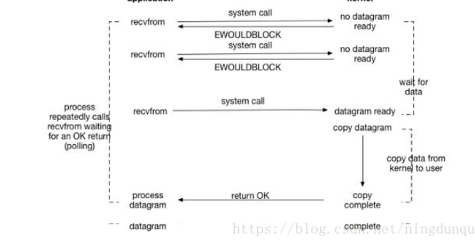

当用户进程发出read操作时，如果kernel中的数据还没有准备好，那么它并不会block用户进程，而是立刻返回一个error。用户进程判断结果是一个error时，它就知道数据还没有准备好，于是它可以再次发送read操作。一旦kernel中的数据准备好了，并且又再次收到了用户进程的system call，那么它马上就将数据拷贝到了用户内存，然后返回。

所以，nio的特点是用户进程不断轮询kernel缓冲区的数据是否ready了。

## 2.2 IO多路复用

IO multiplexing就是select、poll、epoll，多路复用的好处就在于单个进程就可以同时处理多个网络连接的IO。它的基本原理就是select、poll、epoll这个function会不断的轮询所负责的所有socket，当某个socket有数据到达了，就通知用户进程（其实更准确的说是一个用户进程的selector注册多个socket，任何一个socket中数据准备好了，selector都会知道，当用户进程调用selector的select方法时，会得到所有数据准备好的sockets，用户进程再调用read操作，将数据从kernel拷贝到用户进程）。

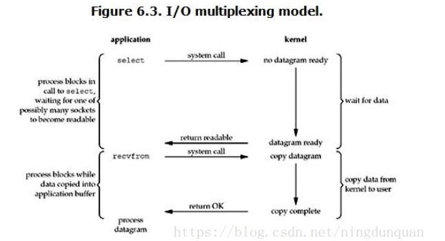

所以，I/O 多路复用的特点是通过一种机制一个进程能同时等待多个文件描述符，而这些文件描述符（套接字描述符）其中的任意一个进入读就绪状态，select()函数就可以返回。

IO多路复用中，对于每个socket都是非阻塞式的，但是由于用户进程需要调用selector的select方法，如果所有注册在selector上的socket都block了（没有数据到达），整个用户进程还是block。只是用户进程是被select这个函数block，而不是被socket IO给block。

IO多路复用的流程大体都是一样的，主要区别就是一句话：任何一个socket中数据准备好了，selector都会知道。select、poll、epoll三种机制就是通过不同的模式来通知selector的。

IO多路复用是同步非阻塞IO。

### 2.2.1 select模型

select 函数监视的文件描述符分3类，分别是writefds、readfds、和exceptfds。调用后select函数会阻塞，直到有socket描述符就绪（有数据 可读、可写、或者有except），或者超时（timeout指定等待时间，如果立即返回设为null即可），函数返回。当select函数返回后，可以 通过遍历fdset，来找到就绪的描述符。

```c++
int select (int n, fd_set *readfds, fd_set *writefds, fd_set *exceptfds, struct timeval *timeout);
```

在于单个进程能够监视的文件描述符的数量存在最大限制，在Linux上一般为1024，可以通过修改宏定义甚至重新编译内核的方式提升这一限制，但是这样也会造成效率的降低。

### 2.3.2 poll模型

与select不同，poll使用一个 pollfd的指针实现。

```c
int poll (struct pollfd *fds, unsigned int nfds, int timeout);
```

pollfd结构包含了要监视的event和发生的event，不再使用select“参数-值”传递的方式。同时，pollfd并没有最大数量限制（但是数量过大后性能也是会下降）。 和select函数一样，poll返回后，需要轮询pollfd来获取就绪的描述符。

select和poll都需要在返回后，通过遍历文件描述符来获取已经就绪的socket。事实上，同时连接的大量客户端在一时刻可能只有很少的处于就绪状态，因此随着监视的描述符数量的增长，其效率也会线性下降。

### 2.4.3 epoll模型

相对于select和poll来说，epoll更加灵活，没有描述符限制。epoll使用一个文件描述符管理多个描述符，将用户关系的文件描述符的事件存放到内核的一个事件表中，这样在用户空间和内核空间的copy只需一次。

```c
//创建一个epoll的句柄，size用来告诉内核这个监听的数目一共有多大
int epoll_create(int size)；
//对指定描述符fd执行op操作。epfd：是epoll_create()的返回值，op：表示op操作，fd：是需要监听的fd，epoll_event：是告诉内核需要监听什么事
int epoll_ctl(int epfd, int op, int fd, struct epoll_event *event)；
//等待epfd上的io事件，最多返回maxevents个事件。
int epoll_wait(int epfd, struct epoll_event * events, int maxevents, int timeout);
```

在 select/poll中，进程只有在调用一定的方法后，内核才对所有监视的文件描述符进行扫描，而epoll事先通过epoll_ctl()来注册一 个文件描述符，一旦基于某个文件描述符就绪时，内核会采用类似callback的回调机制，迅速激活这个文件描述符，当进程调用epoll_wait() 时便得到通知。

epoll的优点

epoll监视的描述符数量不受限制，它所支持的FD上限是最大可以打开文件的数目

IO的效率不会随着监视fd的数量的增长而下降。epoll不同于select和poll轮询的方式，而是通过每个fd定义的回调函数来实现的。只有就绪的fd才会执行回调函数。

netty的nio模型就是epoll机制

附IO模型与Netty文档：IO模型与Netty


三、server是如何启动的
在看netty启动之前，先来看看jdk原生的nio server是如何启动的

```C++
// 创建一个ServerSocketChannel对象
ServerSocketChannel ssc = ServerSocketChannel.open();
// 绑定tcp端口,监听请求,也可以放在后面
ssc.socket().bind(new InetSocketAddress("127.0.0.1", 8000));
// 设置io模式为非阻塞
ssc.configureBlocking(false);

// 创建一个Selector
Selector selector = Selector.open();
// 注册 channel，并且指定感兴趣的事件是 Accept
ssc.register(selector, SelectionKey.OP_ACCEPT);
```

分为五步

创建一个ServerSocketChannel对象

绑定tcp端口,监听请求,也可以放在后面

设置io模式为非阻塞

创建一个Selector

注册 channel，并且指定感兴趣的事件是 Accept

再来看看netty服务端启动的代码

```java
public class ChatNettyServer {
private int port;
 
public ChatNettyServer(int port) {
    this.port = port;
}
 
public void start() throws Exception {
    EventLoopGroup bossGroup = new NioEventLoopGroup(1);
    EventLoopGroup workerGroup = new NioEventLoopGroup();
 
    try {
        ServerBootstrap b = new ServerBootstrap();
        b.group(bossGroup, workerGroup)
                .channel(NioServerSocketChannel.class)
                .childHandler(new ChatServerInitializer());
 
        System.out.println("ChatNettyServer 启动了");
        // 绑定端口，开始接收进来的连接
        ChannelFuture f = b.bind(port).sync();
 
        f.channel().closeFuture().sync();
    } catch (Exception e) {
        workerGroup.shutdownGracefully();
        bossGroup.shutdownGracefully();
        System.out.println("ChatNettyServer 关闭了");
 
    }finally {
        System.out.println("finally");
    }
}
}
```

大致意思是netty开启一个tcp server，将端口绑定在port上，使用nio的模式。

这里有一些组件已经是上面我们提到的了，比如ServerBootstrap，server启动器设置一系列参数，比如EventLoopGroup、ChannelHandler、Channel等，最后绑定端口启动服务；EventLoopGroup的主要作用是生成事件循环处理器EventLoop；NioServerSocketChannel是通过反射的方式生成服务端的channel，负责监听一个tcp端口。

最后通过ServerBootstrap的bind(port)方法真正绑定端口，完成服务端启动的工作。

netty的服务端启动主要分为三步：

init

register

bind

因此带来的三个问题分别是：

init初始化什么？

register向谁注册了什么？

跟什么绑定了？

## 3.1 init初始化

ServerBootstrap从bind方法开始调用，先调用validate验证ServerBootstrap上的参数，然后调用doBind方法进入到initAndRegister方法中，在initAndRegister方法中完成init和register的工作。

init和register的源码：

```java
final ChannelFuture initAndRegister() {
    Channel channel = null;
    // 1、init过程
    try {
        channel = channelFactory.newChannel();
        init(channel);
    } catch (Throwable t) {
        if (channel != null) {
            channel.unsafe().closeForcibly();
        }
        return new DefaultChannelPromise(channel, GlobalEventExecutor.INSTANCE).setFailure(t);
    }
    // 2、register的过程
    ChannelFuture regFuture = config().group().register(channel);
    if (regFuture.cause() != null) {
        if (channel.isRegistered()) {
            channel.close();
        } else {
            channel.unsafe().closeForcibly();
        }
    }

return regFuture;

}
```

init初始化完成两件事

创建一个channel对象

初始化这个channel

创建channel对象是由channelFactory这个工厂类生成的，根据NioServerSocketChannel.class反射生成ServerChannel对象。

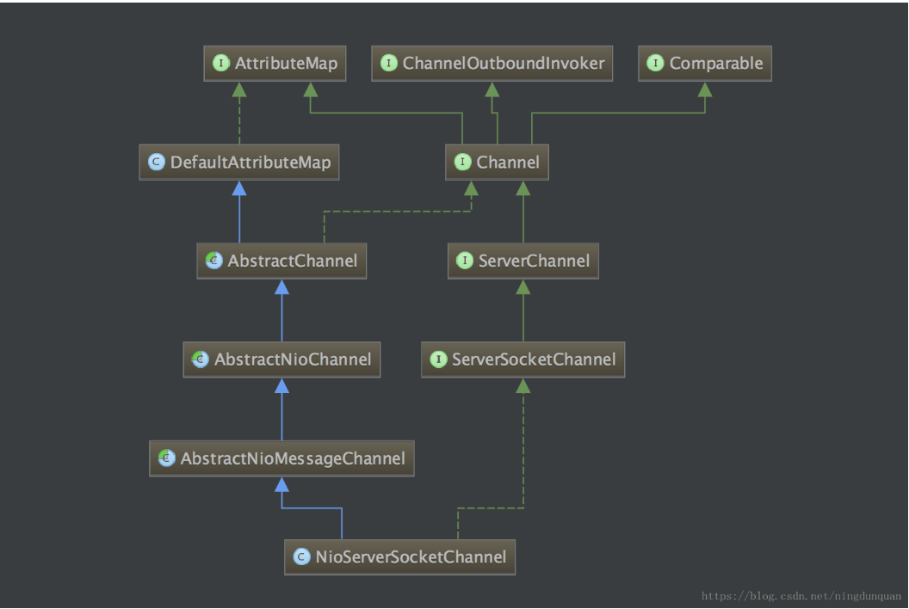

实例化NioServerSocketChannel也分为几个阶段，NioServerSocketChannel对象的创建是从NioServerSocketChannel一层一层调用父类的构造方法创建的，一直到AbstractChannel的构造方法创建完成。

通过jdk的nio原生方法生成ServerSocketChannel对象（最后监听端口就是通过这个对象监听的），绑定到NioServerSocketChannel上，设置ServerSocketChannel为非阻塞方式

调用newUnsafe()方法生成一个Unsafe对象，这里的Unsafe对象是在AbstractNioMessageChannel类中生成的，所以是一个NioMessageUnsafe的实例，不同的Unsafe子类完成的工作不同，NioMessageUnsafe负责处理accept事件。

调用newChannelPipeline()方法生成一个DefaultChannelPipeline对象，DefaultChannelPipeline中默认有head和tail两个节点的ChannelHandler，后续再加ChannelHandler都是在这条链上。

经过这几步操作，完成了NioServerSocketChannel的实例化过程，接下来就是channel的init了。

init channel也分了几步

获取设置在bootstrap上的options和attrs，将其注入到channel中

获取设置在bootstrap上的ChannelHandler，将其加入到channel的ChannelPipeline的处理链上，这样server channel上的任何事件都会经过这个ChannelHandler处理

最后生成一个ServerBootstrapAcceptor对象，这同样是一个ChannelHandler，将其也加入到channel的ChannelPipeline的处理链上ServerBootstrapAcceptor的作用是：监听到accept事件，生成NioSocketChannel对象，然后将这个对象注册到worker reactor上，让worker reactor负责这条连接的读写。

客户端的bootstrap并没有最后一步生成ServerBootstrapAcceptor的过程，因为客户端不需要监听端口，只需要处理一条连接的读写，这是netty服务端和客户端启动初始化的区别。

netty启动init阶段初始化了一些基本的配置和属性，以及在pipeline上加入了一个接入器，用来专门接受新连接。

而在nio层面，完成了创建一个ServerSocketChannel对象和设置io模式为非阻塞这两步操作。

## 3.2 register注册

完成了启动初始化工作之后，接下来netty要开始register注册了，register主要是注册channel。

在流程上，从initAndRegister方法出发，调用路径如下：

AbstractBootstrap.initAndRegister() —> EventLoopGroup.register(channel) —> EventLoop.register(channel) —> AbstractUnsafe.register(this, promise) —> AbstractNioUnsafe.doRegister()

到了AbstractNioUnsafe的doRegister方法，netty基本上只做了一件事，jdk原生的serverChannel向selector注册感兴趣的事件

selectionKey = javaChannel().register(eventLoop().selector, 0, this);
只是这里注册的opts是0，表示此channel不关注任何类型的事件。（言外之意，register方法只是获取一个selectionKey，具体这个Channel对何种事件感兴趣，可以在稍后操作）

所以真正注册对accept是在后面。

## 3.3 bind绑定

完成了启动的初始化和假注册之后，netty需要真正绑定端口监听了。bind过程主要就是完成真正注册关注accept事件，bind端口完成启动工作。

bind的流程调用有两条路径，通过eventLoop异步执行task，流程如下：

AbstractChannel.bind(localAddress, promise) —> DefaultChannelPipeline.bind(localAddress, promise) —> tail.bind(localAddress, promise) —> head.bind(this, localAddress, promise) —> AbstractUnsafe.bind(localAddress, promise) —> NioServerSocketChannel.doBind(localAddress)

AbstractChannel.bind(localAddress, promise) —> DefaultChannelPipeline.fireChannelActive() —> head.invokeChannelActive() —> head.readIfIsAutoRead() —> AbstractChannel.read() —> DefaultChannelPipeline.read() —> tail.read() —> head.read() —> AbstractUnsafe.beginRead() —> AbstractNioUnsafe.doBeginRead()

第一条路径是执行绑定操作，监听你设置的端口号。最后执行到NioServerSocketChannel的doBind方法，调用jdk的ServerSocketChannel执行bind操作：javaChannel().bind(localAddress, config.getBacklog());

而第二条路径是完成真正关注accept事件，先获取在register阶段获得的selectionKey，然后真正注册对accept事件感兴趣，这样channel就可以接收所有连接请求了，boss reactor将这些请求都通过ServerBootstrapAcceptor连接器处理，把这些请求注册给worker reactor，让worker reactor负责这条连接的读写。

~~~java
protected void doBeginRead() throws Exception {
    // Channel.read() or ChannelHandlerContext.read() was called
    final SelectionKey selectionKey = this.selectionKey;
    if (!selectionKey.isValid()) {
        return;
    }

```
readPending = true;
 
final int interestOps = selectionKey.interestOps();
if ((interestOps & readInterestOp) == 0) {
    // 真正注册对accept事件感兴趣
    selectionKey.interestOps(interestOps | readInterestOp);
}
```

}
~~~

最后，netty客户端的启动过程跟服务端启动流程相似，客户端的是init、register和connect，而且客户端的启动比服务端简单，感兴趣可以自行关注。

## 四、Netty的Reactor

了解完netty如何启动的，接下来看看netty的reactor模型。

Reactor是一种广泛应用在服务器端开发的设计模式，被称之为反应器。实际上在nio中selector使用的就是Reactor模式，由一个不断等待和循环的单独进程（线程）来做这件事，它接受所有handler的注册，并负责先操作系统查询IO是否就绪，在就绪后就调用指定handler进行处理，这个角色的名字就叫做Reactor。

reactor模型：

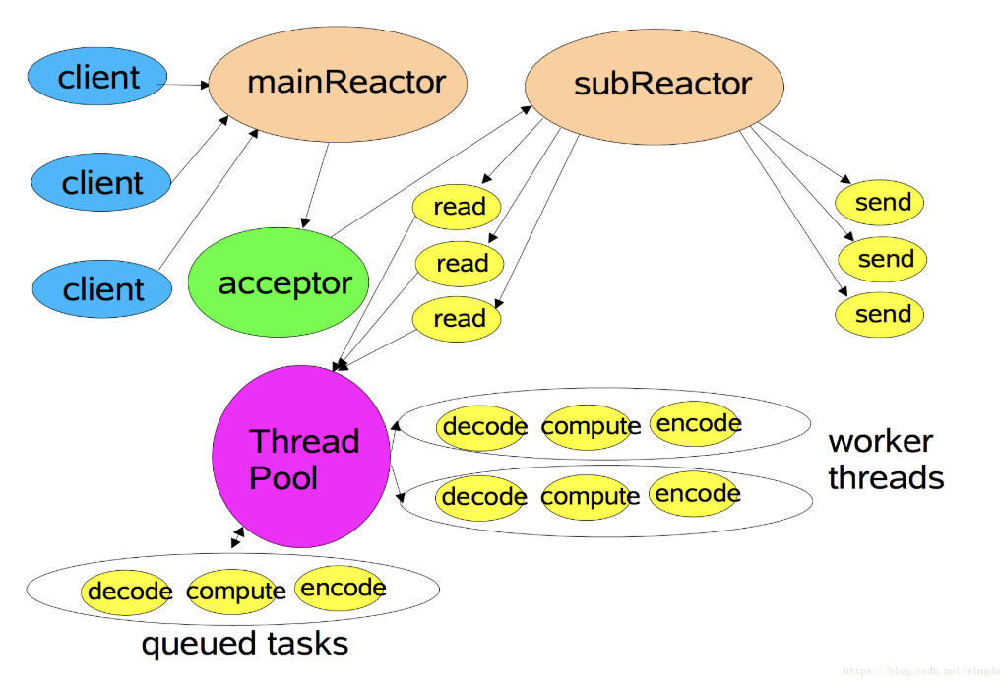

这是一个典型的主从Reactor多线程模型，mainReactor只有一个，所以只有一个selector来接收建立连接的请求，然后把请求交给acceptor处理，acceptor把这些请求注册给subReactor，subReactor是一组，采用多个selector处理连接的读写操作，把处理过程交给线程池异步执行。

### 4.1 NioEventLoop模型

需要注意的是，这个模型已经很像Netty的Reactor模型，但是依然不是Netty的真实模型，Netty并没有使用线程池异步处理请求，而且在每个subReactor中串行的处理请求。

netty的reactor模型：


或模型2：

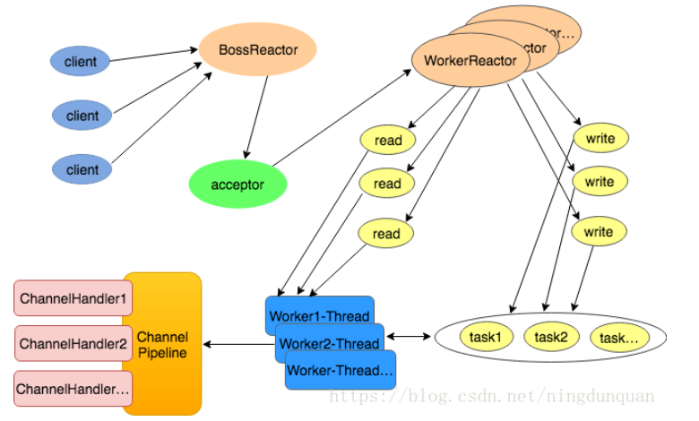

在netty中，boss reactor一般只有一个，负责响应client的连接请求，并建立连接，它使用一个NioEventLoop；subReactor可以有一个或者多个，每个subReactor都会在一个独立线程中执行，并且维护一个独立的NioEventLoop。

reactor就是事件循环器EventLoop，EventLoop就是reactor。我们常用的是NioEventLoop。（个人认为）EventLoop是netty设计最为精巧的组件，也是netty最核心的组件。

一般开发过程中把reactor分为boss reactor和worker reactor，boss reactor一般只有一个，worker reactor一般是 cpu的核数 * 2个。boss和worker这只是人为划分，并不代表boss reactor和worker reactor是两个类实例的对象。实际上，boss reactor和worker reacto对应的类都是NioEventLoop，所有流程都是一样的，只是NioEventLoop对应的channel不同，使得boss reactor处理accept事件，将新连接封装成channel对象扔给worker reactor，worker reactor处理连接的读写事件。

NioEventLoop在netty4.0之前分别被称为NioServerBoss和NioWorker。

NioEventLoop的类层次结构：

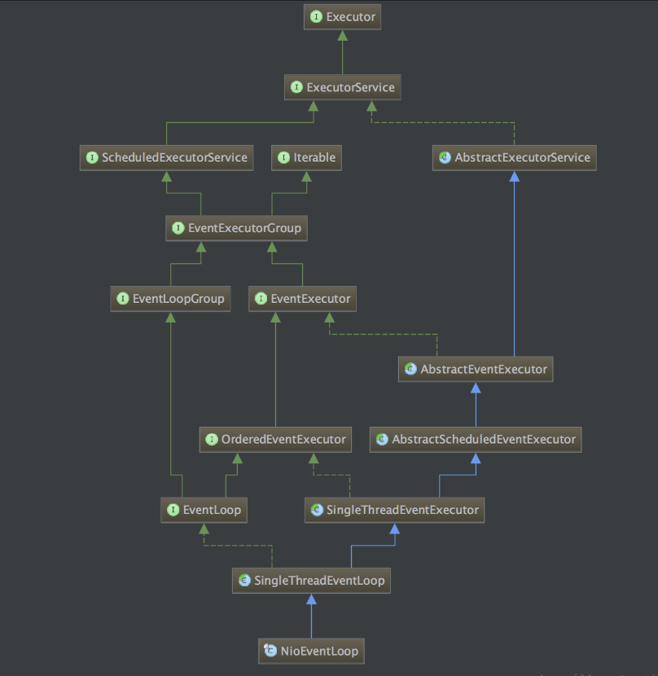

NioEventLoop 继承于 SingleThreadEventLoop, 而 SingleThreadEventLoop 又继承于 SingleThreadEventExecutor. SingleThreadEventExecutor 是 Netty 中对本地线程的抽象, 它内部有一个 Thread thread 属性, 存储了一个本地 Java 线程。从名字来看，NioEventLoop是一个单线程的，所以，一个 NioEventLoop 其实和一个特定的线程绑定, 并且在其生命周期内, 绑定的线程都不会再改变。

而NioEventLoop在顶层也实现了ExecutorService接口，表示可以向NioEventLoop提交task，由NioEventLoop进行调度执行。实际上，NioEventLoop维护了一个任务队列，可以执行一些定时任务和优先级任务。NioEventLoop 肩负着两种任务, 第一个是作为 IO 线程, 执行与 Channel 相关的 IO 操作, 包括 调用 select 等待就绪的 IO 事件、读写数据与数据的处理等; 而第二个任务是作为任务队列, 执行 taskQueue 中的任务, 例如用户调用 eventLoop.schedule 提交的定时任务也是这个线程执行的。并且，netty的write操作也是通过task来实现的，这就是NioEventLoop设计精巧之处。

NioEventLoop是一个单线程的无限循环，启动时首先会判断是否在循环中，如果在，就直接向NioEventLoop的taskQueue添加task；如果不在，则先启动线程，开始循环，然后向taskQueue添加task。

```java
public void execute(Runnable task) {
        if (task == null) {
            throw new NullPointerException("task");
        }
 
        boolean inEventLoop = inEventLoop();
  			// 判断是否在循环中
        if (inEventLoop) {
          // 直接提交task
            addTask(task);
        } else {
          // 先启动线程，开始循环
            startThread();
            addTask(task);
            if (isShutdown() && removeTask(task)) {
                reject();
            }
        }
 
        if (!addTaskWakesUp && wakesUpForTask(task)) {
            wakeup(inEventLoop);
        }
    }
```

启动线程其实就是在单线程中执行NioEventLoop的run方法，run方法就是一个无限循环


```java
        protected void run() {
        for (;;) {
            try {
              // 第一步，轮询io事件
                switch (selectStrategy.calculateStrategy(selectNowSupplier, hasTasks())) {
                    case SelectStrategy.CONTINUE:
                        continue;
                    case SelectStrategy.SELECT:
                        select(wakenUp.getAndSet(false));
                        if (wakenUp.get()) {
                            selector.wakeup();
                        }
                    default:
                        // fallthrough
                }
        cancelledKeys = 0;
            needsToSelectAgain = false;
            final int ioRatio = this.ioRatio;
            if (ioRatio == 100) {
                try {
                  // 第二步，处理io事件
                    processSelectedKeys();
                } finally {
                    // 第三步，处理taskQueue中的任务
                    runAllTasks();
                }
            } else {
                final long ioStartTime = System.nanoTime();
                try {
                    processSelectedKeys();
                } finally {
                    // Ensure we always run tasks.
                    final long ioTime = System.nanoTime() - ioStartTime;
                    runAllTasks(ioTime * (100 - ioRatio) / ioRatio);
                }
            }
        } catch (Throwable t) {
            handleLoopException(t);
        }
        // Always handle shutdown even if the loop processing threw an exception.
        try {
            if (isShuttingDown()) {
                closeAll();
                if (confirmShutdown()) {
                    return;
                }
            }
        } catch (Throwable t) {
            handleLoopException(t);
        }
    }
}
```
run方法中的代码看起来复杂，但其实主要的就只有三步：

select操作：轮询注册到reactor线程对应的selector上的所有channel的IO事件

processSelectedKeys操作：处理轮询到的IO事件

runAllTasks操作：处理任务队列的task

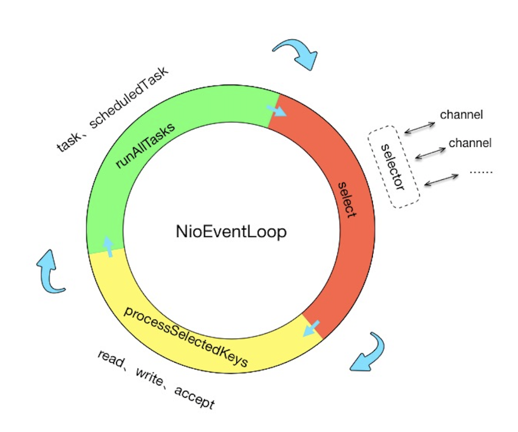

### 4.2 轮询IO事件

```java
select(wakenUp.getAndSet(false));
if (wakenUp.get()) {
      selector.wakeup();
}
```

在进行select操作过程中，wakenUp 表示是否应该唤醒正在阻塞的select操作，可以看到netty在进行一次新的loop之前，都会将wakeUp 被设置成false，标志新的一轮loop的开始。

其实轮询IO事件在jdk中很简单，就是selector.selectNow()或selector.select(timeout)方法，但是netty处理得非常麻烦，主要是因为netty需要处理任务队列中的任务和“丧心病狂”的性能优化。

因此，结束当前loop的轮询的条件有：

定时任务截止事时间快到了，中断本次轮询

轮询过程中发现有任务加入，中断本次轮询

timeout时间内select到IO事件（select会阻塞，但是外部线程在execute任务会调用wakeup方法唤醒selector的阻塞）

用户主动唤醒（直接调用wakeup方法）

此外，netty还解决了jdk的一个nio bug，该bug会导致Selector一直空轮询，最终导致cpu 100%，nio server不可用。netty使用rebuildSelector来fix空轮询bug。

netty 会在每次进行 selector.select(timeoutMillis) 之前记录一下开始时间currentTimeNanos，在select之后记录一下结束时间，判断select操作是否至少持续了timeoutMillis秒，如果持续的时间大于等于timeoutMillis，说明就是一次有效的轮询，重置selectCnt标志，否则，表明该阻塞方法并没有阻塞这么长时间，可能触发了jdk的空轮询bug，当空轮询的次数超过一个阀值的时候，默认是512，就开始重建selector。

### 4.3 处理轮询到的IO事件

处理IO事件的主体代码如下：


```java
       private void processSelectedKeysOptimized(SelectionKey[] selectedKeys) {
        for (int i = 0;; i ++) {
          // 取出轮询到的SelectionKey
            final SelectionKey k = selectedKeys[i];
            if (k == null) {
                break;
            }
            // null out entry in the array to allow to have it GC'ed once the Channel close
          // 可以立即gc回收对象
            selectedKeys[i] = null;
       final Object a = k.attachment();
					// attachment取出来的值AbstractNioChannel是对象，然后处理channel
        if (a instanceof AbstractNioChannel) {
            processSelectedKey(k, (AbstractNioChannel) a);
        } else {
            NioTask<SelectableChannel> task = (NioTask<SelectableChannel>) a;
            processSelectedKey(k, task);
        }
					// 判断是否需要再次轮询
        if (needsToSelectAgain) {
            for (;;) {
                i++;
                if (selectedKeys[i] == null) {
                    break;
                }
                selectedKeys[i] = null;
            }
 
            selectAgain();
            
            selectedKeys = this.selectedKeys.flip();
            i = -1;
        }
    }
}
```
从上面方法的名字就可以看出来，这是一个被优化过的处理轮询的方法。this.selectedKeys是一个set，与selector绑定，selector在调用select()族方法的时候，如果有IO事件发生，就会往this.selectedKeys中塞相应的selectionKey。而selectedKeys内部维护了两个SelectionKey[]数组，重写了set的add方法，在add的时候实际上是往数组里面塞SelectionKey。而在遍历时只用遍历数组而不是遍历set，可见netty对性能的极致优化。

处理轮询到的IO事件也主要是三步：

取出轮询到的SelectionKey

取出与客户端交互的channel对象，处理channel

判断是否需要再次轮询

第一步上面已经说了，this.selectedKeys与selector绑定，如果有IO事件发生，就会往this.selectedKeys中塞相应的selectionKey。然后遍历selectedKeys，取出轮询到的SelectionKey。

第二步取出selectionKey中的attachment对象，这里attachment一般是AbstractNioChannel对象，AbstractNioChannel对象代表每一条连接，拿到这个对象就可以获取每条连接的所有信息了。然后来看看selectionKey是在哪里设置这个对象。

在AbstractNioChannel中有一个doRegister方法，这里将jdk的channel注册到selector上去，并且将自身设置到attachment上。这样再jdk轮询出某条SelectableChannel有IO事件发生时，就可以直接取出AbstractNioChannel了。

```java
selectionKey = javaChannel().register(eventLoop().selector, 0, this);
```

第二步最重要的就是处理channel，也就是真正到了处理轮询到的IO事件了，主体代码如下：


```java
    private void processSelectedKey(SelectionKey k, AbstractNioChannel ch) {
        final AbstractNioChannel.NioUnsafe unsafe = ch.unsafe();
        // 先去掉一些无关代码
  			// ……
    try {
        int readyOps = k.readyOps();
        // 首先完成连接操作
        if ((readyOps & SelectionKey.OP_CONNECT) != 0) {
            int ops = k.interestOps();
            ops &= ~SelectionKey.OP_CONNECT;
            k.interestOps(ops);
 
            unsafe.finishConnect();
        }
 
        // 处理write事件的flush
        if ((readyOps & SelectionKey.OP_WRITE) != 0) {
            // Call forceFlush which will also take care of clear the OP_WRITE once there is nothing left to write
            ch.unsafe().forceFlush();
        }
 
        // 处理读和新连接的accept事件
        if ((readyOps & (SelectionKey.OP_READ | SelectionKey.OP_ACCEPT)) != 0 || readyOps == 0) {
            unsafe.read();
            if (!ch.isOpen()) {
                // Connection already closed - no need to handle write.
                return;
            }
        }
    } catch (CancelledKeyException ignored) {
        unsafe.close(unsafe.voidPromise());
    }
}
```
从这里也可以看出来netty所有关于IO操作都是通过内部的Unsafe来实现的。

processSelectedKey是一个很复杂的过程，简单讲解一下，也分成三步

首先在读写之前都要先调用finishConnect，来确保与客户端连接上。这个过程最终会传递给channelHandler的channelActive方法，因此可以通过channelActive来验证有多少客户端在线。

接下来是处理write事件的flush，注意，我们的write不是在这里做的，真正的write一般是封装成task去执行的。

第三步是处理读和新连接的accept事件。netty将新连接的accept也当做一次read。对于boss NioEventLoop来说，新连接的accept事件在read的时候通过他的pipeline将连接扔给一个worker NioEventLoop处理；而worker NioEventLoop处理读事件，是通过他的pipeline将读取到的字节流传递给每个channelHandler来处理。

接下来是判断是否再次轮询，是根据needsToSelectAgain来判断的，当needsToSelectAgain为true，表示需要再次轮询。那么最重要的是看needsToSelectAgain什么时候为true。在NioEventLoop类中，只有在cancel方法中将needsToSelectAgain设置为true。而在AbstractNioChannel的doDeregister调用了eventLoop的cancel方法。

```java
protected void doDeregister() throws Exception {
        eventLoop().cancel(selectionKey());
    }
```

这个方法是在channel从selector上移除的时候，调用cancel函数将key取消，并且当被去掉的key到达 CLEANUP_INTERVAL = 256 的时候，设置needsToSelectAgain为true。

即netty每隔256次channel断线，重新清理一下selectionKey，保证现存的SelectionKey及时有效。

总结一下处理轮询到的IO事件的过程就是：

netty使用数组替换掉jdk原生的HashSet来保证IO事件的高效处理，每个SelectionKey上绑定了netty类AbstractChannel对象作为attachment，在处理每个SelectionKey的时候，就可以找到AbstractChannel，然后通过pipeline的方式将处理串行到ChannelHandler，回调到用户channelHandler的方法。

### 4.4 处理任务队列的task

NioEventLoop三步曲的最后一步了，处理任务队列的task，按照惯例，先把代码的主流程贴出来。

       protected boolean runAllTasks(long timeoutNanos) {
            fetchFromScheduledTaskQueue();
            Runnable task = pollTask();
            if (task == null) {
                afterRunningAllTasks();
                return false;
            }
       final long deadline = ScheduledFutureTask.nanoTime() + timeoutNanos;
        long runTasks = 0;
        long lastExecutionTime;
        for (;;) {
            safeExecute(task);
     
            runTasks ++;
     
            if ((runTasks & 0x3F) == 0) {
                lastExecutionTime = ScheduledFutureTask.nanoTime();
                if (lastExecutionTime >= deadline) {
                    break;
                }
            }
     
            task = pollTask();
            if (task == null) {
                lastExecutionTime = ScheduledFutureTask.nanoTime();
                break;
            }
        }
     
        afterRunningAllTasks();
        this.lastExecutionTime = lastExecutionTime;
        return true;
    }
这个方法就是尽量在timeoutNanos时间内，将所有的任务都取出来run一遍。

而这个时间是怎么定的呢？

```java
final long ioStartTime = System.nanoTime();
try {
  processSelectedKeys();
} finally {
  // Ensure we always run tasks.
  final long ioTime = System.nanoTime() - ioStartTime;
  runAllTasks(ioTime * (100 - ioRatio) / ioRatio);
}
```

processSelectedKeys是处理轮询到的IO事件，ioRatio设定的是50，那么ioTime * (100 - ioRatio) / ioRatio = ioTime * (100 - 50) / 50 = ioTime，netty是希望最多在等同于处理IO事件的时间去处理task任务，严格控制了内部队列的执行时间。

NioEventLoop执行task的过程，同样可以分成几步：

从scheduledTaskQueue转移定时任务到taskQueue

计算本次任务循环的截止时间

执行任务

执行完任务后的工作

从上面可以看到NioEventLoop中至少有两种队列，taskQueue和scheduledTaskQueue。

EventLoop是一个Executor，因此用户可以向EventLoop提交task。在execute方法中，当EventLoop处于循环中或启动了循环后都会通过addTask(task)向EventLoop提交任务。EventLoop内部使用一个taskQueue将task保存起来。

```
protected Queue<Runnable> newTaskQueue(int maxPendingTasks) {
   return new LinkedBlockingQueue<Runnable>(maxPendingTasks);
}
```

taskQueue是一个有界阻塞队列，在reactor线程内部用单线程来串行执行，最终真正执行的地方就是这个runAllTasks方法。

taskQueue最大的应用场景就是用户在channelHandler中获取到channel，然后通过channel.write()数据，这里会把write操作封装成一个WriteTask，然后通过eventLoop.execute(task)执行，实际上是给EventLoop提交了一个task，加入到taskQueue队列中

```java
private void write(Object msg, boolean flush, ChannelPromise promise) {
    AbstractChannelHandlerContext next = findContextOutbound();
    final Object m = pipeline.touch(msg, next);
  	// executor就是eventLoop
    EventExecutor executor = next.executor();
    if (executor.inEventLoop()) {
      if (flush) {
        next.invokeWriteAndFlush(m, promise);
      } else {
        next.invokeWrite(m, promise);
      }
    } else {
      // inEventLoop返回false，执行这里的操作
      AbstractWriteTask task;
      if (flush) {
        task = WriteAndFlushTask.newInstance(next, m, promise);
      }  else {
        task = WriteTask.newInstance(next, m, promise);
      }
      // 将write操作封装成WriteTask，然后像eventLoop提交task
      safeExecute(executor, task, promise, m);
    }
}
```

同时，EventLoop也是一个ScheduledExecutorService，这意味着用户可以通过ScheduledFuture<?> schedule(Runnable command, long delay, TimeUnit unit)方法向EventLoop提交定时任务。因此，EventLoop内部也维护了一个优先级队列scheduledTaskQueue来保存提交的定时任务。

知道了NioEventLoop内部的任务队列后，再来看执行task的过程。

第一步，是将到期的定时任务转移到taskQueue中，只有在当前定时任务的截止时间已经到了，才会取出来。

然后第二步计算本次任务循环的截止时间deadline。

第三步真正去执行任务，先执行task的run方法，然后将runTasks加一，每执行完64（0x3F）个任务，就判断当前时间是否超过deadline，如果超过，就break，如果没有超过，就继续执行。

需要注意的是，这里如果任务没执行完break掉了，afterRunningAllTasks后，NioEventLoop就会重新开始一轮新的循环，没完成的任务仍然在taskQueue中，等待runAllTasks的时候去执行。

最后一步是afterRunningAllTasks，执行完所有任务后需要进行收尾，相当于一个钩子方法，可以作统计用。
最后总结一下处理任务队列的task的过程就是：

eventLoop是一个Executor，可以调用execute给eventLoop提交任务，NioEventLoop会在runAllTasks执行。NioEventLoop内部分为普通任务和定时任务，在执行过程中，NioEventLoop会把过期的定时任务从scheduledTaskQueue转移到taskQueue中，然后执行taskQueue中的任务，同时每隔64个任务检查是否该退出任务循环。


## 五、Netty的PipeLine

EventLoop是一个无限循环，netty中几乎所有事件和任务都是在EventLoop中执行的。而这些事件或任务大多会通过netty的ChannelPipeLine在ChannelHandler链执行下去。

在创建Netty的Channel的构造函数中，都会创建一个ChannelPipeLine。

```java
protected AbstractChannel(Channel parent) {
    this.parent = parent;
    id = newId();
    unsafe = newUnsafe();
    pipeline = newChannelPipeline();
}
```

AbstractChannel 有一个 pipeline 字段, 在构造器中会初始化它为 DefaultChannelPipeline的实例。而AbstractChannel是NioSocketChannel和NioServerSocketChannel的父类，因此，netty每一个channel都有一个ChannelPipeLine对象。也就是每条连接都会有一个ChannelPipeLine对象，ChannelPipeLine的通道处理每条连接IO事件的操作。

### 5.1 PipeLine模型

在channel中创建的ChannelPipeLine都是DefaultChannelPipeline，会把channel自身当做参数传给DefaultChannelPipeline，让DefaultChannelPipeline同样持有channel对象。

~~~java
protected DefaultChannelPipeline(Channel channel) {
    this.channel = ObjectUtil.checkNotNull(channel, "channel");
    succeededFuture = new SucceededChannelFuture(channel, null);
    voidPromise =  new VoidChannelPromise(channel, true);

```
tail = new TailContext(this);
head = new HeadContext(this);
 
head.next = tail;
tail.prev = head;
```

}
~~~

从DefaultChannelPipeline的构造方法中，可以看到有两个ChannelHandlerContext对象，head和tail，head和tail是ChannelHandler链的头尾两个节点，head是HeadContext的实例，tail是TailContext的实例。head是tail有一些不同，head同时是ChannelInboundHandler和ChannelOutboundHandler，而tail只是一个ChannelInboundHandler，这意味着channel的读写都会通过head，而只有读会通过tail。同时，head中持有channel的unsafe对象，表面head是与IO操作最密切相关的。

ChannelHandlerContext节点中包裹了执行器ChannelHandler以及ChannelPipeLine自身。ChannelHandlerContext节点是一个双向链表，含有prev和next节点，这就组成了一个ChannelHandler链。ChannelPipeLine的模型如下：

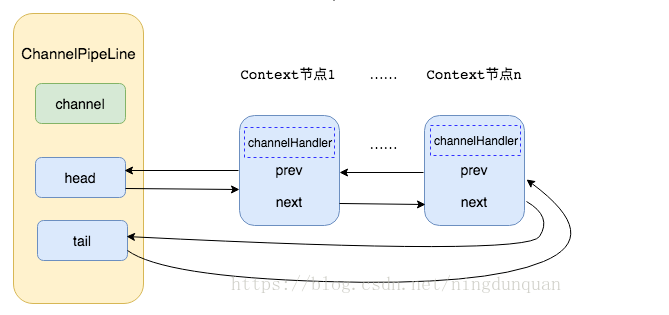

最原始的ChannelPipeLine的ChannelHandler链只有head和tail两个节点，通过ChannelPipeLine的addLast和addFirst方法添加channelHandler。


```java
 public final ChannelPipeline addLast(EventExecutorGroup group, String name, ChannelHandler handler) {
    final AbstractChannelHandlerContext newCtx;
    synchronized (this) {
      // 检查是否有重复的handler
      checkMultiplicity(handler);
			// 创建ChannelHandlerContext节点
      newCtx = newContext(group, filterName(name, handler), handler);
			// 添加节点到链表中
      addLast0(newCtx);
 if (!registered) {
    newCtx.setAddPending();
    callHandlerCallbackLater(newCtx, true);
    return this;
  }
 
  EventExecutor executor = newCtx.executor();
  if (!executor.inEventLoop()) {
    newCtx.setAddPending();
    executor.execute(new Runnable() {
      @Override
      public void run() {
        // 回调用户方法
        callHandlerAdded0(newCtx);
      }
    });
    return this;
  }
}
callHandlerAdded0(newCtx);
return this;
     }
```

添加channelHandler链节点的操作也分为四步：

检查pipeline中是否有重复的channelHandler

基于此channelHandler创建一个ChannelHandlerContext节点

将节点添加到链表中

添加成功后回调用户handlerAdded方法

前面两步都比较简单，第三步添加节点到链表中就是一个很常规的双向链表的插入操作，添加过程如图：

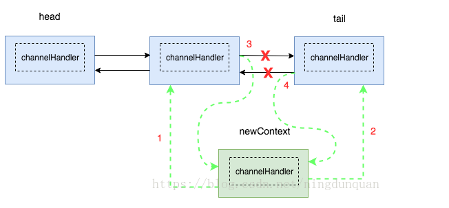

插入成功后的结果：

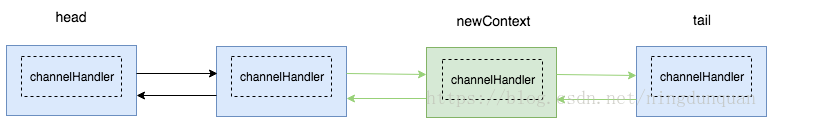

删除与插入差不多，都是对双向链表的操作。

最后一步是回调用户的handlerAdded方法，即回调此handler的handlerAdded，这样channelHandler可以及时感知何时被添加到channelPipeLine中，是一个设计得很好的地方。

### 5.2 PipeLine的责任链

讲完ChannelPipeLine的结构和模型，接下来具体来看看PipeLine的这条ChannelHandler链。

下图是netty的官方文档ChannelPipeLine的图


可以看出netty将ChannelHandler分为两种类型，InboundHandler和OutboundHandler，分别对应着两种类型的节点。InboundHandler处理inBound事件，最典型的就是读取数据流，OutboundHandler处理outBound事件，处理写数据流。InboundHandler是从head流向tail，OutboundHandler是从tail流向head。上面已经知道head节点既是InboundHandler也是OutboundHandler，所以读写都会通过head节点。而read正好是最开始读数据出来再做处理，write正好是最后处理完才写出去，所以不管是read还是write都是最后与IO交互的都是head节点，因此head节点中持有unsafe对象，将所有IO的操作都委托给Unsafe执行。

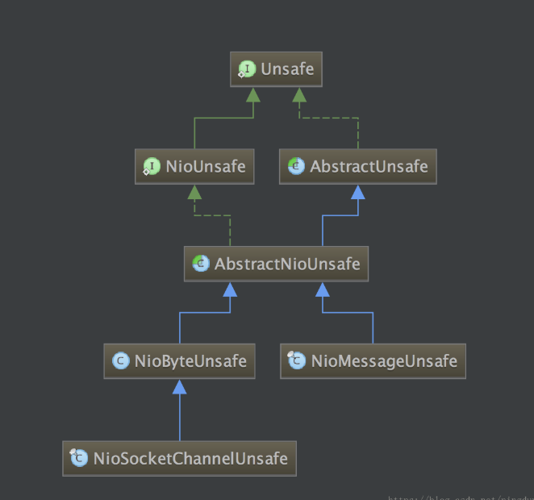

这是nio相关的Unsafe类继承关系，Unsafe 都是属于Channel的内部类，NioMessageUnsafe是NioServerSocketChannel相关的Unsafe类，NioByteUnsafe是NioSocketChannel相关的Unsafe类，分别对应着处理新连接accept相关的操作和每条连接读写相关的操作。

再来看看很常见的一条Pipeline的ChannelHandler链，分为InboundHandler和OutboundHandler，如图

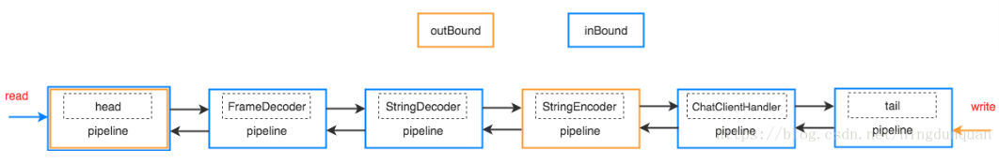

read事件的时候，ChannelHandler链只会依次通过head、FrameDecoder、StringDecoder、ChatClientHandler、tail这些节点，而write时，ChannelHandler链只会依次通过StringEncoder、head这两个节点。

## 六、Netty如何处理事件

讲完EventLoop和ChannelPipeLine，接下来看看netty具体是如何处理事件，把EventLoop和ChannelPipeLine关联上的。

netty处理accept、read、write事件的过程各不相同

boss reactor的selector轮询到accept事件，然后调用NioMessageUnsafe的read方法，通过ServerSocketChannel的accept方法获取到一个SocketChannel，然后NioMessageUnsafe调用ChannelPipeLine串行执行channelHandler的channelRead方法，在ServerBootstrapAcceptor将NioSocketChannel注册到worker reactor中的selector上去，让worker reactor负责这个channel的读写。

worker reactor的selector轮询到read事件，然后调用NioByteUnsafe的read方法，调用pipeline.fireChannelRead(byteBuf)方法，通过worker reactor的ChannelPipeLine串行执行channelHandler的channelRead方法。

write操作跟accept事件和read事件不太一样，write操作一般是用户通过channel.write调用的。channel.write实际上也是调用pipeline.write(msg)方法，一般情况下netty将write操作封装成一个WriteTask任务，提交给EventLoop，EventLoop在runAllTasks方法中执行这个task。在WriteTask的run方法中，netty执行ChannelPipeLine的outBound channelHandler链，依次执行handler的write方法，最后通过head的write方法委托给unsafe.write(msg, promise)方法把数据写给socket缓冲区。

6.1 netty处理连接事件

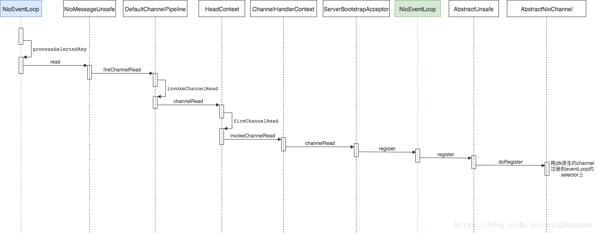


第一个NioEventLoop是boss reactor，第二个NioEventLoop是worker reactor。boss reactor的selector轮询到accept事件，调用processSelectedKeys处理accept事件，然后调用NioMessageUnsafe的read方法，通过ServerSocketChannel的accept方法获取到一个SocketChannel，然后NioMessageUnsafe调用ChannelPipeLine串行执行channelHandler的channelRead方法，在ServerBootstrapAcceptor中调用NioEventLoop的register方法，最后调用AbstractNioChannel的doRegister方法，将NioSocketChannel注册到worker reactor中的selector上去，让worker reactor负责这个channel的读写。

6.2 netty处理read事件

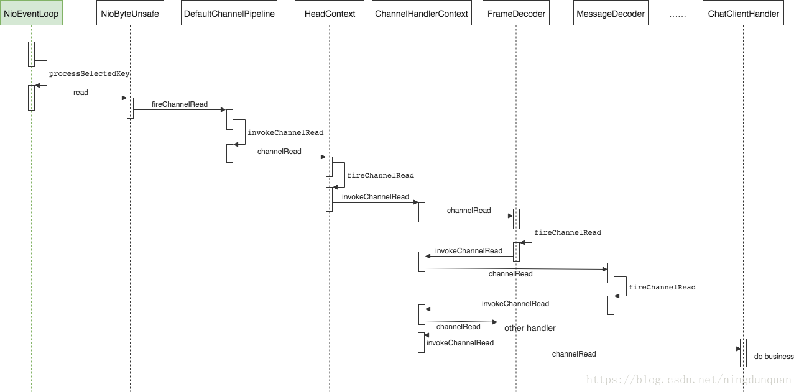


worker reactor的selector轮询到read事件，然后调用NioByteUnsafe的read方法，调用pipeline.fireChannelRead(byteBuf)方法，通过worker reactor的ChannelPipeLine串行执行channelHandler的channelRead方法。

6.3 netty处理write操作

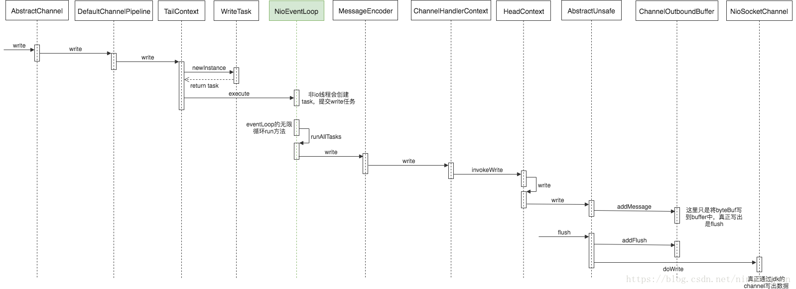

write操作跟accept事件和read事件不太一样，write操作一般是用户主动通过channel.write调用的，这就意味着write操作可能在EventLoop的循环IO线程中（直接在channelHandler执行write操作），也可能在用户自定义线程中执行。当然大部分请求下都是在用户线程执行，因为我们的IO线程的所有操作都是串行执行的，如果放在IO线程，会阻塞IO线程，影响netty的性能。

channel.write实际上也是调用pipeline.write(msg)方法，然后netty将write操作封装成一个WriteTask任务，提交给EventLoop，EventLoop在runAllTasks方法中执行这个task。在WriteTask的run方法中，netty执行ChannelPipeLine的outBound的channelHandler链，依次执行handler的write方法，最后造head的write方法中，委托给unsafe.write(msg, promise)方法把数据写到netty自定义的ChannelOutboundBuffer缓冲区中（DirectByteBuf，在堆之外直接分配内存，直接缓冲区不会占用堆的容量，可以实现零拷贝），最后调用flush方法，才真正执行doWrite操作，调用NioSocketChannel通过jdk的channel写出数据流。


七、Netty其他相关
7.1 netty的byteBuf
Netty 使用自建的 buffer API，而不是使用 NIO 的 ByteBuffer 来表示一个连续的字节序列。与 ByteBuffer 相比这种方式拥有明显的优势。 

netty中ByteBuf的缓冲区的优势： 

需要的话，可以自定义buffer类型；

通过组合buffer类型，可实现透明的零拷贝；

提供动态的buffer类型，如StringBuffer一样，容量是按需扩展；

无需调用flip()方法；

通常比ByteBuffer快。

Netty的zero-copy则是完全在用户态，Netty通过ByteBuf.slice以及Unpooled.wrappedBuffer等方法拆分、合并Buffer无需拷贝数据。

堆内存和直接内存

1) 堆内存字节缓冲区（HeapByteBuf）

内存的分配和回收速度快，可以被JVM自动回收，缺点是如果进行socket的I/O读写，需要额外做一次内存复制，将堆内存对应的字节缓冲区复制到内核Channel中，性能会有一定的下降。

2) 直接内存字节缓冲区（DirectByteBuf）

非堆内存，它在堆外进行内存分配，相比于堆内存，它的分配和回收速度会慢一些，但是将他写入或者从SocketChannel中读取出是，由于少了一次内存复制，速度比堆内存快。

netty写数据用的ChannelOutboundBuffer就是直接内存缓冲区，这样在写入socket缓冲区的时候少了一次内存复制，速度更快；在读数据时，netty使用的PooledUnsafeDirectByteBuf也是直接内存缓冲区，同样减少内存复制，速度更快。

7.2 粘包、拆包
粘包和拆包是TCP协议中两个很常见的问题。

在用户数据量非常小的情况下，如果TCP数据包每次只有一个字节，该TCP数据包的有效载荷非常低，传递x字节的数据，需要x次TCP传送，x次ACK，在应用及时性要求不高的情况下，TCP设计了Nagle算法，将多次间隔较小、数据量小的数据，合并成一个大的数据块，然后进行封包。这样只会传输一次，返回一个ACK。
拆包和粘包是相对的，一端粘了包，另外一端就需要将粘过的包拆开。另外，用户数据包超过了mss(最大报文长度)，那么这个数据包在发送的时候必须拆分成几个数据包，接收端收到之后需要将这些数据包粘合起来之后，再拆开。

需要拆包的根本原因是：TCP是基于字节流的传输协议，每次报文传输的长度有效，而应用层需要区分不同的数据单元（例如每次完整的请求都是一个数据单元，每个请求的数据可能会分成几个数据报文传输，也可能与其他请求单元合并在一个数据报文传输。而server的应用层必须区分开这些请求数据单元）

基于这个原因，可以设想出拆包的基本原理：

在应用层，如果当前读取的数据不足以拼接成一个完整的业务数据单元，那就保留该数据，继续从tcp缓冲区中读取，直到得到一个完整的数据单元；

如果当前读到的数据加上已经读取的数据足够拼接成一个数据单元，那就将已经读取的数据拼接上本次读取的数据，形成一个完整的数据单元，然后将这个数据单元传递到业务逻辑（即其后的channelHandler）；

如果组成完整的数据单元后还有多余的数据，则将数据仍然保留，下次读到的数据尝试拼接。

netty 中的拆包就是这个原理，内部会有一个累加器，每次读取到数据都会不断累加，然后尝试对累加到的数据进行拆包，拆成一个完整的业务数据单元，netty拆包的基类是ByteToMessageDecoder。


```java
   public void channelRead(ChannelHandlerContext ctx, Object msg) throws Exception {
    if (msg instanceof ByteBuf) {
      CodecOutputList out = CodecOutputList.newInstance();
      try {
        ByteBuf data = (ByteBuf) msg;
        first = cumulation == null;
        if (first) {
          cumulation = data;
        } else {
          cumulation = cumulator.cumulate(ctx.alloc(), cumulation, data);
        }
        callDecode(ctx, cumulation, out);
      } catch (DecoderException e) {
        throw e;
      } catch (Throwable t) {
        throw new DecoderException(t);
      } finally {
        if (cumulation != null && !cumulation.isReadable()) {
          numReads = 0;
          cumulation.release();
          cumulation = null;
        } else if (++ numReads >= discardAfterReads) {
          
   numReads = 0;
      discardSomeReadBytes();
    }
 
    int size = out.size();
    decodeWasNull = !out.insertSinceRecycled();
    fireChannelRead(ctx, out, size);
    out.recycle();
  }
} else {
  ctx.fireChannelRead(msg);
}
}
```

拆包过程分为四步：

累加数据

将累加到的数据传递给业务进行业务拆包

清理字节容器

传递业务数据包给业务解码器处理

用户需要自定义业务拆包可以选择继承ByteToMessageDecoder，实现decode，就可以按照自己的业务模型进行拆包了。