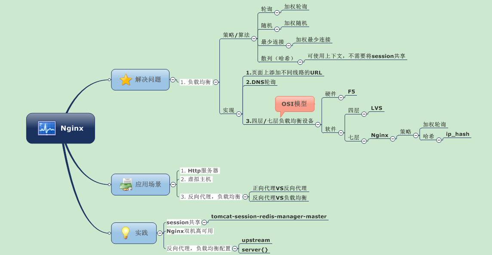
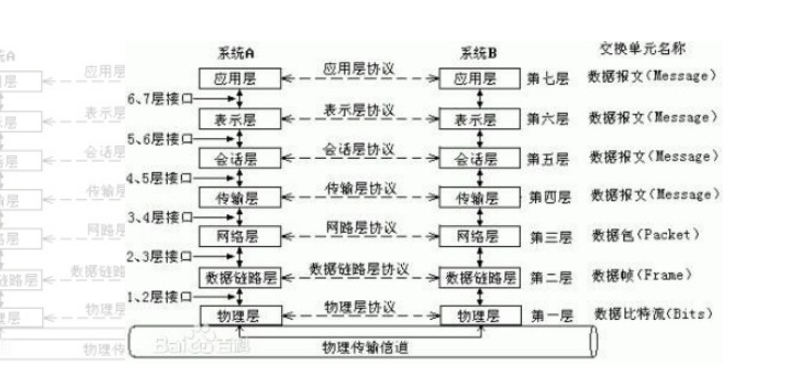
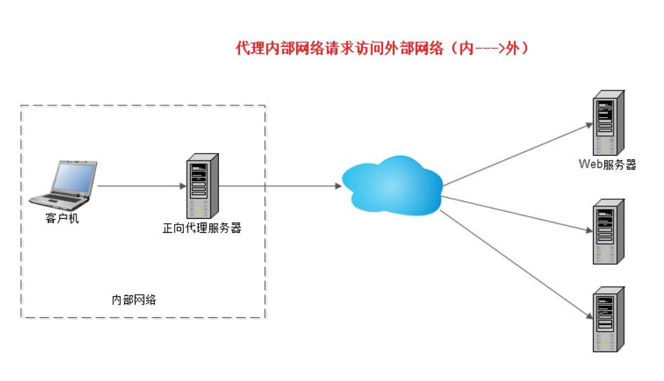
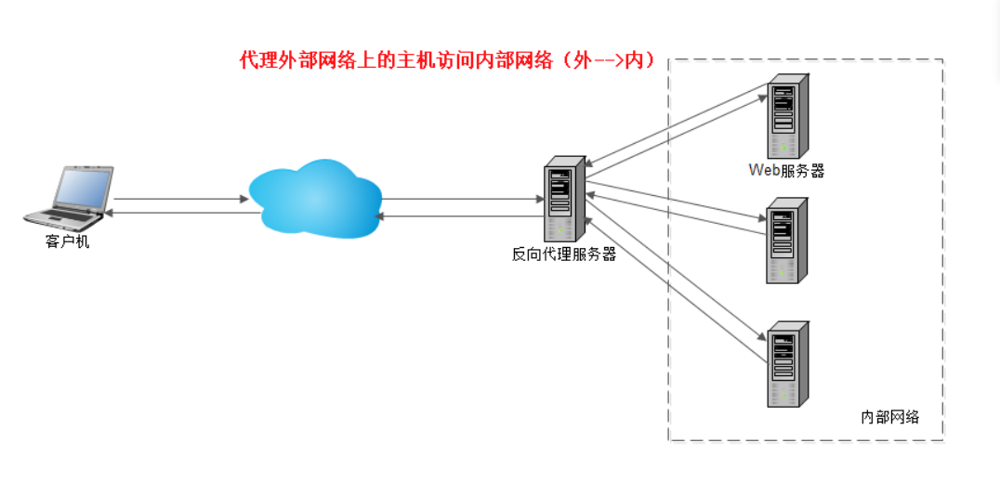

## 1、Nginx是如何处理一个请求的呢？

首先，nginx在启动时，会解析配置文件，得到需要监听的端口与ip地址，然后在nginx的master进程里面
先初始化好这个监控的socket，再进行listen
然后再fork出多个子进程出来,  子进程会竞争accept新的连接。
此时，客户端就可以向nginx发起连接了。当客户端与nginx进行三次握手，与nginx建立好一个连接后
此时，某一个子进程会accept成功，然后创建nginx对连接的封装，即ngx_connection_t结构体
接着，根据事件调用相应的事件处理模块，如http模块与客户端进行数据的交换。
最后，nginx或客户端来主动关掉连接，到此，一个连接就寿终正寝了

## 2.nginx是如何实现高并发的

一个主进程，多个工作进程，每个工作进程可以处理多个请求
每进来一个request，会有一个worker进程去处理。但不是全程的处理，处理到可能发生阻塞的地方，比如向上游（后端）服务器转发request，并等待请求返回。那么，这个处理的worker继续处理其他请求，而一旦上游服务器返回了，就会触发这个事件，worker才会来接手，这个request才会接着往下走。
由于web server的工作性质决定了每个request的大部份生命都是在网络传输中，实际上花费在server机器上的时间片不多。这是几个进程就解决高并发的秘密所在。即@skoo所说的webserver刚好属于网络io密集型应用，不算是计算密集型。

## nginx为什么不使用多线程？

Apache: 创建多个进程或线程，而每个进程或线程都会为其分配cpu和内存（线程要比进程小的多，所以worker支持比perfork高的并发），并发过大会榨干服务器资源。
Nginx: 采用单线程来异步非阻塞处理请求（管理员可以配置Nginx主进程的工作进程的数量）(epoll)，不会为每个请求分配cpu和内存资源，节省了大量资源，同时也减少了大量的CPU的上下文切换。所以才使得Nginx支持更高的并发。

## 为什么Nginx性能这么高？什么是epoll模型

异步非阻塞事件处理机制：运用了epoll（无需忙轮询和无差别轮询，会把那个流发生了什么事件直接告诉cpu）模型，提供了一个队列，排队解决。

## 请解释Nginx服务器上的Master和Worker进程分别是什么?

nginx在启动后，会有一个master进程和多个worker进程。
master进程主要用来管理worker进程，包含：接收来自外界的信号，向各worker进程发送信号，监控worker进程的运行状态，当worker进程异常退出后，，会自动重新启动新的worker进程。
而基本的网络事件，则是放在worker进程中来处理了。多个worker进程之间是对等的，他们同等竞争来自客户端的请求，各进程互相之间是独立的。一个请求，只可能在一个worker进程中处理，一个worker进程，不可能处理其它进程的请求。worker进程的个数是可以设置的，一般我们会设置与机器cpu核数一致，这里面的原因与nginx的进程模型以及事件处理模型是分不开的。nginx的进程模型，可以由下图来表示：

## nginx的优缺点与apache的对比

为什么要用Nginx？
优点：    
1、作为Web服务器，Nginx处理静态文件、索引文件，自动索引的效率非常高
2、作为代理服务器，Nginx可以实现无缓存的反向代理加速，提高网站运行速度
3、作为负载均衡服务器，Nginx既可以在内部直接支持Rails和PHP，也可以支持HTTP代理服务器对外进行服务，同时还支持简单的容错和利用算法进行负载均衡
4、在性能方面，Nginx是专门为性能优化而开发的，实现上非常注重效率。它采用内核Poll模型，可以支持更多的并发连接，最大可以支持对5万个并发连接数的响应，而且只占用很低的内存资源
5、在稳定性方面，Nginx采取了分阶段资源分配技术，使得CPU与内存的占用率非常低。Nginx官方表示，Nginx保持1万个没有活动的连接，而这些连接只占用2.5MB内存，因此，类似DOS这样的攻击对Nginx来说基本上是没有任何作用的
6、在高可用性方面，Nginx支持热部署，启动速度特别迅速，因此可以在不间断服务的情况下，对软件版本或者配置进行升级，即使运行数月也无需重新启动，几乎可以做到7x24小时不间断地运行
7、内置的健康检查功能：如果有一个服务器宕机，会做一个健康检查，再发送的请求就不会发送到宕机的服务器了。重新将请求提交到其他的节点上。

 

## Nginx VS Apache

相同点：
1、都是HTTP服务器软件
2、功能上都采用模块化结构设计
3、都支持通用的语言接口，如PHP、Perl、Python等
4、支持正向、反向代理、虚拟主机、URL重写、压缩传输、SSL加密传输

不同点：
1、Apache处理速度很慢，占用很多内存资源
2、功能上，Apache所有模块支持动静态编译，Nginx模块都是静态编译的
3、对Fcgi的支持：Apache支持的很不好，Nginx支持非常好
4、处理连接方式：Nginx支持epoll,Apache不支持
5、空间使用上：Nginx安装包仅几百K
6、抗并发，nginx 处理请求是异步非阻塞的，而apache 则是阻塞型的，在高并发下nginx 能保持低资源低消耗高性能


nginx使用：
5、在Nginx中，如何使用未定义的服务器名称来阻止处理请求?
只需将请求删除的服务器就可以定义为：
Server {
listen 80;
server_name “ “ ;
return 444;
}
这里，服务器名被保留为一个空字符串，它将在没有“主机”头字段的情况下匹配请求，而一个特殊的Nginx的非标准代码444被返回，从而终止连接。


请解释是否有可能将Nginx的错误替换为502错误、503?
502 =错误网关
503 =服务器超载
有可能，但是您可以确保fastcgi_intercept_errors被设置为ON，并使用错误页面指令。
Location / {
fastcgi_pass 127.0.01:9001;
fastcgi_intercept_errors on;
error_page 502 =503/error_page.html;
#…

## 6、解释如何在Nginx中获得当前的时间?

要获得Nginx的当前时间，必须使用SSI模块、$date_gmt和$date_local的变量。
Proxy_set_header THE-TIME $date_gmt;

## 7、用Nginx服务器解释-s的目的是什么?

用于运行Nginx -s参数的可执行文件。

## 8、解释如何在Nginx服务器上添加模块?

在编译过程中，必须选择Nginx模块，因为Nginx不支持模块的运行时间选择。

## 9、解释Nginx是否支持将请求压缩到上游?

您可以使用Nginx模块gunzip将请求压缩到上游。gunzip模块是一个过滤器，它可以对不支持“gzip”编码方法的客户机或服务器使用“内容编码:gzip”来解压缩响应。

## 11、在Nginx中，解释如何在URL中保留双斜线?

要在URL中保留双斜线，就必须使用merge_slashes_off;
语法:merge_slashes [on/off]
默认值: merge_slashes on
环境: http，server

## 12、请解释ngx_http_upstream_module的作用是什么?

ngx_http_upstream_module用于定义可通过fastcgi传递、proxy传递、uwsgi传递、memcached传递和scgi传递指令来引用的服务器组。

## 13、请解释什么是C10K问题?

C10K问题是指无法同时处理大量客户端(10,000)的网络套接字。

## 14、请陈述stub_status和sub_filter指令的作用是什么?

Stub_status指令：该指令用于了解Nginx当前状态，如当前的活动连接，接受和处理当前读/写/等待连接的总数
Sub_filter指令：它用于搜索和替换响应中的内容，并快速修复陈旧的数据

## 15.fastcgi与cgi是什么？fastcgi与cgi的区别

cgi:
web服务器会根据请求的内容，然后会fork一个新进程来运行外部c程序（或perl脚本...）， 这个进程会把处理完的数据返回给web服务器，最后web服务器把内容发送给用户，刚才fork的进程也随之退出。 如果下次用户还请求改动态脚本，那么web服务器又再次fork一个新进程，周而复始的进行。
fastcgi:

web服务器收到一个请求时，他不会重新fork一个进程（因为这个进程在web服务器启动时就开启了，而且不会退出），web服务器直接把内容传递给这个进程（进程间通信，但fastcgi使用了别的方式，tcp方式通信），这个进程收到请求后进行处理，把结果返回给web服务器，最后自己接着等待下一个请求的到来，而不是退出。


# 【Nginx实战】（一）——Nginx要点内容总结



解决问题

单台服务器已经无法承担大量用户的并发访问，必须采用多台服务器协同工作，以提高计算机系统的处理能力和计算强度（集群），满足当前业务量的需求。如何完成同样功能的多个网络设备之间实现合理的业务量分配——负载均衡。

负载均衡策略/算法

轮询：依次分发到每台应用服务器上，所以每台处理请求数相同
加权轮询：按照配置的权重将请求分发，高性能的服务器分配更多请求。
随机：随机分配
加权随机：
最少连接：记录每个应用服务器正在处理的连接数，将新的请求分发到最少连接的服务器上。
加权最少连接
源地址散列：根据来源的IP地址进行Hash计算得到应用服务器，这样来自同一个IP地址的请求总在同一个服务器上处理。该请求的上下文信息可以存储在这台服务器上

负载均衡的实现方法
步骤
1.根据负载均衡算法和Web服务器列表计算得到集群中一台Web服务器的地址。 
2.将请求数据发送到该地址对应的Web服务器上。

方案
【1】.网页上提供不同线路，不同服务器连接的方式

【2】.DNS轮询

对同一主机名添加多条A记录，DNS服务器将解析请求按照A记录的顺序，随机分配到不同的IP。 
缺点： 
可靠性不高，DNS轮询的服务器发生故障，不会及时响应，继续接收请求。即使在记录中去掉，也会有缓存。 
负载分配不均衡，简单轮询，不能做到性能好的多分配请求；本地DNS缓存已解析的域名到IP的映射，使一段时间内一直访问同一台。 
场景：可靠性要求不高的服务器集群。图片服务器集群等。

【3】.四/七层负载均衡设备（硬件和软件）

开放系统互联模型（OSI）：用于不同机型，操作系统或公司的网络体系结构能够互连。

硬件四/七层负载均衡交换机： F5 

软件四层负载均衡：LVS （Linux Virtual Server）

采用IP负载均衡技术和基于内容请求分发技术

软件七层负载均衡

大多基于HTTP反向代理方式，Nginx 
Nginx可以按轮询、IP哈希、URL哈希、权重等多种方式对后端服务器做负载均衡，还支持后端服务器的健康检查。

【4】.多线多地区智能DNS解析和混合负载均衡* 
“线”：网通、电信……

应用场景
1、http服务器。Nginx是一个http服务可以独立提供http服务。可以做网页静态服务器。 
2、虚拟主机。可以实现在一台服务器虚拟出多个网站。例如个人网站使用的虚拟主机。

修改/usr/local/nginx/conf/nginx.conf文件，添加两个虚拟主机，如下：

```C++
#配置虚拟主机aaa.test.com 
server {
        #监听的ip和端口，配置本机ip和端口
        listen 192.168.101.3:80;        
        #虚拟主机名称是aaa.test.com，请求域名aaa.test.com的url将由此server配置解析
        server_name aaa.test.com;    
        #所有的请求都以/开始，所有的请求都可以匹配此location
        location / {
        #使用root指令指定虚拟主机目录即网页存放目录
        #比如访问http://ip/test.html将找到/usr/local/aaa_html/test.html
        #比如访问http://ip/item/test.html将找到/usr/local/aaa_html/item/test.html
                root /usr/local/aaa_html;   
                #指定欢迎页面，按从左到右顺序查找
                index index.html index.htm; 
        }
    }
```

```c++
#配置虚拟主机bbb.test.com
    server {
        listen 192.168.101.3:80;
        server_name bbb.test.com;
        location / {
                root /usr/local/bbb_html;
                index index.html index.htm;
        }
    }
```


3、反向代理，负载均衡。当网站的访问量达到一定程度后，单台服务器不能满足用户的请求时，需要用多台服务器集群可以使用nginx做反向代理。并且多台服务器可以平均分担负载，不会因为某台服务器负载高宕机而某台服务器闲置的情况。

正向代理VS反向代理
反向代理是指：以代理服务器来接受Internet上的连接请求，然后将请求转发给内部网络上的服务器，并将从服务器上得到的结果返回给Internet上请求链接的客户端。

正向代理：代理服务器代理内部网络对Internet的连接请求，客户机必须指定代理服务器，并将本来要直接发送到Web服务器上的http请求发送到代理服务器中。因为请求哪个Web服务器是不确定的，而且这些Web服务器并没有配置这个代理服务器，所以不支持外部对内部网络的访问请求。





反向代理VS负载均衡
反向代理，是把一些静态资源存储在服务器上，当用户有请求的时候，就直接返回反向代理服务器上的资源给用户，而如果反向代理服务器上没有的资源，就转发给后面的负载均衡服务器，负载均衡服务器再将请求分发给后端的web服务器。 区别就是：反向代理服务器是需要存储资源的，让用户更快速的接收到资源 负载均衡就是，为了保证后端web服务器的高可用，高并发，是不需要要存储资源，只需要转发用户的请求。

实践问题
session共享

nginx对tomcat做负载，怎么解决session共享的问题？——tomcat-redis-session-manager-master

nginx负载均衡和反向代理配置

```
Upstream模块中的Server指令用于指定后端服务器的名称和参数。可以是域名，IP或端口号。 
server{……}虚拟主机内，通过proxy_pass和fastgi_pass指令设置进行反向代理的upstream服务器集群。 
proxy_set_header指令用于在向反向代理的后端Web服务器发起请求时添加指定的Header头信息。 
proxy_set_header Host 设置域名
```

nginx双机高可用

防止一台nginx宕掉，加一台备用机。 

方案一：正常情况下只有一台用于负载均衡，另一台空闲。可以用keepalive软件实现一台出问题时切换到另一台。 

方案二：两台都用于负载均衡。

