Redis是key-value的存储系统，其数据组成结构如下所示：

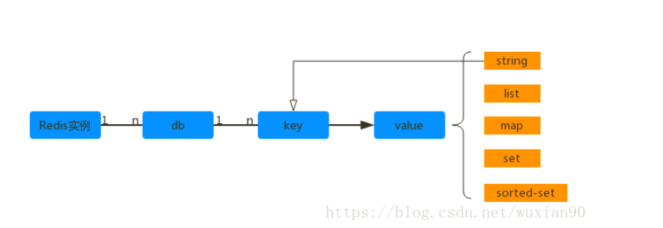

Redis 没有传统关系型数据库的Table 模型，schema 所对应的db仅以编号区分。同一个db 内，key 作为顶层模型，它的值是扁平化的。也就是说db 就是key的命名空间。key的定义通常以“:” 分隔，如：Article:Count:1。我们常用的Redis数据类型有：string、list、set、map、sorted-set。

## valueObject通用结构

Redis中的所有value 都是以object 的形式存在的，其通用结构如下所示：

```C++
typedef struct redisObject {
    unsigned [type] 4;
    unsigned [encoding] 4;
    unsigned [lru] REDIS_LRU_BITS;
    int refcount;
    void *ptr;
} robj;
```

type 指的是前面提到的 string、list 等类型。
encoding 指的是这些结构化类型具体的实现方式，同一个类型可以有多种实现。如: string 可以用int 来实现，也可以使用char[] 来实现；list 可以用ziplist 或者链表来实现。
lru 表示本对象的空转时长，用于有限内存下长时间不访问的对象清理。
refcount 对象引用计数，用于GC。
ptr 指向以encoding 方式实现这个对象实际实现者的地址。如：string 对象对应的SDS地址（string的数据结构/简单动态字符串）。
string
Redis中的string 可以表示四很多语义，如：字节串（bits）、整数和浮点数。这三种类型，redis会根据具体的场景完成自动转换，并且根据需要选取底层的承载方式。例如整数可以由32-bit/64-bit、有符号/无符号承载，以适应不同场景对值域的要求。

基本操作
 
除此之外，string 类型的value还有一些CAS的原子操作，如：get、set、set value nx（如果不存在就设置）、set value xx（如果存在就设置）。

内存结构
在Redis内部，string的内部以 int、SDS（简单动态字符串 simple dynamic string）作为存储结构。int 用来存放整型数据；SDS 用来存放字节/字符和浮点型数据。

## SDS结构

```c++
typedef struct sdshdr {
    // buf中已经占用的字符长度
    unsigned int len;
    // buf中剩余可用的字符长度
    unsigned int free;
    // 数据空间
    char buf[];
}
```

其结构图如下所示：

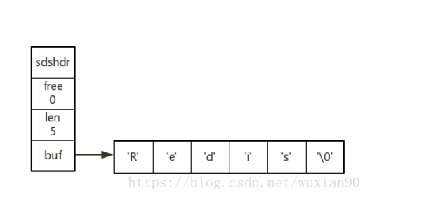

上面存储的内容为“Redis”，Redis采用类似C语言的存储方法，使用’\0’结尾（仅仅是定界符）。上面SDS的free 空间大小为0，当free > 0时，buf中的free 区域的引入提升了SDS对字符串的处理性能，可以减少处理过程中的内存申请和释放次数。

buf 的扩容与缩容
当对SDS 进行操作时，如果超出了容量。SDS会对其进行扩容，触发条件如下：

字节串初始化时，buf的大小 = len + 1，即加上定界符’\0’刚好用完所有空间。

当对串的操作后小于1M时，扩容后的buf 大小 = 业务串预期长度 * 2 + 1，也就是扩大2倍。

对于大小 > 1M的长串，buf总是留出 1M的 free空间，即2倍扩容，但是free最大为 1M。

字节串与字符串
SDS中存储的内容可以是ASCII 字符串，也可以是字节串。由于SDS通过len 字段来确定业务串的长度，因此业务串可以存储非文本内容。对于字符串的场景，buf[len] 作为业务串结尾的'\0'又可以复用C的已有字符串函数。

SDS编码的优化
value 在内存中有2个部分：redisObject和ptr 指向的字节串部分。在创建时，通常要分别为2个部分申请内存，但是对于小字节串，可以一次性申请。

使用场景
字符串类型的主要使用场景如下：缓存（缓存业务数据：如用户信息、商品信息等）、计数器（如网页浏览数）、分布式锁（如实现并发控制）等。

## List

List就是列表对象，用于存储string序列。

基本操作
 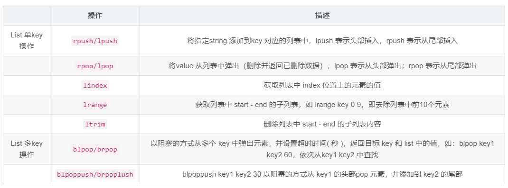
内存结构
List 类型的 value对象，由 linkedlist 或者 ziplist 实现。当 List 元素个数少并且元素内容长度不大时，Redis 会采用ziplist 实现，否则使用linkedlist 实现。

### linkedlist实现

链表的代码结构如下所示：

```c++
typedef struct list {
  // 头结点
  listNode *head;
  // 尾节点
  listNode *tail;
  // 节点值复制函数
  void *(*dup)(void * ptr);
  // 节点值释放函数
  void *(*free)(void *ptr);
  // 节点值对比函数
  int (*match)(void *ptr, void *key);
  // 链表长度
  unsigned long len;  
} list;

// Node节点结构
typedef struct listNode {
    struct listNode *prev;
    struct listNode *next;
    void *value;
} listNode;
```

linkedlist 结构图如下所示：

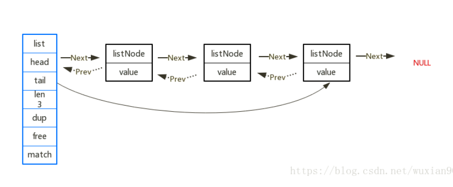

### ziplist实现

ziplist 是存储在连续内存中的，其组成结构图如下所示：

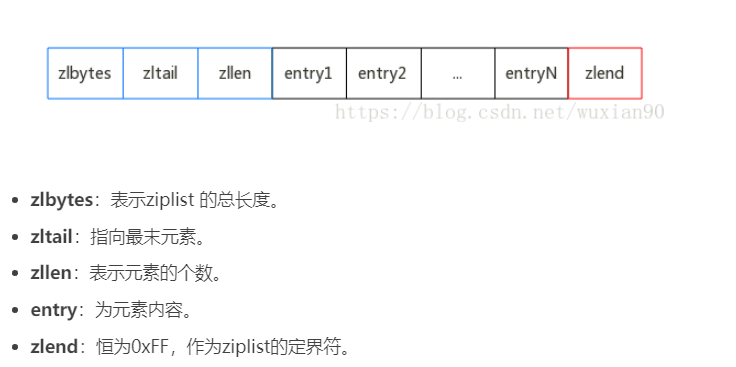
从上面的结构可以看出，对于linkedlist和 ziplist，它们的rpush、rpop、llen的时间复杂度都是O(1)。但是对于ziplist，lpush、lpop都会牵扯到所有数据的移动，时间复杂度为O(N)。但是由于List的元素少，体积小，这种情况还是可控的。

对于ziplist 的每个Entry 其结构如下所示：

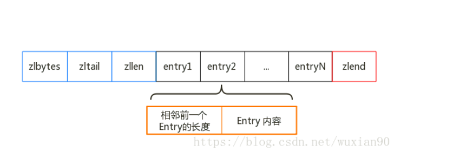

记录前一个相邻的Entry的长度，作用是方便进行双向遍历，类似于linkedlist 的prev 指针。ziplist是连续存储，指针由偏移量来承载。Redis中实现了2种方式的实现：当前邻 Entry的长度小于254 时，使用1字节来实现；否则使用5个字节。

这里面会有个问题，就是当前一个Entry的长度变化时，这时候有可能会造成后续的所有空间移动。当然这种情况发生的可能性比较小。

Entry内容本身是自描述的，意味着第二部分（Entry内容）包含了几个信息：Entry内容类型、长度和内容本身。而内容本身有包含：类型长度部分和内容本身部分。类型和长度同样采用变长编码：

00xxxxxx ：string类型；长度小于64，0~63可由6位bit 表示，即xxxxxx表示长度。

01xxxxxx|yyyyyyyy ： string类型；长度范围是[64, 16383]，可由14位 bit 表示，即xxxxxxyyyyyyyy这14位表示长度。

10xxxxxx|yy..y(32个y) : string类型，长度大于16383.

1111xxxx ：integer类型，integer本身内容存储在xxxx 中，只能是1~13之间取值。也就是说内容类型已经包含了内容本身。

11xxxxxx ：其余的情况，Redis用1个字节的类型长度表示了integer的其他几种情况，如：int_32、int_24等。

由此可见，ziplist 的元素结构采用的是可变长的压缩方法，针对于较小的整数/字符串的压缩效果较好。

## Map

Map类型的value 在Redis中又叫做 Hash。因为Redis本身是一个key - valueObject的结构，Hash类型的结构可以理解为subkey - subvalue。这里面的subkey - subvalue只能是：整型、浮点型或者字符串。

基本操作
 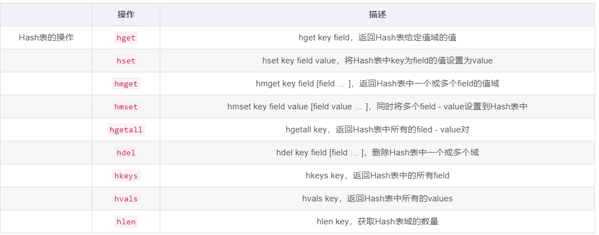
因为Map的value 可以表示整型和浮点型，因此Map也可以使用 hincrby 对某个field的value值做自增操作。

内存结构
Map可以由HashTable 和 ziplist 两种方式来承载。对于数据量较小的Map，使用ziplist 实现。

### HashTable 实现

HashTable在Redis 中分为3 层，自底向上分别是：

dictEntry：管理一个field - value 对，同事保留同一桶中相邻元素的指针，以此维护Hash 桶中的内部链。

dictht：维护Hash表的所有桶链。

dict：当dictht需要扩容/缩容时，用户管理dictht的迁移。

dict是Hash表存储的顶层结构。其代码如下所示：

```C++
// 哈希表（字典）数据结构，Redis 的所有键值对都会存储在这里。其中包含两个哈希表。
typedef struct dict {
    // 哈希表的类型，包括哈希函数，比较函数，键值的内存释放函数
    dictType *type;
    // 存储一些额外的数据
    void *privdata;
    // 两个哈希表
    dictht ht[2];
    // 哈希表重置下标，指定的是哈希数组的数组下标
    int rehashidx; /* rehashing not in progress if rehashidx == -1 */
    // 绑定到哈希表的迭代器个数
    int iterators; /* number of iterators currently running */
} dict;
```

Hash表的核心结构是dictht，它的table 字段维护着 Hash 桶，桶（bucket）是一个数组，数组的元素指向桶中的第一个元素（dictEntry）。

```c++
typedef struct dictht { 
    //槽位数组
    dictEntry **table; 
    //槽位数组长度
    unsigned long size; 
    //用于计算索引的掩码 
    unsigned long sizemask;
    //真正存储的键值对数量
    unsigned long used; 
} dictht;
```

其结构图如下所示：

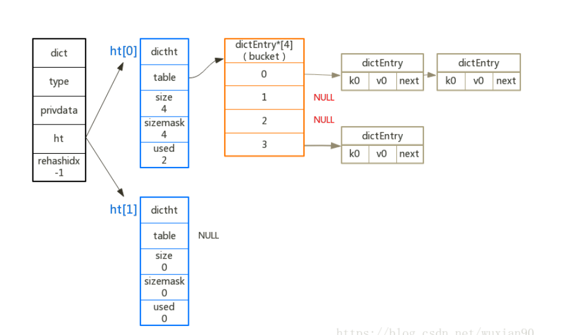

从上图可以看出，Hash表使用的是 链地址法 解决Hash冲突的。当一个bucket 中的Entry 很多时，Hash表的插入性能会下降，此时就需要增加bucket的个数来减少Hash 冲突。

Hash表扩容
和大多数Hash表实现一样，Redis引入负载因子判定是否需要增加bucket个数，负载因子 = Hash表中已有元素 / bucket数量。扩容之后bucket的数量是原先的2倍。目前有2 个阀值：

小于1 时一定不扩容；

大于5 时一定扩容；

在1 ~ 5 之间时，Redis 如果没有进行bgsave/bdrewrite 操作时则会扩容。

当key - value 对减少时，低于0.1时会进行缩容。缩容之后，bucket的个数是原先的0.5倍。

### ziplist 实现

这里面的ziplist 和List的ziplist实现类似，都是通过Entry 存放element。和List不同的是，Map对应的ziplist 的Entry 个数总是2的整数倍，第奇数个Entry 存放key，下一个相邻的Entry存放value。

ziplist承载时，Map的大多数操作不再是O(1)了，而是由Hash表遍历，变成了链表的遍历，复杂度变为O(N)。由于Map相对较小时采用ziplist，采用Hash表时计算hash值的开销较大，因此综合起来ziplist的性能相对好一些。

## Set

Set类似List，但是它是一个无序集合，包含的元素不重复。

基本操作

内存结构
Set在Redis中以intset或 hashtable来存储。Hashtable前面已经介绍过了，对于Set，HashTable的value永远为NULL。当Set中只包含整型数据时，采用intset作为实现。

### intset

intset的核心元素是一个字节数组，其中从小到大有序的存放着set的元素，其代码结构如下所示：

```
typedef struct intset {
    // 编码方式
  uint32_t enconding;
  // 集合包含的元素数量
  uint32_t length;
  // 保存元素的数组    
  int8_t contents[];
} intset;
```


其结构图如下所示：

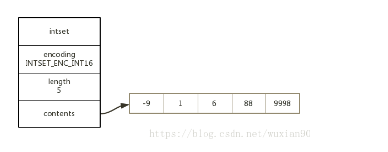

因为元素有序排列，所以SET的获取操作采用二分查找的方式，复杂度为O(log(N))。

进行插入操作时，首先通过二分查找到要插入的位置，再对元素进行扩容。然后将插入位置之后的所有元素向后移动一个位置，最后插入元素。时间复杂度为O(N)。

为了使二分查找的速度足够快，存储在content 中的元素是定长的。

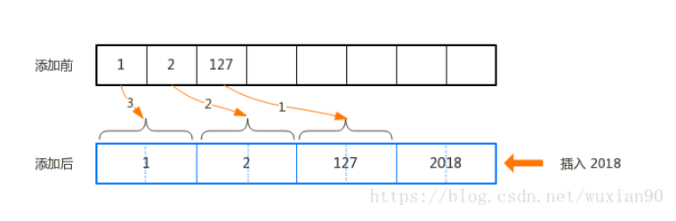

从上图中可以看出，当插入2018 时，所有的元素向后移动，并且不会发生覆盖的情况。并且当Set 中存放的整型元素集中在小整数范围[-128, 127]内时，可以大大的节省内存空间。这里面需要注意的是：IntSet支持升级，但是不支持降级。

## Sorted-Set

Sorted-Set是Redis特有的数据，类似于Map的key-value对，但是它是有序的。

key ：key-value对中的键，在一个Sorted-Set中不重复。

value ： 是一个浮点数，称为 score。

有序 ：内部按照score 从小到大的顺序排列。

基本操作
由于Sorted-Set 本身包含排序信息，在普通Set 的基础上，Sorted-Set 新增了一系列和排序相关的操作：

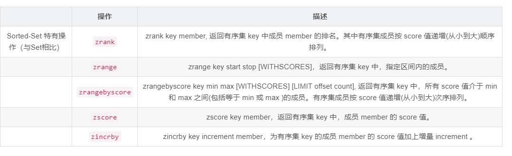
内部结构
Sorted-Set类型的valueObject 内部由ziplist或者 skiplist+hashtable来实现。

作为ziplist的实现方式和Map类似。由于Sorted-Set包含了Score的排序信息，ziplist内部的key-value元素对的排序方式也是按照Score递增排序的，意味着每次插入数据都要移动之后的数据。因此ziplist适用于元素个数不多，元素内容不大的场景。

对于更通用的场景，Sorted-Set使用sliplist来实现。

### skiplist跳跃表

和通用的跳表不同的是，Redis为每个level 对象增加了span 字段，表示该level 指向的forward节点和当前节点的距离，使得getByRank类的操作效率提升。skiplist的代码结构如下：

```c++
typedef struct zskiplist {
     //表头节点和表尾节点
     structz skiplistNode *header,*tail;
     //表中节点数量
     unsigned long length;
     //表中层数最大的节点的层数
     int level;
} zskiplist;

skiplistNode的代码结构如下所示：

typedef struct zskiplistNode {
    // 层
    struct zskiplistLevel{
        struct zskiplistNode *forward; // 前进指针
        unsigned int span; // 跨度
    } level[];
    // 后退指针
    struct zskiplistNode *backward;
    // 分值
    double score;
    // 成员对象
    robj *obj;
}
```


skiplist的结构示意图如下所示：


从上图可以看出，每次向skiplist 中新增或者删除一个节点时，需要同时修改图标中红色的箭头，修改其forward和span的值。可以看出，需要修改的箭头和对skip进行查找操作遍历并废弃过的路径是吻合的。对于span的修改仅仅是+1或者-1 。skiplist 的查找复杂度平均是 O(Log(N))，因此add / remove的复杂度也是O(Log(N))。因此Redis中新增的span 提升了获取rank（排序）操作的性能，仅需对遍历路径相加即可（矢量相加）。

还有一点需要注意的是，每个skiplist的节点level 大小都是随机生成的（1-32之间）。

### hashtable

skiplist 是zset 实现顺序相关操作比较高效的数据结构，但是对于简单的zscore操作效率并不高。Redis在实现时，同时使用了Hashtable和skiplist，代码结构如下：

```C++
typedef struct zset {
    dict *dict;
    zskiplist *zsl;
} zset;	
```

Hash表的存在使得Sorted-Set中的Map相关操作复杂度由O(N)变为O(1)。