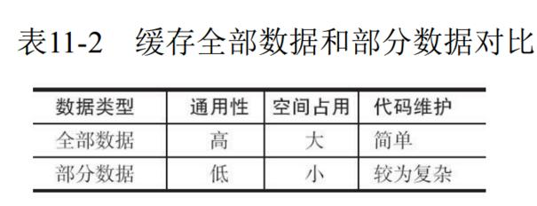
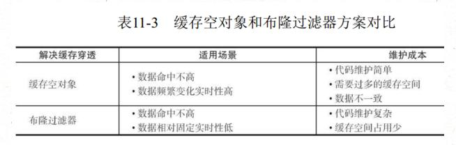
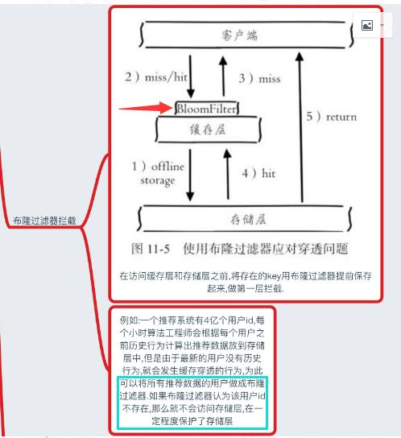
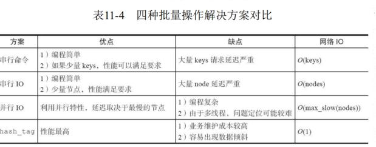
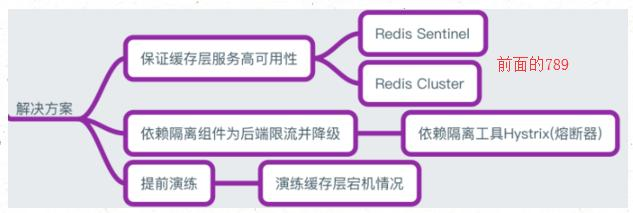

1、为什么使用redis
2、使用redis有什么缺点
3、单线程的redis为什么这么快
4、redis的数据类型，以及每种数据类型的使用场景
5、redis的过期策略以及内存淘汰机制
6、redis和数据库双写一致性问题
7、如何应对缓存穿透和缓存雪崩问题
8、如何解决redis的并发竞争问题

## 

## **正文**

### **1、为什么使用redis**

分析:博主觉得在项目中使用redis，主要是从两个角度去考虑:性能和并发。当然，redis还具备可以做分布式锁等其他功能，但是如果只是为了分布式锁这些其他功能，完全还有其他中间件(如zookpeer等)代替，并不是非要使用redis。因此，这个问题主要从性能和并发两个角度去答。

回答:如下所示，分为两点

（一）性能

如下图所示，我们在碰到需要执行耗时特别久，且结果不频繁变动的SQL，就特别适合将运行结果放入缓存。这样，后面的请求就去缓存中读取，使得请求能够迅速响应。

题外话：忽然想聊一下这个迅速响应的标准。其实根据交互效果的不同，这个响应时间没有固定标准。不过曾经有人这么告诉我:”在理想状态下，我们的页面跳转需要在瞬间解决，对于页内操作则需要在刹那间解决。另外，超过一弹指的耗时操作要有进度提示，并且可以随时中止或取消，这样才能给用户最好的体验。”

（二）并发 

如下图所示，在大并发的情况下，所有的请求直接访问数据库，数据库会出现连接异常。这个时候，就需要使用redis做一个缓冲操作，让请求先访问到redis，而不是直接访问数据库。

###  

### **2、使用redis有什么缺点**

分析:大家用redis这么久，这个问题是必须要了解的，基本上使用redis都会碰到一些问题，常见的也就几个。

回答:主要是四个问题

(一)缓存和数据库双写一致性问题

(二)缓存雪崩问题

(三)缓存击穿问题

(四)缓存的并发竞争问题

这四个问题，我个人是觉得在项目中，比较常遇见的，具体解决方案，后文给出。

### **3、单线程的redis为什么这么快**

分析:这个问题其实是对redis内部机制的一个考察。其实根据博主的面试经验，很多人其实都不知道redis是单线程工作模型。所以，这个问题还是应该要复习一下的。

回答:主要是以下三点

(一)纯内存操作
(二)单线程操作，避免了频繁的上下文切换
(三)采用了非阻塞I/O多路复用机制

真实的redis线程模型，如图所示

参照上图，简单来说，就是。我们的redis-client在操作的时候，会产生具有不同事件类型的socket。在服务端，有一段I/0多路复用程序，将其置入队列之中。然后，文件事件分派器，依次去队列中取，转发到不同的事件处理器中。

需要说明的是，这个I/O多路复用机制，redis还提供了select、epoll、evport、kqueue等多路复用函数库，大家可以自行去了解。

### **4、redis的数据类型，以及每种数据类型的使用场景**

分析：是不是觉得这个问题很基础，其实我也这么觉得。然而根据面试经验发现，至少百分八十的人答不上这个问题。建议，在项目中用到后，再类比记忆，体会更深，不要硬记。基本上，一个合格的程序员，五种类型都会用到。

回答：一共五种

(一)String

这个其实没啥好说的，最常规的set/get操作，value可以是String也可以是数字。一般做一些复杂的计数功能的缓存。

(二)hash

这里value存放的是结构化的对象，比较方便的就是操作其中的某个字段。博主在做单点登录的时候，就是用这种数据结构存储用户信息，以cookieId作为key，设置30分钟为缓存过期时间，能很好的模拟出类似session的效果。

(三)list

使用List的数据结构，可以做简单的消息队列的功能。另外还有一个就是，可以利用lrange命令，做基于redis的分页功能，性能极佳，用户体验好。本人还用一个场景，很合适---取行情信息。就也是个生产者和消费者的场景。LIST可以很好的完成排队，先进先出的原则。

(四)set

因为set堆放的是一堆不重复值的集合。所以可以做全局去重的功能。为什么不用JVM自带的Set进行去重？因为我们的系统一般都是集群部署，使用JVM自带的Set，比较麻烦，难道为了一个做一个全局去重，再起一个公共服务，太麻烦了。

另外，就是利用交集、并集、差集等操作，可以计算共同喜好，全部的喜好，自己独有的喜好等功能。

(五)sorted set

sorted set多了一个权重参数score,集合中的元素能够按score进行排列。可以做排行榜应用，取TOP N操作。

 底层数据结构

### **5、redis的过期策略以及内存淘汰机制**

分析:这个问题其实相当重要，到底redis有没用到家，这个问题就可以看出来。比如你redis只能存5G数据，可是你写了10G，那会删5G的数据。怎么删的，这个问题思考过么？还有，你的数据已经设置了过期时间，但是时间到了，内存占用率还是比较高，有思考过原因么?

回答:

redis采用的是定期删除+惰性删除策略。

为什么不用定时删除策略?

定时删除,用一个定时器来负责监视key,过期则自动删除。虽然内存及时释放，但是十分消耗CPU资源。在大并发请求下，CPU要将时间应用在处理请求，而不是删除key,因此没有采用这一策略.

定期删除+惰性删除是如何工作的呢?

定期删除，redis默认每个100ms检查，是否有过期的key,有过期key则删除。需要说明的是，redis不是每个100ms将所有的key检查一次，而是随机抽取进行检查(如果每隔100ms,全部key进行检查，redis岂不是卡死)。因此，如果只采用定期删除策略，会导致很多key到时间没有删除。

于是，惰性删除派上用场。也就是说在你获取某个key的时候，redis会检查一下，这个key如果设置了过期时间那么是否过期了？如果过期了此时就会删除。

采用定期删除+惰性删除就没其他问题了么?

不是的，如果定期删除没删除key。然后你也没即时去请求key，也就是说惰性删除也没生效。这样，redis的内存会越来越高。那么就应该采用内存淘汰机制。

在redis.conf中有一行配置

> \# maxmemory-policy volatile-lru

该配置就是配内存淘汰策略的：

1）noeviction：当内存不足以容纳新写入数据时，新写入操作会报错。应该没人用吧。

2）allkeys-lru：当内存不足以容纳新写入数据时，在键空间中，移除最近最少使用的key。推荐使用，目前项目在用这种。

3）allkeys-random：当内存不足以容纳新写入数据时，在键空间中，随机移除某个key。应该也没人用吧，你不删最少使用Key,去随机删。

4）volatile-lru：当内存不足以容纳新写入数据时，在设置了过期时间的键空间中，移除最近最少使用的key。这种情况一般是把redis既当缓存，又做持久化存储的时候才用。不推荐

5）volatile-random：当内存不足以容纳新写入数据时，在设置了过期时间的键空间中，随机移除某个key。依然不推荐

6）volatile-ttl：当内存不足以容纳新写入数据时，在设置了过期时间的键空间中，有更早过期时间的key优先移除。不推荐

ps：如果没有设置 expire 的key, 不满足先决条件(prerequisites); 那么 volatile-lru, volatile-random 和 volatile-ttl 策略的行为, 和 noeviction(不删除) 基本上一致。

 

**6、redis和数据库双写一致性问题**

分析:一致性问题是分布式常见问题，还可以再分为最终一致性和强一致性。数据库和缓存双写，就必然会存在不一致的问题。答这个问题，先明白一个前提。

就是如果对数据有强一致性要求，不能放缓存。我们所做的一切，只能保证最终一致性。另外，我们所做的方案其实从根本上来说，只能说降低不一致发生的概率，无法完全避免。因此，有强一致性要求的数据，不能放缓存。

首先，采取正确更新策略，先更新数据库，再删缓存。其次，因为可能存在删除缓存失败的问题，提供一个补偿措施即可，例如利用消息队列。

**7、如何应对缓存穿透和缓存雪崩问题**

分析:这两个问题，说句实在话，一般中小型传统软件企业，很难碰到这个问题。如果有大并发的项目，流量有几百万左右。这两个问题一定要深刻考虑。

回答:如下所示

缓存穿透，即黑客故意去请求缓存中不存在的数据，导致所有的请求都怼到数据库上，从而数据库连接异常。

解决方案:

(一)利用互斥锁，缓存失效的时候，先去获得锁，得到锁了，再去请求数据库。没得到锁，则休眠一段时间重试

(二)采用异步更新策略，无论key是否取到值，都直接返回。value值中维护一个缓存失效时间，缓存如果过期，异步起一个线程去读数据库，更新缓存。需要做缓存预热(项目启动前，先加载缓存)操作。

(三)提供一个能迅速判断请求是否有效的拦截机制，比如，利用布隆过滤器，内部维护一系列合法有效的key。迅速判断出，请求所携带的Key是否合法有效。如果不合法，则直接返回。

缓存雪崩，即缓存同一时间大面积的失效，这个时候又来了一波请求，结果请求都怼到数据库上，从而导致数据库连接异常。

解决方案:

(一)给缓存的失效时间，加上一个随机值，避免集体失效。

(二)使用互斥锁，但是该方案吞吐量明显下降了。

(三)双缓存。我们有两个缓存，缓存A和缓存B。缓存A的失效时间为20分钟，缓存B不设失效时间。自己做缓存预热操作。然后细分以下几个小点

- I 从缓存A读数据库，有则直接返回
- II A没有数据，直接从B读数据，直接返回，并且异步启动一个更新线程。
- III 更新线程同时更新缓存A和缓存B。

### **8、如何解决redis的并发竞争key问题**

分析:这个问题大致就是，同时有多个子系统去set一个key。这个时候要注意什么呢？

大家思考过么。需要说明一下，博主提前百度了一下，发现答案基本都是推荐用redis事务机制。

博主不推荐使用redis的事务机制。因为我们的生产环境，基本都是redis集群环境，做了数据分片操作。

你一个事务中有涉及到多个key操作的时候，这多个key不一定都存储在同一个redis-server上。因此，redis的事务机制，十分鸡肋。

回答:如下所示

(1)如果对这个key操作，不要求顺序

这种情况下，准备一个分布式锁，大家去抢锁，抢到锁就做set操作即可，比较简单。

(2)如果对这个key操作，要求顺序

假设有一个key1,系统A需要将key1设置为valueA,系统B需要将key1设置为valueB,系统C需要将key1设置为valueC.

期望按照key1的value值按照 valueA–>valueB–>valueC的顺序变化。这种时候我们在数据写入数据库的时候，需要保存一个时间戳。假设时间戳如下

 

> 系统A key 1 {valueA  3:00}
>
> 系统B key 1 {valueB  3:05}
>
> 系统C key 1 {valueC  3:10}

 

那么，假设这会系统B先抢到锁，将key1设置为{valueB 3:05}。接下来系统A抢到锁，发现自己的valueA的时间戳早于缓存中的时间戳，那就不做set操作了。以此类推。

其他方法，比如利用队列，将set方法变成串行访问也可以。总之，灵活变通。

### redis单点吞吐量

单点TPS达到8万/秒，QPS达到10万/秒。

redis的5中存储类型

string、list、set、map（hash）、stored-set

redis的string类型

1. 能表达3中类型：字符串、整数和浮点数。根据场景相互间自动转型，并且根据需要选取底层的承载方式
2. value内部以int、sds作为结构存储。int存放整型数据，sds存放字节/字符串和浮点型数据
3. sds内部结构： 

- - 用buf数组存储字符串的内容，但数组的长度会大于所存储内容的长度。会有一格专门存放”\0”（C标准库）作为结尾，还有预留多几个空的（即free区域），当append字符串的长度小于free区域，则sds不会重新申请内存，直接使用free区域
  - 扩容：当对字符串的操作完成后预期的串长度小于1M时，扩容后的buf数组大小=预期长度*2+1；若大于1M，则buf总是会预留出1M的free空间
  - value对象通常具有两个内存部分：redisObject部分和redisObject的ptr指向的sds部分。创建value对象时，通常需要为redisObject和sds申请两次内存。单对于短小的字符串，可以把两者连续存放，所以可以一次性把两者的内存一起申请了

redis的list类型

1. list类型的value对象内部以linkedlist或ziplist承载。当list的元素个数和单个元素的长度较小时，redis会采用ziplist实现以减少内存占用，否则采用linkedlist结构
2. linkedlist内部实现是双向链表。在list中定义了头尾元素指针和列表的长度，是的pop/push操作、llen操作的复杂度为O(1)。由于是链表，lindex类的操作复杂度仍然是O(N)
3. ziplist的内部结构 

- - 所有内容被放置在连续的内存中。其中zlbytes表示ziplist的总长度，zltail指向最末元素，zllen表示元素个数，entry表示元素自身内容，zlend作为ziplist定界符
  - rpush、rpop、llen，复杂度为O(1);lpush/pop操作由于涉及全列表元素的移动，复杂度为O(N)

redis的map类型

1. map又叫hash。map内部的key和value不能再嵌套map了，只能是string类型：整形、浮点型和字符串
2. map主要由hashtable和ziplist两种承载方式实现，对于数据量较小的map，采用ziplist实现
3. hashtable内部结构 

- - 主要分为三层，自底向上分别是dictEntry、dictht、dict
  - dictEntry：管理一个key-value对，同时保留同一个桶中相邻元素的指针，一次维护哈希桶的内部连
  - dictht：维护哈希表的所有桶链
  - dict：当dictht需要扩容/缩容时，用于管理dictht的迁移
  - 哈希表的核心结构是dictht，它的table字段维护着hash桶，它是一个数组，每个元素指向桶的第一个元素（dictEntry）
  - set值的流程：先通过MurmurHash算法求出key的hash值，再对桶的个数取模，得到key对应的桶，再进入桶中，遍历全部entry，判定是否已有相同的key，如果没有，则将新key对应的键值对插入到桶头，并且更新dictht的used数量，used表示hash表中已经存了多少元素。由于每次插入都要遍历hash桶中的全部entry，所以当桶中entry很多时，性能会线性下降
  - 扩容：通过负载因子判定是否需要增加桶数。负载因子=哈希表中已有元素/哈希桶数的比值。有两个阈值，小于1一定不扩容；大于5一定扩容。扩容时新的桶数目是现有桶的2n倍
  - 缩容：负载因子的阈值是0.1
  - 扩/缩容通过新建哈希表的方式实现。即扩容时，会并存两个哈希表，一个是源表，一个是目标表。通过将源表的桶逐步迁移到目标表，以数据迁移的方式实现扩容，迁移完成后目标表覆盖源表。迁移过程中，首先访问源表，如果发现key对应的源表桶已完成迁移，则重新访问目标表，否则在源表中操作
  - redis是单线程处理请求，迁移和访问的请求在相同线程内进行，所以不会存在并发性问题

1. ziplist内部结构 

- - 和list的ziplist实现类似。不同的是，map对应的ziplist的entry个数总是2的整数倍，奇数存放key，偶数存放value
  - ziplist实现下，由哈希遍历变成了链表的顺序遍历，复杂度变成O(N)

redis的set类型

1. set以intset或hashtable来存储。hashtable中的value永远为null，当set中只包含整数型的元素时，则采用intset
2. intset的内部结构 

- - 核心元素是一个字节数组，从小到大有序存放着set的元素
  - 由于元素有序排列，所以set的获取操作采用二分查找方式实现，复杂度O(log(N))。进行插入时，首先通过二分查找得到本次插入的位置，再对元素进行扩容，再将预计插入位置之后的所有元素向右移动一个位置，最后插入元素，插入复杂度为O(N)。删除类似

redis的sorted-set类型

1. 类似map是一个key-value对，但是有序的。value是一个浮点数，称为score，内部是按照score从小到大排序
2. 内部结构以ziplist或skiplist+hashtable来实现

## redis客户端与服务器的交互模式

1. 串行的请求/响应模式 

- - 每一次请求的发送都依赖于上一次请求的相应结果完全接收，同一个连接的每秒吞吐量低
  - redis对单个请求的处理时间通常比局域网的延迟小一个数量级，所以串行模式下，单链接的大部分时间都处于网络等待

1. 双工的请求/相应模式(pipeline) 

- - 适用于批量的独立写入操作。即可将请求数据批量发送到服务器，再批量地从服务器连接的字节流中一次读取每个响应数据，减少了网络延迟，所以单连接吞吐量较串行会提高一个数量级

1. 原子化的批量请求/响应模式（事务） 

- - 客户端通过和redis服务器两阶段的交互做到批量命令原子执行的事务效果：入队操作（即服务器端先将客户端发送过来的连接对象暂存在请求队列中）和执行阶段（依次执行请求队列中的所有请求）
  - 一个连接的请求在执行批量请求的过程中，不会执行其他客户端的请求
  - redis的事务不是一致的，没有回滚机制。如果中途失败，则返回错误信息，但已经成功执行的命令不会回滚
  - 事务里面有可能会带有读操作作为条件，由于批量请求只会先入队列，再批量一起执行，所以一般读操作不会跟批量写请求一起执行，这时候就有可能会导致批量写之前和之后读到的数据不一致，这种可以通过乐观锁的可串行化来解决，redis通过watch机制实现乐观锁。具体实现过程看下一题

1. 发布/订阅模式 

- - 发布端和订阅者通过channel关联
  - channel的订阅关系，维护在reids实例级别，独立于redisDB的key-value体系。所有的channel都由一个map维护，键是channel的名字，value是它所有订阅者client的指针链表

1. 脚本化的批量执行（脚本模式）

### redis通过watch机制实现乐观锁流程

1. 将本次事务涉及的所有key注册为观察模式
2. 执行只读操作
3. 根据只读操作的结果组装写操作命令并发送到服务器端入队
4. 发送原子化的批量执行命令EXEC试图执行连接的请求队列中的命令
5. 如果前面注册为观察模式的key中有一个货多个，在EXEC之前被修改过，则EXEC将直接失败，拒绝执行；否则顺序执行请求队列中的所有请求
6. redis没有原生的悲观锁或者快照实现，但可通过乐观锁绕过。一旦两次读到的操作不一样，watch机制触发，拒绝了后续的EXEC执行

### redis的网络协议

redis协议位于TCP层之上，即客户端和redis实例保持双工的连接，交互的都是序列化后的协议数据

redis处理命令的主要逻辑

1. redis服务器对命令的处理都是单线程的，但是I/O层面却面向多个客户端并发地提供服务，并发到内部单线程的转化通过多路复用框架来实现
2. 首先从多路服用框架（epoll、evport、kqueue）中select出已经ready的文件描述符（fileDescriptor）
3. ready的标准是已有数据到达内核（kernel）、已准备好写入数据
4. 对于上一步已经ready的fd，redis会分别对每个fd上已ready的事件进行处理，处理完相同fd上的所有事件后，再处理下一个ready的fd。有3中事件类型 

- - acceptTcpHandler：连接请求事件
  - readQueryFromClient：客户端的请求命令事件
  - sendReplyToClient：将暂存的执行结果写回客户端

1. 对来自客户端的命令执行结束后，接下来处理定时任务（TimeEvent）
2. aeApiPoll的等待时间取决于定时任务处理（TimeEvent）逻辑
3. 本次主循环完毕，进入下一次主循环的beforeSleep逻辑，后者负责处理数据过期、增量持久化的文件写入等任务

## redis的持久化机制

1. redis主要提供了两种持久化机制：RDB和AOF；
2. RDB 

- - 默认开启，会按照配置的指定时间将内存中的数据快照到磁盘中，创建一个dump.rdb文件，redis启动时再恢复到内存中。
  - redis会单独创建fork()一个子进程，将当前父进程的数据库数据复制到子进程的内存中，然后由子进程写入到临时文件中，持久化的过程结束了，再用这个临时文件替换上次的快照文件，然后子进程退出，内存释放。
  - 需要注意的是，每次快照持久化都会将主进程的数据库数据复制一遍，导致内存开销加倍，若此时内存不足，则会阻塞服务器运行，直到复制结束释放内存；都会将内存数据完整写入磁盘一次，所以如果数据量大的话，而且写操作频繁，必然会引起大量的磁盘I/O操作，严重影响性能，并且最后一次持久化后的数据可能会丢失；

1. AOF 

- - 以日志的形式记录每个写操作（读操作不记录），只需追加文件但不可以改写文件，redis启动时会根据日志从头到尾全部执行一遍以完成数据的恢复工作。包括flushDB也会执行。
  - 主要有两种方式触发：有写操作就写、每秒定时写（也会丢数据）。
  - 因为AOF采用追加的方式，所以文件会越来越大，针对这个问题，新增了重写机制，就是当日志文件大到一定程度的时候，会fork出一条新进程来遍历进程内存中的数据，每条记录对应一条set语句，写到临时文件中，然后再替换到旧的日志文件（类似rdb的操作方式）。默认触发是当aof文件大小是上次重写后大小的一倍且文件大于64M时触发；

1. 当两种方式同时开启时，数据恢复redis会优先选择AOF恢复。一般情况下，只要使用默认开启的RDB即可，因为相对于AOF，RDB便于进行数据库备份，并且恢复数据集的速度也要快很多。
2. 开启持久化缓存机制，对性能会有一定的影响，特别是当设置的内存满了的时候，更是下降到几百reqs/s。所以如果只是用来做缓存的话，可以关掉持久化。

redis内存分析的设计思路

1. 主要有3种方式可以实现 

- - keys命令：获取到所有的key，再根据key获取所有的内容。缺点是如果key数量特别多，则会导致redis卡住影响业务
  - aof：通过aof文件获取到所有数据。缺点是有一些redis实例写入频繁，不适合开启aof，并且文件可能特别大，传输、解析效率差
  - rdb：使用bgsave获取rdb文件，然后解析。缺点是bgsave在fork子进程时有可能会卡住主进程。当对于其他两种，在低峰期在从节点做bgsave获取rdb文件，相对安全可靠。

1. 设计思路： 

- - 在访问低峰期时根据redis获取rdb文件
  - 解析rdb文件
  - 根据相对应的数据结构及内容，估算内容消耗等
  - 统计并生成报表

1. 开源框架：https://github.com/xueqiu/rdr

redis内存估算

1. 基础的数据类型：sds、dict、intset、zipmap、adlist、quicklist、skiplist
2. 举例：以key为hello，value为world，类型是string，它的内存使用： 

- - 一个dictEntry的消耗（有2个指针，一个int64的内存消耗），RedisDB就是一个大dict，每对kv都是其中的一个entry；
  - 一个robj的消耗（有1指针，一个int，以及几个使用位域的字段共消耗4字节），robj是为了在同一个dict内能够存储不同类型的value，而使用的一个通用的数据结构，全名是RedisObject；
  - 存储key的sds消耗（存储header以及字符串长度+1的空间，header长度根据字符串长度不同也会有所不同），sds是Redis中存储字符串使用的数据结构；
  - 存储过期时间消耗（也是存储为一个dictEntry，时间戳为int64）；
  - 存储value的sds消耗，根据数据结构不同而不同；
  - 前四项基本是存储任何一个key都需要消耗的，最后一项根据value的数据结构不同而不同；

## redis集群（redis cluster）

1. redis3以后，节点之间提供了完整的sharding（分片）、replication（主备感知能力）、failover（故障转移）的特性

2. 配置一致性：

   ​		每个节点（Node）内部都保存了集群的配置信息，存储在clusterState中，通过引入自增的epoch变量来使得集		群配置在各个节点间保持一致

3. sharding数据分片 

- - 将所有数据划分为16384个分片（slot），每个节点会对应一部分slot，每个key都会根据分布算法映射到16384个slot中的一个，分布算法为slotId=crc16(key)%16384
  - 当一个client访问的key不在对应节点的slots中，redis会返回给client一个moved命令，告知其正确的路由信息从而重新发起请求。client会根据每次请求来缓存本地的路由缓存信息，以便下次请求直接能够路由到正确的节点
  - 分片迁移：分片迁移的触发和过程控制由外部系统完成，redis只提供迁移过程中需要的原语支持。主要包含两种：一种是节点迁移状态设置，即迁移前标记源、目标节点；另一种是key迁移的原子化命令

1. failover故障转移 

- - 故障发现：节点间两两通过TCP保持连接，周期性进行PING、PONG交互，若对方的PONG相应超时未收到，则将其置为PFAIL状态，并传播给其他节点
  - 故障确认：当集群中有一半以上的节点对某一个PFAIL状态进行了确认，则将起改为FAIL状态，确认其故障
  - slave选举：当有一个master挂掉了，则其slave重新竞选出一个新的master。
  - 主要根据各个slave最后一次同步master信息的时间，越新表示slave的数据越新，竞选的优先级越高，就更有可能选中。竞选成功之后将消息传播给其他节点。

1. 集群不可用的情况： 

- - 集群中任意master挂掉，且当前master没有slave。
  - 集群中超过半数以上master挂掉。
  - 有A，B，C三个节点的集群,在没有复制模型的情况下,如果节点B失败了，那么整个集群就会以为缺少5501-11000这个范围的槽而不可用。

普通哈希算法和一致性哈希算法对比

1. 普通哈希：也称硬哈希，采用简单取模的方式，将机器进行散列，这在cache环境不变的情况下能取得让人满意的结果，但是当cache环境动态变化时，这种静态取模的方式显然就不满足单调性的要求（当增加或减少一台机子时，几乎所有的存储内容都要被重新散列到别的缓冲区中）。

2. 一致性哈希：将机器节点和key值都按照一样的hash算法映射到一个0~2^32的圆环上。当有一个写入缓存的请求到来时，计算Key值k对应的哈希值Hash(k)，如果该值正好对应之前某个机器节点的Hash值，则直接写入该机器节点，如果没有对应的机器节点，则顺时针查找下一个节点，进行写入，如果超过2^32还没找到对应节点，则从0开始查找（因为是环状结构）。为了更可能的满足平衡性，可以引入虚拟节点，即一个实体节点映射到多个虚拟节点。

3. 参考：http://blog.huanghao.me/?p=14

4. ### **说说Redis哈希槽的概念？**

   Redis集群没有使用一致性hash,而是引入了哈希槽的概念，Redis集群有16384个哈希槽，每个key通过CRC16校验后对16384取模来决定放置哪个槽，集群的每个节点负责一部分hash槽。

   ### **23、Redis集群的主从复制模型是怎样的？**

   为了使在部分节点失败或者大部分节点无法通信的情况下集群仍然可用，所以集群使用了主从复制模型,每个节点都会有N-1个复制品.

   ### **24、Redis集群会有写操作丢失吗？为什么？**

   Redis并不能保证数据的强一致性，这意味这在实际中集群在特定的条件下可能会丢失写操作。

   ### **25、Redis集群之间是如何复制的？**

   异步复制

   ### **26、Redis集群最大节点个数是多少？**

   16384个。

   ### **27、Redis集群如何选择数据库？**

   Redis集群目前无法做数据库选择，默认在0数据库。当然可以再代码里面设置

   ### **35、Redis集群方案应该怎么做？都有哪些方案？**

   1.codis。

   目前用的最多的集群方案，基本和twemproxy一致的效果，但它支持在 节点数量改变情况下，旧节点数据可恢复到新hash节点。

   2.redis cluster3.0自带的集群，特点在于他的分布式算法不是一致性hash，而是hash槽的概念，以及自身支持节点设置从节点。具体看官方文档介绍。

   3.在业务代码层实现，起几个毫无关联的redis实例，在代码层，对key 进行hash计算，然后去对应的redis实例操作数据。 这种方式对hash层代码要求比较高，考虑部分包括，节点失效后的替代算法方案，数据震荡后的自动脚本恢复，实例的监控，等等

缓存雪崩，缓存穿透，缓存并发，缓存预热，缓存算法

1. 缓存雪崩：可能是因为数据未加载到缓存中，或者缓存同一时间大面积的失效，从而导致所有请求都去查数据库，导致数据库CPU和内存负载过高，甚至宕机。解决思路： 

- - 加锁计数（即限制并发的数量，可以用semphore）或者起一定数量的队列来避免缓存失效时大量请求并发到数据库。但这种方式会降低吞吐量。
  - 分析用户行为，然后失效时间均匀分布。或者在失效时间的基础上再加1~5分钟的随机数。
  - 如果是某台缓存服务器宕机，则考虑做主备。

1. 缓存穿透：指用户查询数据，在数据库没有，自然在缓存中也不会有。这样就导致用户查询的时候，在缓存中找不到，每次都要去数据库中查询。解决思路： 

- - 如果查询数据库也为空，直接设置一个默认值存放到缓存，这样第二次到缓冲中获取就有值了，而不会继续访问数据库。设置一个过期时间或者当有值的时候将缓存中的值替换掉即可。
  - 可以给key设置一些格式规则，然后查询之前先过滤掉不符合规则的Key。

1. 缓存并发：如果网站并发访问高，一个缓存如果失效，可能出现多个进程同时查询DB，同时设置缓存的情况，如果并发确实很大，这也可能造成DB压力过大，还有缓存频繁更新的问题。解决思路： 

- - 对缓存查询加锁，如果KEY不存在，就加锁，然后查DB入缓存，然后解锁；其他进程如果发现有锁就等待，然后等解锁后返回数据或者进入DB查询。

1. 缓存预热：目的就是在系统上线前，将数据加载到缓存中。解决思路： 

- - 数据量不大的话，在系统启动的时候直接加载。
  - 自己写个简单的缓存预热程序。

1. 缓存算法： 

- - FIFO算法：First in First out，先进先出。原则：一个数据最先进入缓存中，则应该最早淘汰掉。也就是说，当缓存满的时候，应当把最先进入缓存的数据给淘汰掉。
  - LFU算法：Least Frequently Used，最不经常使用算法。
  - LRU算法：Least Recently Used，近期最少使用算法。
  - LRU和LFU的区别。LFU算法是根据在一段时间里数据项被使用的次数选择出最少使用的数据项，即根据使用次数的差异来决定。而LRU是根据使用时间的差异来决定的。

用redis实现分布式锁

1. 主要使用的命令： 

- - setnx key val。当且仅当key不存在时，set一个key为val的字符串，返回1；若key存在，则什么都不做，返回0。
  - expire key timeout。为key设置一个超时时间，单位为second，超过这个时间锁会自动释放，避免死锁。
  - delete key。删除锁

1. 实现思想： 

- - 使用setnx加锁，如果返回1，则说明加锁成功，并设置超时时间，避免系统挂了，锁没法释放。在finally中delete删除锁释放。
  - 如果需要设置超时等待时间，则可以加个while循环，在获取不到锁的情况下，进行循环获取锁，超时了则退出。

**10.1 key过期清除（超时剔除）策略**

惰性过期（类比懒加载，这是懒过期）：只有当访问一个key时，才会判断该key是否已过期，过期则清除。该策略可以最大化地节省CPU资源，却对内存非常不友好。极端情况可能出现大量的过期key没有再次被访问，从而不会被清除，占用大量内存。

定期过期：每隔一定的时间，会扫描一定数量的数据库的expires字典中一定数量的key，并清除其中已过期的key。该策略是前两者的一个折中方案。通过调整定时扫描的时间间隔和每次扫描的限定耗时，可以在不同情况下使得CPU和内存资源达到最优的平衡效果。

(expires字典会保存所有设置了过期时间的key的过期时间数据，其中，key是指向键空间中的某个键的指针，value是该键的毫秒精度的UNIX时间戳表示的过期时间。键空间是指该Redis集群中保存的所有键。)

问：比如这么个场景，我设计了很多key，过期时间是5分钟，当前内存占用率是50%。但是5分钟到了，内存占用率还是很高，请问为什么？

Redis中同时使用了惰性过期和定期过期两种过期策略，即使过期时间到了，但是有部分并没有真正删除，等待惰性删除。

为什么有定期还要有惰性呢？其实很简单，比如10万个key就要过期了，Redis默认是100ms检查一波。如果他检查出10万个即将要清除，那他接下来的时间基本都是在干这些清空内存的事了，那肯定影响性能，所以他只会部分删除，剩下的等惰性

**10.2 Redis的内存淘汰策略**

Redis的内存淘汰策略是指在Redis的用于缓存的内存不足时，怎么处理需要新写入且需要申请额外空间的数据。

noeviction：当内存不足以容纳新写入数据时，新写入操作会报错。

allkeys-lru：当内存不足以容纳新写入数据时，在键空间中，移除最近最少使用的key。

allkeys-random：当内存不足以容纳新写入数据时，在键空间中，随机移除某个key。

volatile-lru：当内存不足以容纳新写入数据时，在设置了过期时间的键空间中，移除最近最少使用的key。

volatile-random：当内存不足以容纳新写入数据时，在设置了过期时间的键空间中，随机移除某个key。

volatile-ttl：当内存不足以容纳新写入数据时，在设置了过期时间的键空间中，有更早过期时间的key优先移除。

**11.缓存粒度控制？**

**12.如何防止缓存穿透？**

（缓存穿透指的是查询一个根本不存在的数据，缓存层不命中，又去查存储层，又不命中。但如果有大量这种查询不存在的数据的请求过来，会对存储层有较大压力，若是恶意攻击，后果就）

**12.1：缓存空值存在的问题：**

**12.2：布隆过滤器：**

布隆过滤器存在的问题：相对来说布隆过滤器搞起来代码还是比较复杂的，现阶段我们暂时还不需要，后面实在需要再考虑去做，什么阶段做什么样的事情，不是说这个系统一下子就能做的各种完美。

**13.无底洞优化？**

造成原因：redis分布式越来越多，导致性能反而下降，因为键值分布到更多的 节点上，所以无论是Memcache还是Redis的分布式，批量操作通常需要从不 同节点上获取，相比于单机批量操作只涉及一次网络操作，分布式批量操作 会涉及多次网络时间。 即分布式过犹不及。

**14.雪崩优化**

如果缓存层由于某些原因不能提供服务，于是所有的请求都会达到存储层，存储层的调用量会暴增，造成存储层也会级联宕机的情况。

**15.热点key优化**

当前key是一个热点key（例如一个热门的娱乐新闻），并发量非常大。

