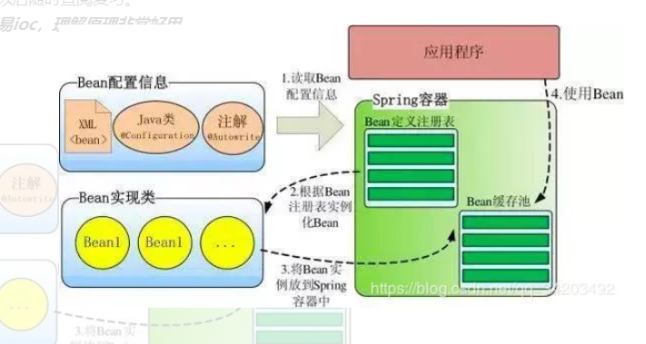
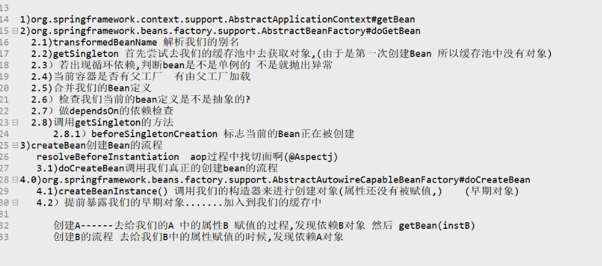

## 1、AOP理解，底层实现过程？


AOP:

​	流程是bean再初始化的时候，判断bean是否被AOP相关注解修饰，如果是便把他们存入advisedBean中（保存了所有需要增强的bean,获取当前Bean，如果需要增强，创建当前对象的代理对象，至于使用JDK还是cglib,spring自己决定，给IOC容器返回增强后的代理对象，以后容器中获取到的就是这个组件的代理对象，执行目标方法的时候。代理对象就会执行通知方法的流程。

目标方法执行流程：

根据代理对象的拦截方法。拦截目标方法的执行，

跟去代理对象获取到目标方法的拦截器链。然后依次执行，如果没有拦截器，直接执行目标方法。拦截器链保证了通知方法和目标方法的执行顺序。

### AOP

AOP(Aspect-Oriented Programming:面向切面编程)能够将那些与业务无关，**却为业务模块所共同调用的逻辑或责任（例如事务处理、日志管理、权限控制等）封装起来**，便于**减少系统的重复代码**，**降低模块间的耦合度**，并**有利于未来的可拓展性和可维护性**。

**Spring AOP就是基于动态代理的**，如果要代理的对象，实现了某个接口，那么Spring AOP会使用**JDK Proxy**，去创建代理对象，而对于没有实现接口的对象，就无法使用 JDK Proxy 去进行代理了，这时候Spring AOP会使用**Cglib** ，这时候Spring AOP会使用 **Cglib** 生成一个被代理对象的子类来作为代理，如下图所示：

SpringAOPProcess

当然你也可以使用 AspectJ ,Spring AOP 已经集成了AspectJ ，AspectJ 应该算的上是 Java 生态系统中最完整的 AOP 框架了。

使用 AOP 之后我们可以把一些通用功能抽象出来，在需要用到的地方直接使用即可，这样大大简化了代码量。我们需要增加新功能时也方便，这样也提高了系统扩展性。日志功能、事务管理等等场景都用到了 AOP 。

## Spring AOP 和 AspectJ AOP 有什么区别？

**Spring AOP 属于运行时增强，而 AspectJ 是编译时增强。** Spring AOP 基于代理(Proxying)，而 AspectJ 基于字节码操作(Bytecode Manipulation)。

Spring AOP 已经集成了 AspectJ ，AspectJ 应该算的上是 Java 生态系统中最完整的 AOP 框架了。AspectJ 相比于 Spring AOP 功能更加强大，但是 Spring AOP 相对来说更简单，

如果我们的切面比较少，那么两者性能差异不大。但是，当切面太多的话，最好选择 AspectJ ，它比Spring AOP 快很多。


Spring的AOP理解：

OOP面向对象，允许开发者定义纵向的关系，但并适用于定义横向的关系，导致了大量代码的重复，而不利于各个模块的重用。

AOP，一般称为面向切面，作为面向对象的一种补充，用于将那些与业务无关，但却对多个对象产生影响的公共行为和逻辑，抽取并封装为一个可重用的模块，这个模块被命名为“切面”（Aspect），减少系统中的重复代码，降低了模块间的耦合度，同时提高了系统的可维护性。可用于权限认证、日志、事务处理。

AOP实现的关键在于 代理模式，AOP代理主要分为静态代理和动态代理。静态代理的代表为AspectJ；动态代理则以Spring AOP为代表。

（1）AspectJ是静态代理的增强，所谓静态代理，就是AOP框架会在编译阶段生成AOP代理类，因此也称为编译时增强，他会在编译阶段将AspectJ(切面)织入到Java字节码中，运行的时候就是增强之后的AOP对象。

（2）Spring AOP使用的动态代理，所谓的动态代理就是说AOP框架不会去修改字节码，而是每次运行时在内存中临时为方法生成一个AOP对象，这个AOP对象包含了目标对象的全部方法，并且在特定的切点做了增强处理，并回调原对象的方法。

Spring AOP中的动态代理主要有两种方式，JDK动态代理和CGLIB动态代理：

  ①JDK动态代理只提供接口的代理，不支持类的代理。核心InvocationHandler接口和Proxy类，InvocationHandler 通过invoke()方法反射来调用目标类中的代码，动态地将横切逻辑和业务编织在一起；接着，Proxy利用 InvocationHandler动态创建一个符合某一接口的的实例,  生成目标类的代理对象。

②如果代理类没有实现 InvocationHandler 接口，那么Spring AOP会选择使用CGLIB来动态代理目标类。CGLIB（Code Generation Library），是一个代码生成的类库，可以在运行时动态的生成指定类的一个子类对象，并覆盖其中特定方法并添加增强代码，从而实现AOP。CGLIB是通过继承的方式做的动态代理，因此如果某个类被标记为final，那么它是无法使用CGLIB做动态代理的。

（3）静态代理与动态代理区别在于生成AOP代理对象的时机不同，相对来说AspectJ的静态代理方式具有更好的性能，但是AspectJ需要特定的编译器进行处理，而Spring AOP则无需特定的编译器处理。

 InvocationHandler 的 invoke(Object  proxy,Method  method,Object[] args)：proxy是最终生成的代理实例;  method 是被代理目标实例的某个具体方法;  args 是被代理目标实例某个方法的具体入参, 在方法反射调用时使用。

AOP底层代码实现细节：

- 遍历获取容器中所有的Bean，依次创建对象getBean(beanName);
- getBean->doGetBean()->getSingleton()->
- 2）、创建bean
- 【AnnotationAwareAspectJAutoProxyCreator在所有bean创建之前会有一个拦截，InstantiationAwareBeanPostProcessor，会调用postProcessBeforeInstantiation()】
- 1）、先从缓存中获取当前bean，如果能获取到，说明bean是之前被创建过的，直接使用，否则再创建；
- 只要创建好的Bean都会被缓存起来
- 2）、createBean（）;创建bean；
- AnnotationAwareAspectJAutoProxyCreator 会在任何bean创建之前先尝试返回bean的实例
- 【BeanPostProcessor是在Bean对象创建完成初始化前后调用的】
- 【InstantiationAwareBeanPostProcessor是在创建Bean实例之前先尝试用后置处理器返回对象的】
- 1）、resolveBeforeInstantiation(beanName, mbdToUse);解析BeforeInstantiation
- 希望后置处理器在此能返回一个代理对象；如果能返回代理对象就使用，如果不能就继续
- 1）、后置处理器先尝试返回对象；
- bean = applyBeanPostProcessorsBeforeInstantiation（）：
- 拿到所有后置处理器，如果是InstantiationAwareBeanPostProcessor;
- 就执行postProcessBeforeInstantiation
- if (bean != null) 
- {
- bean = applyBeanPostProcessorsAfterInitialization(bean, beanName);
- }
- 2）、doCreateBean(beanName, mbdToUse, args);真正的去创建一个bean实例；和3.6流程一样；
- 3）、
- AnnotationAwareAspectJAutoProxyCreator【InstantiationAwareBeanPostProcessor】	的作用：
- 1）、每一个bean创建之前，调用postProcessBeforeInstantiation()；
- 关心MathCalculator和LogAspect的创建
- 1）、判断当前bean是否在advisedBeans中（保存了所有需要增强bean）
- 2）、判断当前bean是否是基础类型的Advice、Pointcut、Advisor、AopInfrastructureBean，
- 或者是否是切面（@Aspect）
- 3）、是否需要跳过
- 1）、获取候选的增强器（切面里面的通知方法）【List<Advisor> candidateAdvisors】
- 每一个封装的通知方法的增强器是 InstantiationModelAwarePointcutAdvisor；
- 判断每一个增强器是否是 AspectJPointcutAdvisor 类型的；返回true
- 2）、永远返回false
- 2）、创建对象
- postProcessAfterInitialization；
- return wrapIfNecessary(bean, beanName, cacheKey);//包装如果需要的情况下
- 1）、获取当前bean的所有增强器（通知方法）  Object[]  specificInterceptors
- 1、找到候选的所有的增强器（找哪些通知方法是需要切入当前bean方法的）
- 2、获取到能在bean使用的增强器。
- 3、给增强器排序
- 2）、保存当前bean在advisedBeans中；
- 3）、如果当前bean需要增强，创建当前bean的代理对象；
- 1）、获取所有增强器（通知方法）
- 2）、保存到proxyFactory
- 3）、创建代理对象：Spring自动决定
- JdkDynamicAopProxy(config);jdk动态代理；
- ObjenesisCglibAopProxy(config);cglib的动态代理；
- 4）、给容器中返回当前组件使用cglib增强了的代理对象；
- 5）、以后容器中获取到的就是这个组件的代理对象，执行目标方法的时候，代理对象就会执行通知方法的流程；
- 3）、目标方法执行	；
- 容器中保存了组件的代理对象（cglib增强后的对象），这个对象里面保存了详细信息（比如增强器，目标对象，xxx）；
- 1）、CglibAopProxy.intercept();拦截目标方法的执行
- 2）、根据ProxyFactory对象获取将要执行的目标方法拦截器链；
- List<Object> chain = this.advised.getInterceptorsAndDynamicInterceptionAdvice(method, targetClass);
- 1）、List<Object> interceptorList保存所有拦截器  初始化长度5
- 一个默认的ExposeInvocationInterceptor 和 4个增强器；
- 2）、遍历所有的增强器，将其转为Interceptor；
- registry.getInterceptors(advisor);
- 3）、将增强器转为List<MethodInterceptor>；
- 如果是MethodInterceptor，直接加入到集合中
- 如果不是，使用AdvisorAdapter将增强器转为MethodInterceptor；
- 转换完成返回MethodInterceptor数组；
- 3）、如果没有拦截器链，直接执行目标方法;
- 拦截器链（其实就是每一个通知方法又被包装为方法拦截器，利用MethodInterceptor机制）
- 4）、如果有拦截器链，把需要执行的目标对象，目标方法，
- 拦截器链等信息传入创建一个 CglibMethodInvocation 对象，
- 并调用 Object retVal =  mi.proceed();
- 5）、拦截器链的触发过程;
- 1)、如果没有拦截器执行目标方法，或者拦截器的索引和拦截器数组-1大小一样（指定到了最后一个拦截器）执行目标方法；
- 2)、链式获取每一个拦截器，拦截器执行invoke方法，每一个拦截器等待下一个拦截器执行完成返回以后再来执行；
- 拦截器链的机制，保证通知方法与目标方法的执行顺序；
- 

## 2、DI / IOC 理解，底层具体实现过程？

IoC（Inverse of Control:控制反转）是一种**设计思想**，就是 **将原本在程序中手动创建对象的控制权，交由Spring框架来管理。** IoC 在其他语言中也有应用，并非 Spirng 特有。 **IoC 容器是 Spring 用来实现 IoC 的载体， IoC 容器实际上就是个Map（key，value）,Map 中存放的是各种对象。**

将对象之间的相互依赖关系交给 IOC 容器来管理，并由 IOC 容器完成对象的注入。这样可以很大程度上简化应用的开发，把应用从复杂的依赖关系中解放出来。 **IOC 容器就像是一个工厂一样，当我们需要创建一个对象的时候，只需要配置好配置文件/注解即可，完全不用考虑对象是如何被创建出来的。** 在实际项目中一个 Service 类可能有几百甚至上千个类作为它的底层，假如我们需要实例化这个 Service，你可能要每次都要搞清这个 Service 所有底层类的构造函数，这可能会把人逼疯。如果利用 IOC 的话，你只需要配置好，然后在需要的地方引用/自动注入就行了，这大大增加了项目的可维护性且降低了开发难度。

Spring 时代我们一般通过 XML 文件来配置 Bean，后来开发人员觉得 XML 文件来配置不太好，于是 SpringBoot 注解配置就慢慢开始流行起来。

**Spring IOC的初始化过程：** 




IOC容器的初始化分为三个过程实现：

- 第一个过程是Resource资源定位。这个Resouce指的是BeanDefinition的资源定位。这个过程就是容器找数据的过程，就像水桶装水需要先找到水一样。
- 第二个过程是BeanDefinition的载入过程。这个载入过程是把用户定义好的Bean表示成Ioc容器内部的数据结构，而这个容器内部的数据结构就是BeanDefition。
- 第三个过程是向IOC容器注册这些BeanDefinition的过程，这个过程就是将前面的BeanDefition保存到HashMap中的过程。

上面提到的过程一般是不包括Bean的依赖注入的实现。在Spring中，Bean的载入和依赖注入是两个独立的过程。依赖注入一般发生在应用第一次通过getBean向容器索取Bean的时候。下面的一张图描述了这三个过程调用的主要方法，图中的四个过程其实描述的是上面的第二个过程和第三个过程：

这个过程的入口是refresh方法中的obtainFreshBeanFactory（）方法。整个过程构建了一个DefaultListableBeanFactory对象，这也就是IOC容器的实际类型。

Spring的IoC理解：

（1）IOC就是控制反转，是指创建对象的控制权的转移，以前创建对象的主动权和时机是由自己把控的，而现在这种权力转移到Spring容器中，并由容器根据配置文件去创建实例和管理各个实例之间的依赖关系，对象与对象之间松散耦合，也利于功能的复用。DI依赖注入，和控制反转是同一个概念的不同角度的描述，即 应用程序在运行时依赖IoC容器来动态注入对象需要的外部资源。

（2）最直观的表达就是，IOC让对象的创建不用去new了，可以由spring自动生产，使用java的反射机制，根据配置文件在运行时动态的去创建对象以及管理对象，并调用对象的方法的。

（3）Spring的IOC有三种注入方式 ：构造器注入、setter方法注入、根据注解注入（字段注入）。

IoC让相互协作的组件保持松散的耦合，而AOP编程允许你把遍布于应用各层的功能分离出来形成可重用的功能组件。


## 3、bean完整生命周期的具体过程。


（1）实例化Bean：

对于BeanFactory容器，当客户向容器请求一个尚未初始化的bean时，或初始化bean的时候需要注入另一个尚未初始化的依赖时，容器就会调用createBean进行实例化。对于ApplicationContext容器，当容器启动结束后，通过获BeanDefinition对象中的信息，实例化所有的bean。

（2）设置对象属性（依赖注入）：

实例化后的对象被封装在BeanWrapper对象中，紧接着，Spring根据BeanDefinition中的信息 以及 通过BeanWrapper提供的设置属性的接口完成依赖注入。

（3）处理Aware接口：

接着，Spring会检测该对象是否实现了xxxAware接口，并将相关的xxxAware实例注入给Bean：

①如果这个Bean已经实现了BeanNameAware接口，会调用它实现的setBeanName(String beanId)方法，此处传递的就是Spring配置文件中Bean的id值；

②如果这个Bean已经实现了BeanFactoryAware接口，会调用它实现的setBeanFactory()方法，传递的是Spring工厂自身。

③如果这个Bean已经实现了ApplicationContextAware接口，会调用setApplicationContext(ApplicationContext)方法，传入Spring上下文；

（4）BeanPostProcessor：

如果想对Bean进行一些自定义的处理，那么可以让Bean实现了BeanPostProcessor接口，那将会调用postProcessBeforeInitialization(Object obj, String s)方法。由于这个方法是在Bean初始化结束时调用的，所以可以被应用于内存或缓存技术；

（5）InitializingBean 与 init-method：

如果Bean在Spring配置文件中配置了 init-method 属性，则会自动调用其配置的初始化方法。

（6）如果这个Bean实现了BeanPostProcessor接口，将会调用postProcessAfterInitialization(Object obj, String s)方法；

以上几个步骤完成后，Bean就已经被正确创建了，之后就可以使用这个Bean了。

（7）DisposableBean：

当Bean不再需要时，会经过清理阶段，如果Bean实现了DisposableBean这个接口，会调用其实现的destroy()方法；

（8）destroy-method：

最后，如果这个Bean的Spring配置中配置了destroy-method属性，会自动调用其配置的销毁方法。



4、依赖注入 的 几种 方式 ？

​	其中注解方式的注入Bean,

​	三种：

​		setter注入：（需要加注解@Autowired等，或者自己创建Bean,调用该Setter方法设进去);

​			

​		构造器注入：(需要加注解@Autowired等,或自己创建Bean,放入构造器中创建);

​			

​		（Field）字段注入：（使用注解）；

​				这种就是一般的手动注入，具体的使用情况具体分析。

5、怎么处理循环依赖注入？

其中Setter注入方式 是Spring 3.x推荐的，
 而`构造器注入方式是Spring 4.x及以上推荐的`。

不推荐是用字段（Field）注入方式，因为可能会产生NPE（空指针）问题，还有在编译期无法检查出循环依赖。

而Setter注入方式，单例模式下可以解决循环依赖问题。

而最后的构造器注入，在编译期时Spring自动帮我们检查Null空值, 并且在编译期时检查出循环依赖，会立马报错，

防止在运行时出现错误。依赖关系在构造时由容器一次性设定，组件被创建之后一直处于相对“不变”的稳定状态。

如以下代码会在编译期报错，并指出循环依赖异常:

Spring提供构造器注入和Setter注入，那么也就可能造成构造器循环依赖和setter循环依赖。

##### 构造器注入

```
<bean id ="a" class="com.zhh.a">
    <constructor-arg value="a" ref="b"></constructor-arg>
</bean>
<bean id ="b" class="com.zhh.b">
    <constructor-arg value="b" ref="c"></constructor-arg>
</bean>
<bean id ="c" class="com.zhh.c">
    <constructor-arg value="a" ref="a"></constructor-arg>
</bean>
```

此时构造器 形成了循环依赖
 1.Spring对于有参构造器的循环依赖并没有解决 而是通过抛出异常
 在创建A的时候发现，首先去 当前 "当前创建的Bean池",查找当前bean是否在创建，如果没有发现，则继续准备需要的构造参数B,并将A 放入到当前正在创建的Bean池。
 2.创建B的时候发现，首先去 当前 "当前创建的Bean池",查找当前bean是否在创建，如果没有发现，则继续准备需要的构造参数C,并将B 放入到当前正在创建的Bean池。
 3.创建C的时候发现，首先去 当前 "当前创建的Bean池",查找当前bean是否在创建，如果没有发现，则继续准备需要的构造参数A,并将A 放入到当前正在创建的Bean池
 4.再次创建A的时候，发现A已近在当前创建的Bean池，表示循环依赖，则抛出beanCurrentLyInCreationException

本质原因，是因为实例化和注入参数是两个步骤。而对象实例化的过程是调用构造器的。（父类 静态块/字段->子类静态块->父类普通块和构造方法->子类普通块和构造方法）构造方法没有调用完成，所以实例化并未完成。

##### Setter注入

1.Spring容器在创建单例“A”的时候，根据无参构造器，创建bean，并且暴露出ObjectFactory,用于返回一个提前暴露一个创建中的Bean（已经创建好，但是只是没有set propty，注意和上面的区别），并将“A” 放入到当前正在创建的Bean多级缓存池中（一个Map），
 2.Spring容器在创建单例“B”的时候，根据无参构造器，创建bean，并且暴露出ObjectFactory,用于返回一个提前暴露一个创建中的Bean，并将“B” 放入到当前创建的Bean池中，
 3.Spring容器在创建单例“C”的时候，根据无参构造器，创建bean，并且暴露出ObjectFactory,用于返回一个提前暴露一个创建中的Bean，并将“C” 放入到当前创建的Bean池中，然后通过setter注入A,由于创建A的时候提前暴露了ObjectFactory，从而可以返回提前暴露的一个Bean.
 4.最后通过依赖注入，A和B ,完成setter注入


一般使用单例工厂创建bean,单例缓存池。都是一个个Map.

创建完成后放入单利缓存池。多级缓存池来解决循环以来。

为啥多例不能解决循环依赖，因为不走缓存。原型模式。每次都是重新创建，