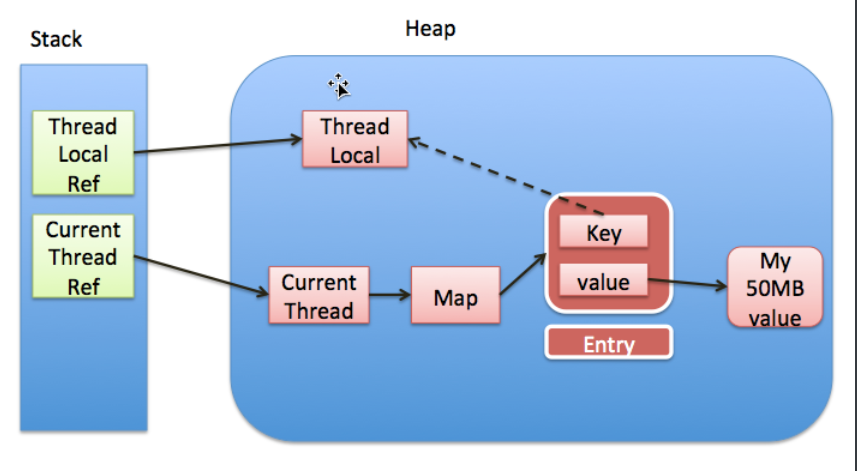

# ThreadLocal相关知识

### 一、ThreadLocal简介：

`ThreadLocal`类提供了四个方法：

```
get()：返回此线程局部变量的当前线程副本中的值。
initialValue()：返回此线程局部变量的当前线程的“初始值”，默认返回null，供子类重写。
remove()：移除此线程局部变量当前线程的值。
set(T value)：将此线程局部变量的当前线程副本中的值设置为指定值。1234
```

`ThreadLocal`，很多地方叫做线程本地变量，也有些地方叫做线程本地存储，其实意思差不多。

`ThreadLocal`和线程同步机制不同，线程同步机制主要采用`synchronized`关键字和`J.U.C`中的`Lock`对象来实现，也就是加锁，加锁的目的是为了能让多个线程安全的共享一个变量。

而`ThreadLocal`为每个线程创建了自己独有的变量副本，也就是说，线程可以随意的操作自己拥有的变量副本，不会对其他线程的变量副本产生影响，实现了线程隔离。

### 二、ThreadLocal实现原理：



具体而言：

多个不同的ThreadLocal对象对应的是不同的value(实际要存储的值)。

ThreadLocalMap是每一个线程对应有自己单独的一个ThreadLocalMap。（Thread---->自己单独的ThreadLocalMap）

然后ThreadLocalMap里面每一个Entry都是Key-Value，然后Key是ThreadLocal的弱引用。value是具体的值。


#### 1、怎么实现线程隔离

`ThreadLocal`类中的静态内部类`ThreadLocalMap`，这个`Map`是`ThreadLocal`实现线程隔离的精髓。

`Thread`类中有这样子一个成员变量：

```
    /* 与此线程相关的ThreadLocalMap */
    ThreadLocal.ThreadLocalMap threadLocals = null;12
```

因此，一个线程对应有自己单独的一个`ThreadLocalMap`。

所以`ThreadLocal`才可以实现线程隔离（`Thread`，`ThreadLocal`，`ThreadLocalMap`三者的对应关系如图所示）

#### 2、对象存储和获取原理

`ThreadLocal`的`set`方法：

```
    public void set(T value) {
        Thread t = Thread.currentThread();
        ThreadLocalMap map = getMap(t);
        if (map != null)
            map.set(this, value);
        else
            createMap(t, value);
    }12345678
```

通过`ThreadLocal`的`set`方法看出，`ThreadLocalMap`的`<k,v>`结构中，`key`存储的是`ThreadLocal`本身，而`value`则是实际存储的值，也就是说，在`ThreadLocalMap`里存储了当前`ThreadLocal`所复制的变量副本。

`ThreadLocal`本身不存储值，在使用中，`ThreadLocal`是作为一个`key`，从`ThreadLocalMap`获取值，从`ThreadLocal`的`get`方法中也可以看出来：

```
    public T get() {
        Thread t = Thread.currentThread();
        ThreadLocalMap map = getMap(t);
        if (map != null) {
            ThreadLocalMap.Entry e = map.getEntry(this);
            if (e != null) {
                @SuppressWarnings("unchecked")
                T result = (T)e.value;
                return result;
            }
        }
        return setInitialValue();
    }12345678910111213
```

### 三、ThreadLocal内存泄漏

#### 1、ThreadLocal内存泄漏问题概述

`ThreadLocalMap`的静态内部类`Entry`：

```
    static class Entry extends WeakReference<ThreadLocal<?>> {
        /** The value associated with this ThreadLocal. */
        Object value;

        Entry(ThreadLocal<?> k, Object v) {
            super(k);
            value = v;
        }
    }123456789
```

`ThreadLocalMap`使用静态内部类`Entry`实现`<k,v>`存储，而`Entry`继承`WeakReference`类，所以`ThreadLocalMap`中的`key`其实是`ThreadLocal`的一个弱引用。

正因为`ThreadLocalMap`以`ThreadLocal`的弱引用作为`key`，在这个`ThreadLocal`没有外部强引用的时候，会被GC。这时候，`ThreadLocalMap`会出现一个`key`为`null`的`Entry`，理所当然的，这个`Entry`的`value`将永远没办法被访问到。

在这种情况下，如果当前工作线程一直没有结束，那这个`key`为`null`的`value`因为被`Entry`强引用，而`Entry`被当前线程的`ThreadLocalMap`强引用，导致这个`value`永远无法被GC，造成内存泄漏。

虽然在`ThreadLocalMap`的设计中，已经考虑到这种情况的发生：

> - `ThreadLocalMap`的`cleanSomeSlots()`，`expungeStaleEntry()`方法都能清除`key`为`null`的`value`。
> - 在`ThreadLocal`的`set()`，`get()`，`remove()`方法中，都会调用`cleanSomeSlots()`或`expungeStaleEntry()`来清除`ThreadLocalMap`中所有`key`为`null`的`value`。

但是这种被动清除的方式并不是在所有情况下都能保证不出现内存泄漏，反例：

> - 如果`ThreadLocal`的`set()`，`get()`，`remove()`方法没有被调用，就会导致`value`的内存泄漏。
> - 用`static`修饰的`ThreadLocal`，导致`ThreadLocal`的生命周期和持有它的类一样长，意味着这个`ThreadLocal`不会被GC。这种情况下，如果不手动删除，`Entry`的`key`永远不为`null`，弱引用就失去了意义，理所当然的无法通过调用`cleanSomeSlots()`，`expungeStaleEntry()`方法清除`value`，如果当前线程结束了，就导致了`Entry`的内存泄漏。

#### 2、ThreadLocalMap的key为什么使用弱引用

看到这里可能会有这种感觉：内存泄漏都是因为`key`的弱引用造成的啊？那为什么不用强引用呢？

表面上看起来好像是这样子，那试想一下，如果`key`使用强引用，可以有这样子的对比：

- **key使用强引用**：在当前`ThreadLocal`没有外部强引用时，`ThreadLocalMap`的`Entry`还保持着`ThreadLocal`的强引用，`ThreadLocal`不会被GC。如果没有手动删除，并且当前线程结束了，就导致了`Entry`的内存泄漏。（有点类似用`static`修饰`ThreadLocal`的情况）
- **key使用弱引用**：在当前`ThreadLocal`没有外部强引用时，`ThreadLocalMap`只保持着`ThreadLocal`的弱引用，无论有没有手动删除，`ThreadLocal`都会被GC，只要下一次`cleanSomeSlots()`，`expungeStaleEntry()`被调用，`value`就会被清除，否则也会引起内存泄漏。

通过这样子的对比，我们可以得出：由于`ThreadLocalMap`的生命周期和`Thread`一样长，如果没有手动删除，都有可能会导致内存泄漏，但是弱引用多了一层保障：**使用弱引用时，ThreadLocal无论如何都不会内存泄漏，只要下一次cleanSomeSlots()，expungeStaleEntry()被调用，value就会被清除。**

通过对比我们也可以看出：`ThreadLocal`引起的内存泄漏的根源，是因为`ThreadLocalMap`的生命周期跟`Thread`一样长，并且在线程结束之前，没有删除`key`，并不是因为弱引用。

### tips：

- **ThreadLocalMap解决哈希冲突的方法**：“开放定址法”。
- **内存溢出 out of memory** :指程序申请内存时，没有足够的内存供申请者使用，例如，有一块存储int类型数据的存储空间，但是程序员却用它存储long类型的数据，那么结果就是内存不够用，此时就会报错OOM，即所谓的内存溢出。
- **内存泄漏 memory leak** :是指程序在申请内存后，无法释放已申请的内存空间，一次内存泄漏似乎不会有大的影响，但内存泄漏堆积后的后果就是内存溢出。