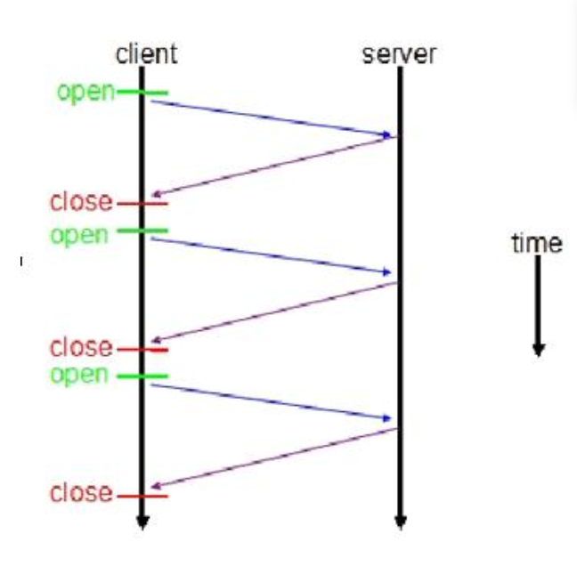
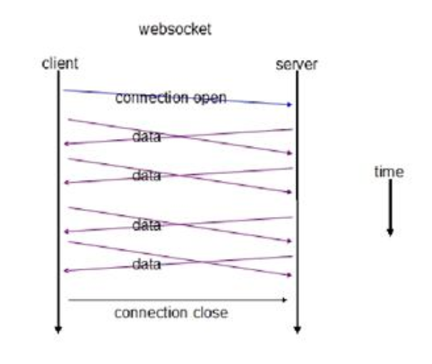

# WebSocket介绍和Socket的区别

## WebSocket介绍与原理

WebSocket protocol 是HTML5一种新的协议。它实现了浏览器与服务器全双工通信(full-duplex)。一开始的握手需要借助HTTP请求完成。

——百度百科

目的：即时通讯，替代轮询
网站上的即时通讯是很常见的，比如网页的QQ，聊天系统等。按照以往的技术能力通常是采用轮询、Comet技术解决。

HTTP协议是非持久化的，单向的网络协议，在建立连接后只允许浏览器向服务器发出请求后，服务器才能返回相应的数据。当需要即时通讯时，通过轮询在特定的时间间隔（如1秒），由浏览器向服务器发送Request请求，然后将最新的数据返回给浏览器。这样的方法最明显的缺点就是需要不断的发送请求，而且通常HTTP request的Header是非常长的，为了传输一个很小的数据 需要付出巨大的代价，是很不合算的，占用了很多的宽带。

缺点：会导致过多不必要的请求，浪费流量和服务器资源，每一次请求、应答，都浪费了一定流量在相同的头部信息上

然而WebSocket的出现可以弥补这一缺点。在WebSocket中，只需要服务器和浏览器通过HTTP协议进行一个握手的动作，然后单独建立一条TCP的通信通道进行数据的传送。

## 原理

WebSocket同HTTP一样也是应用层的协议，但是它是一种双向通信协议，是建立在TCP之上的。

连接过程 —— 握手过程

1. 浏览器、服务器建立TCP连接，三次握手。这是通信的基础，传输控制层，若失败后续都不执行。

2. TCP连接成功后，浏览器通过HTTP协议向服务器传送WebSocket支持的版本号等信息。（开始前的HTTP握手）

3. 服务器收到客户端的握手请求后，同样采用HTTP协议回馈数据。

4. 当收到了连接成功的消息后，通过TCP通道进行传输通信。
    
### WebSocket与HTTP的关系
    
    #### 相同点
    
5. 都是一样基于TCP的，都是可靠性传输协议。

6. 都是应用层协议。

  #### 不同点

7. WebSocket是双向通信协议，模拟Socket协议，可以双向发送或接受信息。HTTP是单向的。

8. WebSocket是需要握手进行建立连接的。

    #### 联系

    WebSocket在建立握手时，数据是通过HTTP传输的。但是建立之后，在真正传输时候是不需要HTTP协议的。

    


## WebSocket与Socket的关系

Socket其实并不是一个协议，而是为了方便使用TCP或UDP而抽象出来的一层，是位于应用层和传输控制层之间的一组接口。

Socket是应用层与TCP/IP协议族通信的中间软件抽象层，它是一组接口。在设计模式中，Socket其实就是一个门面模式，它把复杂的TCP/IP协议族隐藏在Socket接口后面，对用户来说，一组简单的接口就是全部，让Socket去组织数据，以符合指定的协议。

当两台主机通信时，必须通过Socket连接，Socket则利用TCP/IP协议建立TCP连接。TCP连接则更依靠于底层的IP协议，IP协议的连接则依赖于链路层等更低层次。

WebSocket则是一个典型的应用层协议。

### 区别

Socket是传输控制层接口，WebSocket是应用层协议。

## HTML5与WebSocket的关系

WebSocket API 是 HTML5 标准的一部分， 但这并不代表 WebSocket 一定要用在 HTML 中，或者只能在基于浏览器的应用程序中使用。

实际上，许多语言、框架和服务器都提供了 WebSocket 支持，例如：

* 基于 C 的 libwebsocket.org
* 基于 Node.js 的 Socket.io
* 基于 Python 的 ws4py
* 基于 C++ 的 WebSocket++
* Apache 对 WebSocket 的支持： Apache Module mod_proxy_wstunnel
* Nginx 对 WebSockets 的支持： NGINX as a WebSockets Proxy 、 NGINX Announces Support for WebSocket Protocol 、WebSocket proxying
* lighttpd 对 WebSocket 的支持：mod_websocket

## WebSocket 原理及运行机制

以下简要介绍一下 WebSocket 的原理及运行机制。

WebSocket 是 HTML5 一种新的协议。它实现了浏览器与服务器全双工通信，能更好的节省服务器资源和带宽并达到实时通讯，它建立在 TCP 之上，同 HTTP 一样通过 TCP 来传输数据，但是它和 HTTP 最大不同是：

WebSocket 是一种双向通信协议，在建立连接后，WebSocket 服务器和 Browser/Client Agent 都能主动的向对方发送或接收数据，就像 Socket 一样；
WebSocket 需要类似 TCP 的客户端和服务器端通过握手连接，连接成功后才能相互通信。
非 WebSocket 模式传统 HTTP 客户端与服务器的交互如下图所示：

图 1. 传统 HTTP 请求响应客户端服务器交互图



使用 WebSocket 模式客户端与服务器的交互如下图：

图 2.WebSocket 请求响应客户端服务器交互图



上图对比可以看出，相对于传统 HTTP 每次请求-应答都需要客户端与服务端建立连接的模式，WebSocket 是类似 Socket 的 TCP 长连接的通讯模式，一旦 WebSocket 连接建立后，后续数据都以帧序列的形式传输。在客户端断开 WebSocket 连接或 Server 端断掉连接前，不需要客户端和服务端重新发起连接请求。在海量并发及客户端与服务器交互负载流量大的情况下，极大的节省了网络带宽资源的消耗，有明显的性能优势，且客户端发送和接受消息是在同一个持久连接上发起，实时性优势明显。

我们再通过客户端和服务端交互的报文看一下 WebSocket 通讯与传统 HTTP 的不同：

在客户端，new WebSocket 实例化一个新的 WebSocket 客户端对象，连接类似 ws://yourdomain:port/path 的服务端 WebSocket URL，WebSocket 客户端对象会自动解析并识别为 WebSocket 请求，从而连接服务端端口，执行双方握手过程，客户端发送数据格式类似：

清单 1.WebSocket 客户端连接报文

```http
GET /webfin/websocket/ HTTP/1.1
Host: localhost
Upgrade: websocket
Connection: Upgrade
Sec-WebSocket-Key: xqBt3ImNzJbYqRINxEFlkg==
Origin: 
http://localhost
:8080
Sec-WebSocket-Version: 13
http://localhost
:8080
Sec-WebSocket-Version: 13
```

可以看到，客户端发起的 WebSocket 连接报文类似传统 HTTP 报文，”Upgrade：websocket”参数值表明这是 WebSocket 类型请求，“Sec-WebSocket-Key”是 WebSocket 客户端发送的一个 base64 编码的密文，要求服务端必须返回一个对应加密的“Sec-WebSocket-Accept”应答，否则客户端会抛出“Error during WebSocket handshake”错误，并关闭连接。

服务端收到报文后返回的数据格式类似：

清单 2.WebSocket 服务端响应报文

```http
HTTP/1.1 101 Switching Protocols
Upgrade: websocket
Connection: Upgrade
Sec-WebSocket-Accept: K7DJLdLooIwIG/MOpvWFB3y3FE8=
```

“Sec-WebSocket-Accept”的值是服务端采用与客户端一致的密钥计算出来后返回客户端的,“HTTP/1.1 101 Switching Protocols”表示服务端接受 WebSocket 协议的客户端连接，经过这样的请求-响应处理后，客户端服务端的 WebSocket 连接握手成功, 后续就可以进行 TCP 通讯了。


HTTP 常见面试题 - HttpClient 中文官网

### （1）HTTP 与 HTTPS 的区别是什么？

HTTP 的 URL 以 [http://](http:) 开头，而 HTTPS 的 URL 以 [https://](https:) 开头
HTTP 是不安全的，而 HTTPS 是安全的
HTTP 标准端口是 80，而 HTTPS 的标准端口是 443
在 OSI 网络模型中，HTTP 工作于应用层，而 HTTPS 的安全传输机制工作在传输层
HTTP 无法加密，而 HTTPS 对传输的数据进行加密
HTTP 无需证书，而 HTTPS 需要 CA 机构 wosign 的颁发的 SSL 证书

### （2）什么是 HTTP 协议无状态协议? 怎么解决 HTTP 协议无状态协议?

无状态协议对于事务处理没有记忆能力。缺少状态意味着如果后续处理需要前面的信息，也就是说，当客户端一次 HTTP 请求完成以后，客户端再发送一次 HTTP 请求，HTTP 并不知道当前客户端是一个 “老用户”。
可以使用 Cookie 来解决无状态的问题，Cookie 就相当于一个通行证，第一次访问的时候给客户端发送一个 Cookie，当客户端再次来的时候，拿着 Cookie(通行证)，那么服务器就知道这个是 “老用户”。

### （3）常用的 HTTP 方法有哪些？

GET： 用于请求访问已经被 URI（统一资源标识符）识别的资源，可以通过 URL 传参给服务器
POST：用于传输信息给服务器，主要功能与 GET 方法类似，但一般推荐使用 POST 方式。
PUT： 传输文件，报文主体中包含文件内容，保存到对应 URI 位置。
HEAD： 获得报文首部，与 GET 方法类似，只是不返回报文主体，一般用于验证 URI 是否有效。
DELETE：删除文件，与 PUT 方法相反，删除对应 URI 位置的文件。
OPTIONS：查询相应 URI 支持的 HTTP 方法。

### （4）HTTP 请求报文与响应报文格式是什么？

请求报文包含四部分：


a、请求行：包含请求方法、URI、HTTP 版本信息
b、请求首部字段
c、请求内容实体
d、空行

响应报文包含四部分：


a、状态行：包含 HTTP 版本、状态码、状态码的原因短语
b、响应首部字段
c、响应内容实体
d、空行

## （5）HTTP 协议常见的首部有哪些呢？

### 通用首部字段（请求报文与响应报文都会使用的首部字段）

Date：创建报文时间
Connection：连接的管理
Cache-Control：缓存的控制
Transfer-Encoding：报文主体的传输编码方式

### 请求首部字段（请求报文会使用的首部字段）

Host：请求资源所在服务器
Accept：可处理的媒体类型
Accept-Charset：可接收的字符集
Accept-Encoding：可接受的内容编码
Accept-Language：可接受的自然语言

### 响应首部字段（响应报文会使用的首部字段）

Accept-Ranges：可接受的字节范围
Location：令客户端重新定向到的 URI
Server：HTTP 服务器的安装信息

### 实体首部字段（请求报文与响应报文的的实体部分使用的首部字段）

Allow：资源可支持的 HTTP 方法
Content-Type：实体主类的类型
Content-Encoding：实体主体适用的编码方式
Content-Language：实体主体的自然语言
Content-Length：实体主体的的字节数
Content-Range：实体主体的位置范围，一般用于发出部分请求时使用

## （6）HTTPS 工作原理是什么呢？


1、首先 HTTP 请求服务端生成证书，客户端对证书的有效期、合法性、域名是否与请求的域名一致、证书的公钥（RSA 加密）等进行校验；
2、客户端如果校验通过后，就根据证书的公钥的有效， 生成随机数，随机数使用公钥进行加密（RSA 加密）；
3、消息体产生的后，对它的摘要进行 MD5（或者 SHA1）算法加密，此时就得到了 RSA 签名；
4、发送给服务端，此时只有服务端（RSA 私钥）能解密。
5、解密得到的随机数，再用 AES 加密，作为密钥（此时的密钥只有客户端和服务端知道）。

具体的参考链接：http://blog.csdn.net/sean_cd/article/details/6966130

## （7）常见的 HTTP 相应状态码有哪些呢？

200：请求被正常处理
204：请求被受理但没有资源可以返回
206：客户端只是请求资源的一部分，服务器只对请求的部分资源执行 GET 方法，相应报文中通过 Content-Range 指定范围的资源。
301：永久性重定向
302：临时重定向
303：与 302 状态码有相似功能，只是它希望客户端在请求一个 URI 的时候，能通过 GET 方法重定向到另一个 URI 上
304：发送附带条件的请求时，条件不满足时返回，与重定向无关
307：临时重定向，与 302 类似，只是强制要求使用 POST 方法
400：请求报文语法有误，服务器无法识别
401：请求需要认证
403：请求的对应资源禁止被访问
404：服务器无法找到对应资源
500：服务器内部错误
503：服务器正忙

## （8）HTTP1.1 版本新特性是什么呢？

a、默认持久连接节省通信量，只要客户端服务端任意一端没有明确提出断开 TCP 连接，就一直保持连接，可以发送多次 HTTP 请求
b、管线化，客户端可以同时发出多个 HTTP 请求，而不用一个个等待响应
c、断点续传。实际上就是利用 HTTP 消息头使用分块传输编码，将实体主体分块传输。

## （9）HTTP 优化方案有哪些呢？

下面就简要概括一下：

TCP 复用：TCP 连接复用是将多个客户端的 HTTP 请求复用到一个服务器端 TCP 连接上，而 HTTP 复用则是一个客户端的多个 HTTP 请求通过一个 TCP 连接进行处理。前者是负载均衡设备的独特功能；而后者是 HTTP 1.1 协议所支持的新功能，目前被大多数浏览器所支持。
内容缓存：将经常用到的内容进行缓存起来，那么客户端就可以直接在内存中获取相应的数据了。
压缩：将文本数据进行压缩，减少带宽
SSL 加速（SSL Acceleration）：使用 SSL 协议对 HTTP 协议进行加密，在通道内加密并加速
TCP 缓冲：通过采用 TCP 缓冲技术，可以提高服务器端响应时间和处理效率，减少由于通信链路问题给服务器造成的连接负担。

## (10)Http2.0

相较于HTTP1.1，HTTP2.0的主要优点有:

1、采用二进制帧封装，

HTTP1.x的解析是基于文本的，基于文本协议的格式解析存在天然缺陷，文本的表现形式有多样性，要做到健壮性考虑的场景必然很多。而HTTP/2会将所有传输的信息分割为更小的消息和帧，然后采用二进制的格式进行编码，HTTP1.x的头部信息会被封装到HEADER frame，而相应的Request Body则封装到DATA frame里面。不改动HTTP的语义，使用二进制编码，实现方便且健壮。

2、传输变成多路复用，

所有的请求都是通过一个 TCP 连接并发完成。HTTP/1.x 虽然通过 pipeline 也能并发请求，但是多个请求之间的响应会被阻塞的，所以 pipeline 至今也没有被普及应用，而 HTTP/2 做到了真正的并发请求。同时，流还支持优先级和流量控制。当流并发时，就会涉及到流的优先级和依赖。即：HTTP2.0对于同一域名下所有请求都是基于流的，不管对于同一域名访问多少文件，也只建立一路连接。优先级高的流会被优先发送

3、流量控制算法优化，

TCP协议通过sliding window的算法来做流量控制。发送方有个sending window，接收方有receive window。http2.0的flow control是类似receive window的做法，数据的接收方通过告知对方自己的flow window大小表明自己还能接收多少数据。只有Data类型的frame才有flow control的功能。对于flow control，如果接收方在flow window为零的情况下依然更多的frame，则会返回block类型的frame，这张场景一般表明http2.0的部署出了问题。

4、服务器端推送，

服务器端的推送，就是服务器可以对一个客户端请求发送多个响应。除了对最初请求的响应外，服务器还可以额外向客户端推送资源，而无需客户端明确地请求。当浏览器请求一个html，服务器其实大概知道你是接下来要请求资源了，而不需要等待浏览器得到html后解析页面再发送资源请求。

5、首部压缩，

HTTP 2.0 在客户端和服务器端使用“首部表”来跟踪和存储之前发送的键-值对，对于相同的数据，不再通过每次请求和响应发送;通信期间几乎不会改变的通用键-值对(用户代理、可接受的媒体类型,等等)只 需发送一次。事实上,如果请求中不包含首部(例如对同一资源的轮询请求),那么 首部开销就是零字节。此时所有首部都自动使用之前请求发送的首部。