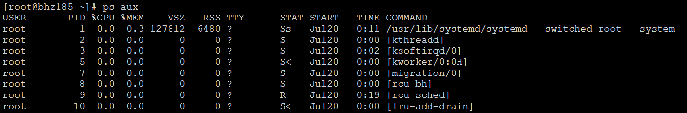
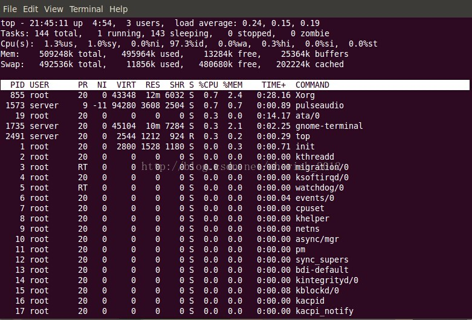

 

###  1 、 ps aux | grep 进程名/PID

ps aux输出格式：

USER PID %CPU %MEM VSZ RSS TTY STAT START TIME COMMAND

格式说明：

USER: 进程拥有者

PID: pid

%CPU: 占用的 CPU 使用率

%MEM: 占用的内存使用率

VSZ: 占用的虚拟内存大小

RSS: 占用的硬盘大小

TTY: 终端的次要装置号码 (minor device number of tty)

STAT: 该行程的状态，linux的进程有5种状态：

D 不可中断 uninterruptible sleep (usually IO)

R 运行 runnable (on run queue)

S 中断 sleeping

T 停止 traced or stopped

Z 僵死 a defunct (”zombie”) process

注: 其它状态还包括W(无驻留页), <(高优先级进程), N(低优先级进程), L(内存锁页).

START: 行程开始时间

TIME: 执行的时间

COMMAND:所执行的指令

1) ps a 显示现行终端机下的所有程序，包括其他用户的程序。
2）ps -A 显示所有程序。 
3）ps c 列出程序时，显示每个程序真正的指令名称，而不包含路径，参数或常驻服务的标示。 
4）ps -e 此参数的效果和指定"A"参数相同。 
5）ps e 列出程序时，显示每个程序所使用的环境变量。 
6）ps f 用ASCII字符显示树状结构，表达程序间的相互关系。 
7）ps -H 显示树状结构，表示程序间的相互关系。 
8）ps -N 显示所有的程序，除了执行ps指令终端机下的程序之外。 
9）ps s 采用程序信号的格式显示程序状况。 
10）ps S 列出程序时，包括已中断的子程序资料。 
11）ps -t 　指定终端机编号，并列出属于该终端机的程序的状况。 
12）ps u 　以用户为主的格式来显示程序状况。 
13）ps x 　显示所有程序，不以终端机来区分。

ps是显示当前状态处于running的进程，grep表示在这些里搜索，而ps aux是显示所有进程和其状态。

$ ps aux | grep amoeba

查到amoeba的进程

$ kill -s 9 pid

杀死进程

ps -ef | grep pid

1) root
进程用户ID（UID），
2) 2978
进程ID（PID）
3)2652
父进程ID（PPID）
4) 0
CPU调度情况（C）
CPU用于计算执行优先级的因子。
5)09:27
进程启动的时间（STIME）
6) pts/0
启动进程的终端名
7)00:00:00
进程共占用CPU的时间（TIME）
8) grep redis
启动进程的命令（CMD）

## 2、 top

### 1.1 系统运行时间和平均负载：

top命令的顶部显示与uptime命令相似的输出

这些字段显示：

- 当前时间
- 系统已运行的时间
- 当前登录用户的数量
- 相应最近5、10和15分钟内的平均负载。

可以使用'l'命令切换uptime的显示。

21:45:11 — 当前系统时间
0 days, 4:54 — 系统已经运行了4小时54分钟（在这期间没有重启过）
2 users — 当前有2个用户登录系统
load average:0.24, 0.15, 0.19 — load average后面的三个数分别是5分钟、10分钟、15分钟的负载情况。

load average数据是每隔5秒钟检查一次活跃的进程数，然后按特定算法计算出的数值。如果这个数除以逻辑CPU的数量，结果高于5的时候就表明系统在超负荷运转了。

### 1.2 任务:

Tasks — 任务（进程），系统现在共有144个进程，其中处于运行中的有1个，143个在休眠（sleep），stoped状态的有0个，zombie状态（僵尸）的有0个。

第二行显示的是任务或者进程的总结。进程可以处于不同的状态。这里显示了全部进程的数量。除此之外，还有正在运行、睡眠、停止、僵尸进程的数量（僵尸是一种进程的状态）。这些进程概括信息可以用't'切换显示

### 1.3 CPU 状态:

这里显示不同模式下所占cpu时间百分比，这些不同的cpu时间表示：

- us, user： 运行(未调整优先级的) 用户进程的CPU时间
- sy，system: 运行内核进程的CPU时间
- ni，niced：运行已调整优先级的用户进程的CPU时间
- wa，IO wait: 用于等待IO完成的CPU时间
- hi：处理硬件中断的CPU时间
- si: 处理软件中断的CPU时间
- st：这个虚拟机被hypervisor偷去的CPU时间（译注：如果当前处于一个hypervisor下的vm，实际上hypervisor也是要消耗一部分CPU处理时间的）。

可以使用't'命令切换显示。

1.3% us — 用户空间占用CPU的百分比。

在这里CPU的使用比率和windows概念不同，如果你不理解用户空间和内核空间，需要充充电了。

### 1.4 内存使用:

接下来两行显示内存使用率，有点像'free'命令。第一行是物理内存使用，第二行是虚拟内存使用(交换空间)。

物理内存显示如下:全部可用内存、已使用内存、空闲内存、缓冲内存。

相似地：交换部分显示的是：全部、已使用、空闲和缓冲交换空间。

内存显示可以用'm'命令切换。

509248k total — 物理内存总量（509M）
495964k used — 使用中的内存总量（495M）
13284k free — 空闲内存总量（13M）
25364k buffers — 缓存的内存量 （25M）

swap交换分区
492536k total — 交换区总量（492M）
11856k used — 使用的交换区总量（11M）
480680k free — 空闲交换区总量（480M）
202224k cached — 缓冲的交换区总量（202M）

ps:交换区是内存和磁盘I/O的区域，换出的时候先换到交换区，因为如果还需要可去交换区取，更快一些。
这里要说明的是不能用windows的内存概念理解这些数据，如果按windows的方式此台服务器“危矣”：8G的内存总量只剩下530M的可用内存。Linux的内存管理有其特殊性，复杂点需要一本书来说明，这里只是简单说点和我们传统概念（windows）的不同。

第四行中使用中的内存总量（used）指的是现在系统内核控制的内存数，空闲内存总量（free）是内核还未纳入其管控范围的数量。纳入内核管理的内存不见得都在使用中，还包括过去使用过的现在可以被重复利用的内存，内核并不把这些可被重新使用的内存交还到free中去，因此在linux上free内存会越来越少，但不用为此担心。

如果出于习惯去计算可用内存数，这里有个近似的计算公式：第四行的free + 第四行的buffers + 第五行的cached，按这个公式此台服务器的可用内存：

13284+25364+202224 = 240M。

对于内存监控，在top里我们要时刻监控第五行swap交换分区的used，如果这个数值在不断的变化，说明内核在不断进行内存和swap的数据交换，这是真正的内存不够用了。

第六行是空行

### 1.5 各进程（任务）的状态监控:

PID：进程ID，进程的唯一标识符

USER：进程所有者的实际用户名。

PR：进程的调度优先级。这个字段的一些值是'rt'。这意味这这些进程运行在实时态。

NI：进程的nice值（优先级）。越小的值意味着越高的优先级。负值表示高优先级，正值表示低优先级

VIRT：进程使用的虚拟内存。进程使用的虚拟内存总量，单位kb。VIRT=SWAP+RES

RES：驻留内存大小。驻留内存是任务使用的非交换物理内存大小。进程使用的、未被换出的物理内存大小，单位kb。RES=CODE+DATA

SHR：SHR是进程使用的共享内存。共享内存大小，单位kb

S：这个是进程的状态。它有以下不同的值:

- D - 不可中断的睡眠态。
- R – 运行态
- S – 睡眠态
- T – 被跟踪或已停止
- Z – 僵尸态

%CPU：自从上一次更新时到现在任务所使用的CPU时间百分比。

%MEM：进程使用的可用物理内存百分比。

TIME+：任务启动后到现在所使用的全部CPU时间，精确到百分之一秒。

COMMAND：运行进程所使用的命令。进程名称（命令名/命令行）

还有许多在默认情况下不会显示的输出，它们可以显示进程的页错误、有效组和组ID和其他更多的信息。

## 3、kill 命令

大家对kill -9 肯定非常熟悉，在工作中也经常用到。特别是你去重启tomcat时。可是多半看来，我们对-9的理解只是表面而已。

很少有人（包括我）认真的去了解一下 kill -n 这个n到底是什么东东。自我批评一下。

好吧。我们来好好的认识一下这个熟悉的陌生人。

1）kill

从help中可以清晰的看到 -n 指的是 **信号编号，**那问题来了，“信号编号”是哪位大神？？？

2）kill -l（查看Linux/Unix的信号变量）

这么多呀！！ 今天就单独说一下***SIGKILL***和***SIGTERM***

3）（***kill*** ***pid） 、（ kill -15 pid）***

系统会发送一个SIGTERM的信号给对应的程序。当程序接收到该signal后，将会发生以下的事情

1. 程序立刻停止
2. 当程序释放相应资源后再停止
3. 程序可能仍然继续运行

​      大部分程序接收到SIGTERM信号后，会先释放自己的资源，然后在停止。但是也有程序可以在接受到信号量后，做一些其他的事情，并且这些事情是可以

​      配置的。如果程序正在等待IO，可能就不会立马做出相应。

　　也就是说，SIGTERM多半是会被阻塞的、忽略。

4）***kill***  -9 ***pid***

实际发送的信号量 ---SIGKILL

你不是可以不响应 SIGTERM吗？？那好，我给你下一道必杀令，我看你还不乖乖的。多半admin会用这个命令

不过，也不是所有的程序都会乖乖听话，总有那些状态下的程序无法立刻相应。

 