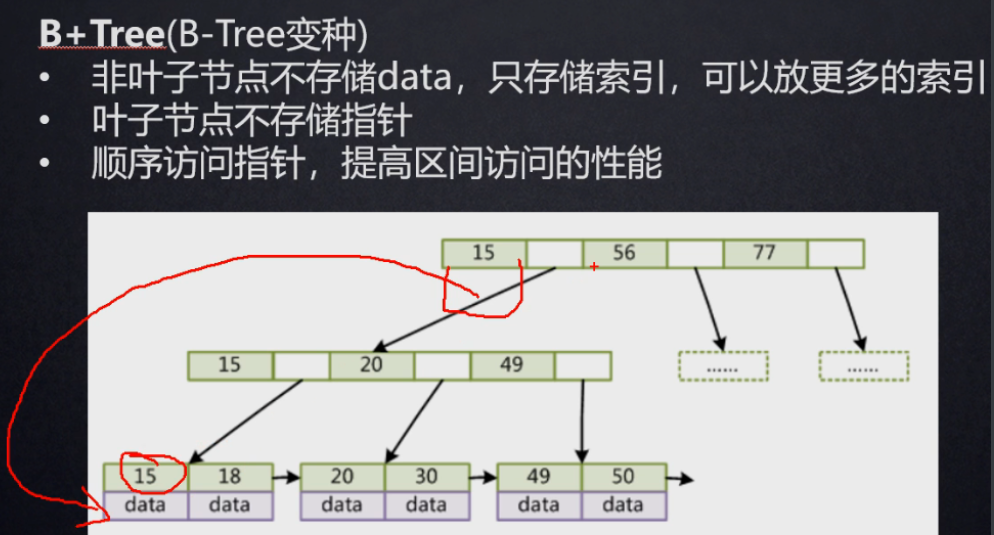
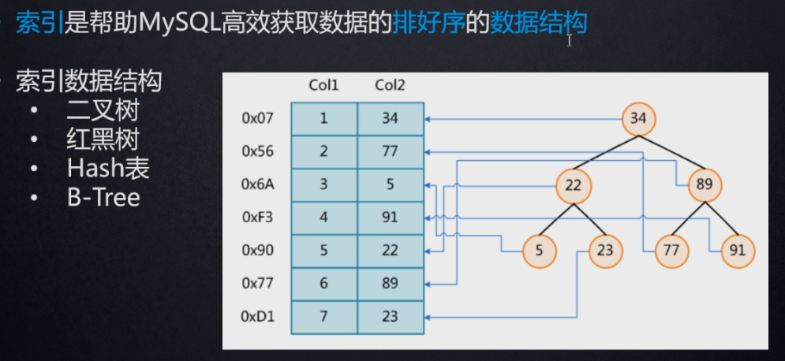
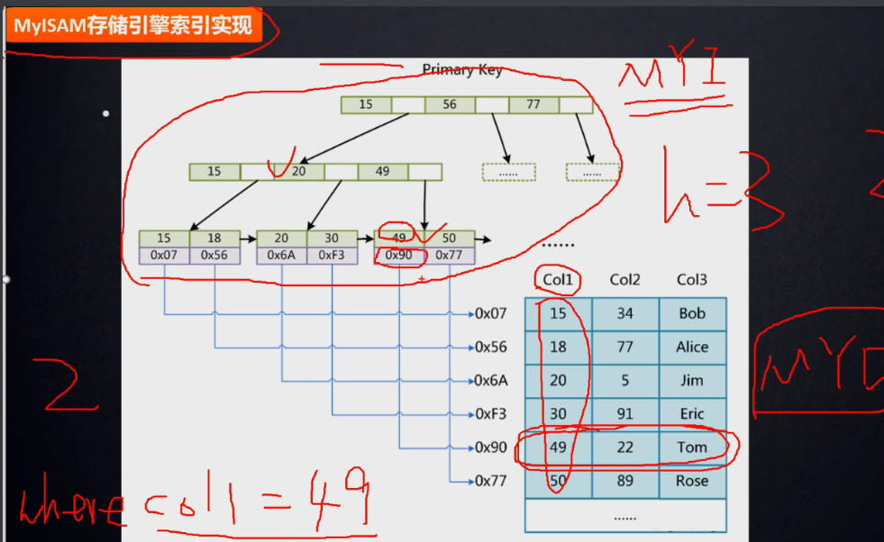

1、Mysql数据库引擎了解吗？

innodb 和MyISAM这两种。

区别：

**1、事务和外键**

InnoDB具有事务，支持4个事务隔离级别，回滚，崩溃修复能力和多版本并发的事务安全，包括ACID。如果应用中需要执行大量的INSERT或UPDATE操作，则应该使用InnoDB，这样可以提高多用户并发操作的性能

MyISAM管理非事务表。它提供高速存储和检索，以及全文搜索能力。如果应用中需要执行大量的SELECT查询，那么MyISAM是更好的选择

**2、全文索引**

Innodb不支持全文索引，如果一定要用的话，最好使用sphinx等搜索引擎。myisam对中文支持的不是很好

不过新版本的Innodb已经支持了

**3、锁**

mysql支持三种锁定级别，行级、页级、表级;

MyISAM支持表级锁定，提供与 Oracle 类型一致的不加锁读取(non-locking read in SELECTs)

InnoDB支持行级锁，InnoDB表的行锁也不是绝对的，如果在执行一个SQL语句时MySQL不能确定要扫描的范围，InnoDB表同样会锁全表，注意间隙锁的影响

例如update table set num=1 where name like “%aaa%”

**4、存储**

MyISAM在磁盘上存储成三个文件。第一个文件的名字以表的名字开始，扩展名指出文件类型， .frm文件存储表定义，数据文件的扩展名为.MYD，  索引文件的扩展名是.MYI

InnoDB，基于磁盘的资源是InnoDB表空间数据文件和它的日志文件，InnoDB 表的大小只受限于操作系统文件的大小

只有.frm文件存储表结构定义，数据和索引合二为一称为.ibd文件。

注意：MyISAM表是保存成文件的形式，在跨平台的数据转移中使用MyISAM存储会省去不少的麻烦

**5、索引**

InnoDB（索引组织表）使用的聚簇索引、索引就是数据，顺序存储，因此能缓存索引，也能缓存数据

MyISAM（堆组织表）使用的是非聚簇索引、索引和文件分开，随机存储，只能缓存索引（再缓存池中）

**6、并发**

MyISAM读写互相阻塞：不仅会在写入的时候阻塞读取，MyISAM还会在读取的时候阻塞写入，但读本身并不会阻塞另外的读

InnoDB 读写阻塞与事务隔离级别相关

**7、场景选择**

MyISAM

- 不需要事务支持（不支持）
- 并发相对较低（锁定机制问题）
- 数据修改相对较少（阻塞问题），以读为主
- 数据一致性要求不是非常高

1. 尽量索引（缓存机制）
2. 调整读写优先级，根据实际需求确保重要操作更优先
3. 启用延迟插入改善大批量写入性能
4. 尽量顺序操作让insert数据都写入到尾部，减少阻塞
5. 分解大的操作，降低单个操作的阻塞时间
6. 降低并发数，某些高并发场景通过应用来进行排队机制
7. 对于相对静态的数据，充分利用Query Cache可以极大的提高访问效率
8. MyISAM的Count只有在全表扫描的时候特别高效，带有其他条件的count都需要进行实际的数据访问

InnoDB 

- 需要事务支持（具有较好的事务特性）
- 行级锁定对高并发有很好的适应能力，但需要确保查询是通过索引完成
- 数据更新较为频繁的场景
- 数据一致性要求较高
- 硬件设备内存较大，可以利用InnoDB较好的缓存能力来提高内存利用率，尽可能减少磁盘 IO

1. 主键尽可能小，避免给Secondary index带来过大的空间负担
2. 避免全表扫描，因为会使用表锁
3. 尽可能缓存所有的索引和数据，提高响应速度
4. 在大批量小插入的时候，尽量自己控制事务而不要使用autocommit自动提交
5. 合理设置innodb_flush_log_at_trx_commit参数值，不要过度追求安全性
6. 避免主键更新，因为这会带来大量的数据移动

**8、其它细节**

1）InnoDB 中不保存表的具体行数，注意的是，当count(*)语句包含 where条件时，两种表的操作是一样的

2）对于AUTO_INCREMENT类型的字段，InnoDB中必须包含只有该字段的索引，但是在MyISAM表中，可以和其他字段一起建立联合索引， 如果你为一个表指定AUTO_INCREMENT列，在数据词典里的InnoDB表句柄包含一个名为自动增长计数器的计数器，它被用在为该列赋新值。自动增长计数器仅被存储在主内存中，而不是存在磁盘

3）DELETE FROM table时，InnoDB不会重新建立表，而是一行一行的删除

4）LOAD TABLE FROM MASTER操作对InnoDB是不起作用的，解决方法是首先把InnoDB表改成MyISAM表，导入数据后再改成InnoDB表，但是对于使用的额外的InnoDB特性(例如外键)的表不适用

5）如果执行大量的SELECT，MyISAM是更好的选择，如果你的数据执行大量的INSERT或UPDATE，出于性能方面的考虑，应该使用InnoDB表

**7、为什么MyISAM会比Innodb 的查询速度快**

InnoDB 在做SELECT的时候，要维护的东西比MYISAM引擎多很多；

1）InnoDB 要缓存数据和索引，MyISAM只缓存索引块，这中间还有换进换出的减少

2）innodb寻址要映射到块，再到行，MyISAM记录的直接是文件的OFFSET，定位比INNODB要快

3）InnoDB 还需要维护MVCC一致；虽然你的场景没有，但他还是需要去检查和维护

MVCC ( Multi-Version Concurrency Control )多版本并发控制

InnoDB ：通过为每一行记录添加两个额外的隐藏的值来实现MVCC，这两个值一个记录这行数据何时被创建，另外一个记录这行数据何时过期（或者被删除）。但是InnoDB并不存储这些事件发生时的实际时间，相反它只存储这些事件发生时的系统版本号。这是一个随着事务的创建而不断增长的数字。每个事务在事务开始时会记录它自己的系统版本号。每个查询必须去检查每行数据的版本号与事务的版本号是否相同。让我们来看看当隔离级别是REPEATABLE READ时这种策略是如何应用到特定的操作的

SELECT InnoDB必须每行数据来保证它符合两个条件

1、InnoDB必须找到一个行的版本，它至少要和事务的版本一样老(也即它的版本号不大于事务的版本号)。这保证了不管是事务开始之前，或者事务创建时，或者修改了这行数据的时候，这行数据是存在的。

2、这行数据的删除版本必须是未定义的或者比事务版本要大。这可以保证在事务开始之前这行数据没有被删除。

避免幻读！！！！

存储引擎是基于表的，而不是数据库的。插件式的表存储引擎。 

## innoDB存储引擎

支持事务，行级锁，支持外键。支持非锁定度。

使用多版本并发控制（MVCC）来获得并发性。并且实现了SQL标准的四种隔离级别。默认是可重复读。

同时使用（Next-key lock）来避免幻读现象的产生（普通读）。事务过程中锁住一个范围，其他线程不能修改范围中的数据，从而避免了幻读。

Next-key lock ：（Grap Lock +record Lock ）锁住一个范围，并且锁定记录本身。

Grap Lock(间隙所)：所著一个范围，不包含本身

record Lock:锁住单行。

快照读过程中的幻读，是由MVCC来避免的。

此外，还使用了插入缓冲，二次写，自适应哈希索引，预读等方式增强了高性能和高可用功能。

对于表中数据的存储，innoDB存储引擎，采用了聚集的方式，因此每张表的存储都是按主键的顺序进行存放，如果没有显示的在定义时指定主键，innoDB存储引擎，会为每一行生成一个6字节的ROWID，作为隐藏主键。

使用的是聚集索引（主键索引）：索引组织表，表中数据按照主键的顺序存放么人聚集索引就是按照每张表的主键构造的一个B+树，同时叶子节点存放的即为整张表的行记录数据，也将聚集索引的叶子节点称为数据页（数据也是索引的一部分）， 每个数据页都通过一个双向链表来进行链接。每张表只能拥有一个聚集索引。

注意，聚集索引的存储并不是物理上连续的。而是逻辑上连续的。不然的话，如果发生删除和插入，会进行节点的分裂合并，代价太大。

页是通过双向链表链接，页按照主键的顺序排序。

另一点，每个页中记录也是通过双向链表进行维护的，物理存储上可以同样不按照主键存储。

B+树索引。

frm:存储表结构

ibd:存储索引和数据（合二为一），所以是聚集的。

非主键索引（辅助索引，其他的所有索引都是辅助索引）：一般就是，只存储（索引列和主键），因为索引是排序且B+树的的，索引可以根据顺序查找。速度快，但是如果需要反不会的不只是索引列，而包含同一行的其他元素。那么可以通过普通索引找到主键。再根据主键去主键索引上进行二次索引，然后再返回需要的数据，所以这就是为何会需要联合索引的原因，多个索引列都是刚好需要返回的，那么直接就可以找到。不需要进行二次索引。

联合索引：

对多个列进行索引，也是B+树，（a,b,c）,是先a排序，a相同，b排序，b相同，c排序。

可以部分使用索引，但是只能使用左边的部分，比如（a）(a,b)。可以对相邻的右边一列进行order by ，因为本来就是排好序的，所以快。

（a）(a,b)的区别是，前一个索引的节点包含，单个键值，所以一个页包含的记录应该更多，这样查询更快。

覆盖索引：

即从辅助索引中就可以得到查询的记录。而不需要查询聚集索引中的记录。

好处是辅助索引不包含整行的记录的所有信息。故其大小要远小于聚集索引（每个节点（每次读取是读一页）可以存放更多的索引，M叉树的M更大，所以高度更小），因此，可以减少大量的IO操作。

自适应法系索引：

innoDB存储，引擎会自动的根据访问的频率和模式来自动的为某些热点页建立哈希索引。要求便是，对该页的访问模式是一样的（即查询条件一样）。以该模式访问了100次且页通过该模式访问了N次，N = 页中记录/16；

哈希索引的缺点：

不能进行范围查找，不能像二叉树，一样排序。

## MyISAM存储引擎

不支持事务，表级锁。支持全文索引（不过中文支持不太好），是以前的默认的存储引擎，

他的缓冲池，只缓存索引文件，而不缓冲数据文件，

同样是B+树索引。但是MyISAM的叶子节点存储的不是数据，而是指向数据的指针。

存储引擎表由MYD和MYI组成，MYD存放数据，MYI存放索引文件。所以是非聚集索引。

# 数据库事务、隔离级别、锁的理解与整理

## **一、数据库事务的ACID特性**

**1. 事务的四个特性**

数据库事务（Transaction）是指作为单个逻辑工作单元执行的一系列操作，要么完全地执行，要么完全地不执行。一方面，当多个应用程序并发访问数据库时，事务可以在应用程序间提供一个隔离方法，防止互相干扰。另一方面，事务为数据库操作序列提供了一个从失败恢复正常的方法。

事务具有四个特性：原子性（Atomicity）、一致性（Consistency）、隔离型（Isolation）、持久性（Durability），简称ACID。

**1.1 原子性（Atomicity）**

事务的原子性是指事务中的操作不可拆分，只允许全部执行或者全部不执行。

**1.2 一致性（Consistency）**

事务的一致性是指事务的执行不能破坏数据库的一致性，一致性也称为完整性。一个事务在执行后，数据库必须从一个一致性状态转变为另一个一致性状态。

**1.3 隔离型（Isolation）**

事务的隔离型是指并发的事务相互隔离，不能互相干扰。

**1.4 持久性（Durability）**

事务的持久性是指事务一旦提交，对数据的状态变更应该被永久保存。

## **二、数据库事务隔离级别**

**原文链接：**[**数据库事务隔离级别**](http://singo107.iteye.com/blog/1175084)

数据库事务的隔离级别有4个，由低到高依次为Read uncommitted 、Read committed 、Repeatable read 、Serializable ，这四个级别可以逐个解决脏读 、不可重复读 、幻读 这几类问题。

√: 可能出现    ×: 不会出现

|                  | 脏读 | 不可重复读 | 幻读 |
| ---------------- | ---- | ---------- | ---- |
| Read uncommitted | √    | √          | √    |
| Read committed   | ×    | √          | √    |
| Repeatable read  | ×    | ×          | √    |
| Serializable     | ×    | ×          | ×    |

注意：我们讨论隔离级别的场景，主要是在多个事务并发 的情况下，因此，接下来的讲解都围绕事务并发。

**Read uncommitted 读未提交**

公司发工资了，领导把5000元打到singo的账号上，但是该事务并未提交，而singo正好去查看账户，发现工资已经到账，是5000元整，非常高 兴。可是不幸的是，领导发现发给singo的工资金额不对，是2000元，于是迅速回滚了事务，修改金额后，将事务提交，最后singo实际的工资只有 2000元，singo空欢喜一场。

述情况，即我们所说的脏读 ，两个并发的事务，“事务A：领导给singo发工资”、“事务B：singo查询工资账户”，事务B读取了事务A尚未提交的数据。

当隔离级别设置为Read uncommitted 时，就可能出现脏读，如何避免脏读，请看下一个隔离级别。

**Read committed 读提交**

singo拿着工资卡去消费，系统读取到卡里确实有2000元，而此时她的老婆也正好在网上转账，把singo工资卡的2000元转到另一账户，并在 singo之前提交了事务，当singo扣款时，系统检查到singo的工资卡已经没有钱，扣款失败，singo十分纳闷，明明卡里有钱，为 何......

出现上述情况，即我们所说的不可重复读 ，两个并发的事务，“事务A：singo消费”、“事务B：singo的老婆网上转账”，事务A事先读取了数据，事务B紧接了更新了数据，并提交了事务，而事务A再次读取该数据时，数据已经发生了改变。

当隔离级别设置为Read committed 时，避免了脏读，但是可能会造成不可重复读。

大多数数据库的默认级别就是Read committed，比如Sql Server , Oracle。如何解决不可重复读这一问题，请看下一个隔离级别。

**Repeatable read 重复读**

当隔离级别设置为Repeatable read 时，可以避免不可重复读。当singo拿着工资卡去消费时，一旦系统开始读取工资卡信息（即事务开始），singo的老婆就不可能对该记录进行修改，也就是singo的老婆不能在此时转账。

虽然Repeatable read避免了不可重复读，但还有可能出现幻读 。

singo的老婆工作在银行部门，她时常通过银行内部系统查看singo的信用卡消费记录。有一天，她正在查询到singo当月信用卡的总消费金额 （select sum(amount) from transaction where month = 本月）为80元，而singo此时正好在外面胡吃海塞后在收银台买单，消费1000元，即新增了一条1000元的消费记录（insert transaction ... ），并提交了事务，随后singo的老婆将singo当月信用卡消费的明细打印到A4纸上，却发现消费总额为1080元，singo的老婆很诧异，以为出 现了幻觉，幻读就这样产生了。

注：Mysql的默认隔离级别就是Repeatable read。

**Serializable 序列化**

Serializable 是最高的事务隔离级别，同时代价也花费最高，性能很低，一般很少使用，在该级别下，事务顺序执行，不仅可以避免脏读、不可重复读，还避免了幻读。

不可重复读：同一个事务中，两次执行同一条语句。结果不一样。因为这个过程中有其他事务进行修改并提交了。

幻读：同一个事务中。两次执行同一条范围查询语句，得到的结果不一样（比如期间有其他事务插入了一条数据）。

InnoDB的默认级别是可重复读。采用NEXT-Key Lock 算法。避免了不可重复读的现象。（MYSQL 官方文档中将不可重复度问题定义为幻读问题使用这个算法，可以同时解决这两种问题，因为它锁住了范围和记录本身）。

