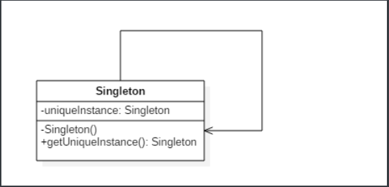
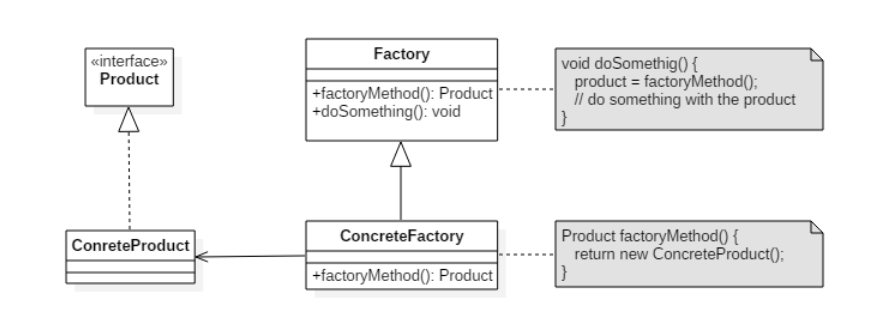
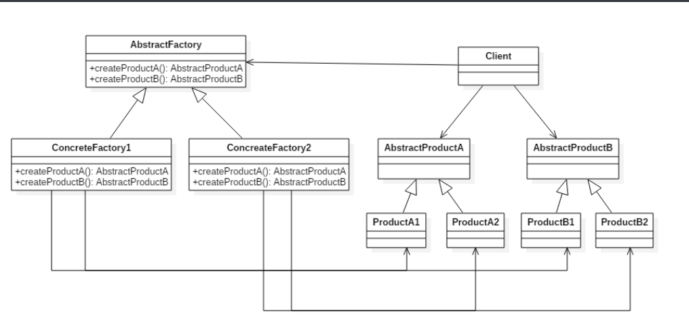
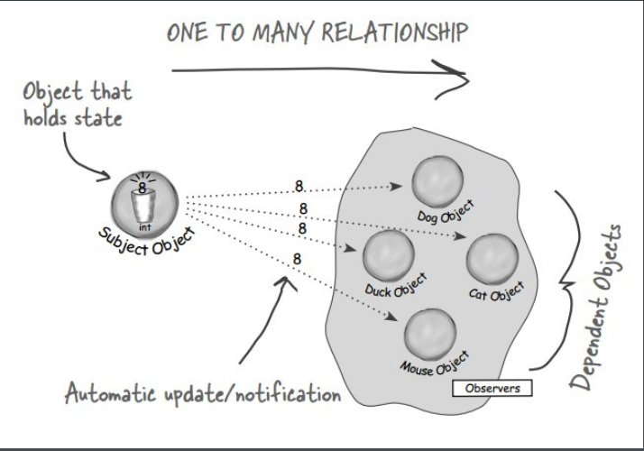
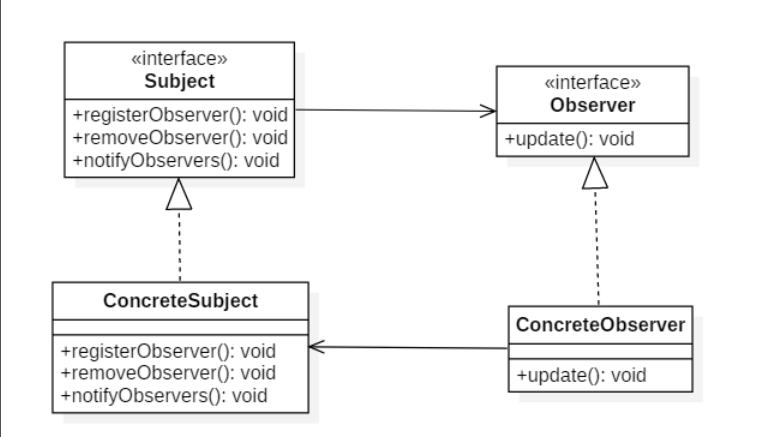
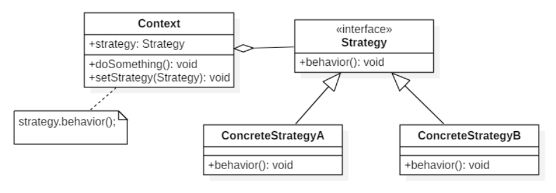
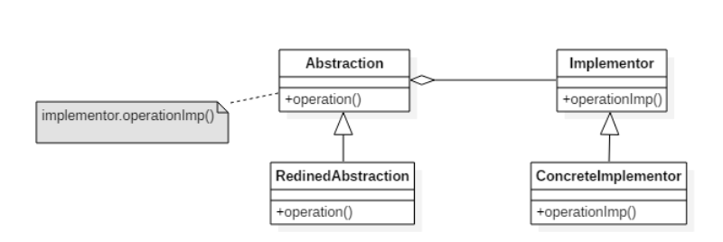
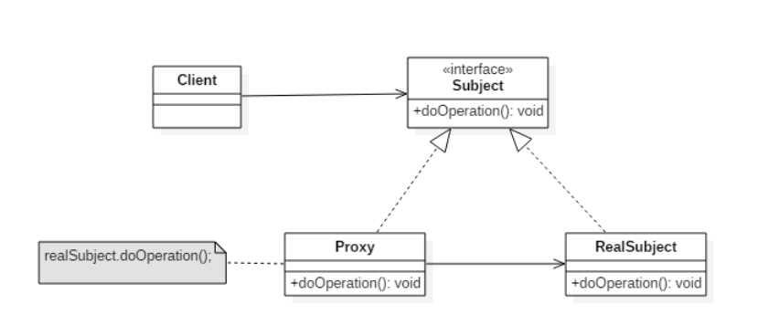
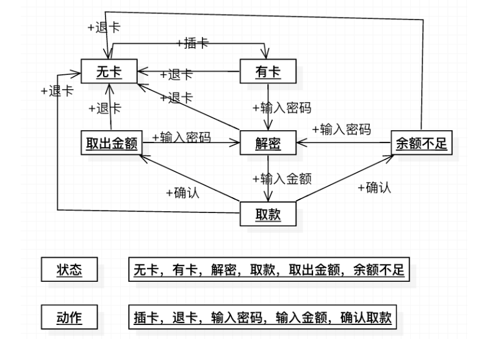

1.请列举出在JDK中几个常用的设计模式/聊聊你熟悉的设计模式？

创建型：

单例模式：

确保一个类只有一个实例，并提供该实例的全局访问点。

使用一个私有构造函数、一个私有静态变量以及一个公有静态函数来实现。

私有构造函数保证了不能通过构造函数来创建对象实例，只能通过公有静态函数返回唯一的私有静态变量。



##### Implementation

###### Ⅰ 懒汉式-线程不安全

以下实现中，私有静态变量 uniqueInstance 被延迟实例化，这样做的好处是，如果没有用到该类，那么就不会实例化 uniqueInstance，从而节约资源。

这个实现在多线程环境下是不安全的，如果多个线程能够同时进入 `if (uniqueInstance == null)` ，并且此时 uniqueInstance 为 null，那么会有多个线程执行 `uniqueInstance = new Singleton();` 语句，这将导致实例化多次 uniqueInstance。

```java
public class Singleton {

    private static Singleton uniqueInstance;

    private Singleton() {
    }

    public static Singleton getUniqueInstance() {
        if (uniqueInstance == null) {
            uniqueInstance = new Singleton();
        }
        return uniqueInstance;
    }
}
```

###### Ⅱ 饿汉式-线程安全

线程不安全问题主要是由于 uniqueInstance 被实例化多次，采取直接实例化 uniqueInstance 的方式就不会产生线程不安全问题。利用了class加载阶段线程安全的特性。

但是直接实例化的方式也丢失了延迟实例化带来的节约资源的好处。

```java
private static Singleton uniqueInstance = new Singleton();
```

###### Ⅲ 懒汉式-线程安全

只需要对 getUniqueInstance() 方法加锁，那么在一个时间点只能有一个线程能够进入该方法，从而避免了实例化多次 uniqueInstance。

但是当一个线程进入该方法之后，其它试图进入该方法的线程都必须等待，即使 uniqueInstance 已经被实例化了。这会让线程阻塞时间过长，因此该方法有性能问题，不推荐使用。

```java
public static synchronized Singleton getUniqueInstance() {
    if (uniqueInstance == null) {
        uniqueInstance = new Singleton();
    }
    return uniqueInstance;
}
```

###### Ⅳ 双重校验锁-线程安全

uniqueInstance 只需要被实例化一次，之后就可以直接使用了。加锁操作只需要对实例化那部分的代码进行，只有当 uniqueInstance 没有被实例化时，才需要进行加锁。

双重校验锁先判断 uniqueInstance 是否已经被实例化，如果没有被实例化，那么才对实例化语句进行加锁。

```java
public class Singleton {

    private volatile static Singleton uniqueInstance;

    private Singleton() {
    }

    public static Singleton getUniqueInstance() {
        if (uniqueInstance == null) {
            synchronized (Singleton.class) {
                if (uniqueInstance == null) {
                    uniqueInstance = new Singleton();
                }
            }
        }
        return uniqueInstance;
    }
}
```

考虑下面的实现，也就是只使用了一个 if 语句。在 uniqueInstance == null 的情况下，如果两个线程都执行了 if 语句，那么两个线程都会进入 if 语句块内。虽然在 if 语句块内有加锁操作，但是两个线程都会执行 `uniqueInstance = new Singleton();` 这条语句，只是先后的问题，那么就会进行两次实例化。因此必须使用双重校验锁，也就是需要使用两个 if 语句。

```java
if (uniqueInstance == null) {
    synchronized (Singleton.class) {
        uniqueInstance = new Singleton();
    }
}
```

uniqueInstance 采用 volatile 关键字修饰也是很有必要的， `uniqueInstance = new Singleton();` 这段代码其实是分为三步执行：

1. 为 uniqueInstance 分配内存空间
2. 初始化 uniqueInstance
3. 将 uniqueInstance 指向分配的内存地址

但是由于 JVM 具有指令重排的特性，执行顺序有可能变成 1>3>2。指令重排在单线程环境下不会出现问题，但是在多线程环境下会导致一个线程获得还没有初始化的实例。例如，线程 T<sub>1</sub> 执行了 1 和 3，此时 T<sub>2</sub> 调用 getUniqueInstance() 后发现 uniqueInstance 不为空，因此返回 uniqueInstance，但此时 uniqueInstance 还未被初始化。

使用 volatile 可以禁止 JVM 的指令重排，保证在多线程环境下也能正常运行。

###### Ⅴ 静态内部类实现

当 Singleton 类加载时，静态内部类 SingletonHolder 没有被加载进内存。只有当调用 `getUniqueInstance()` 方法从而触发 `SingletonHolder.INSTANCE` 时 SingletonHolder 才会被加载，此时初始化 INSTANCE 实例，并且 JVM 能确保 INSTANCE 只被实例化一次。

这种方式不仅具有延迟初始化的好处，而且由 JVM 提供了对线程安全的支持。

```java
public class Singleton {

    private Singleton() {
    }

    private static class SingletonHolder {
        private static final Singleton INSTANCE = new Singleton();
    }

    public static Singleton getUniqueInstance() {
        return SingletonHolder.INSTANCE;
    }
}
```

###### Ⅵ 枚举实现

```java
public enum Singleton {

    INSTANCE;

    private String objName;


    public String getObjName() {
        return objName;
    }


    public void setObjName(String objName) {
        this.objName = objName;
    }


    public static void main(String[] args) {

        // 单例测试
        Singleton firstSingleton = Singleton.INSTANCE;
        firstSingleton.setObjName("firstName");
        System.out.println(firstSingleton.getObjName());
        Singleton secondSingleton = Singleton.INSTANCE;
        secondSingleton.setObjName("secondName");
        System.out.println(firstSingleton.getObjName());
        System.out.println(secondSingleton.getObjName());

        // 反射获取实例测试
        try {
            Singleton[] enumConstants = Singleton.class.getEnumConstants();
            for (Singleton enumConstant : enumConstants) {
                System.out.println(enumConstant.getObjName());
            }
        } catch (Exception e) {
            e.printStackTrace();
        }
    }
}
```

```html
firstName
secondName
secondName
secondName
```

该实现在多次序列化再进行反序列化之后，不会得到多个实例。而其它实现需要使用 transient 修饰所有字段，并且实现序列化和反序列化的方法。

该实现可以防止反射攻击。在其它实现中，通过 setAccessible() 方法可以将私有构造函数的访问级别设置为 public，然后调用构造函数从而实例化对象，如果要防止这种攻击，需要在构造函数中添加防止多次实例化的代码。该实现是由 JVM 保证只会实例化一次，因此不会出现上述的反射攻击。


简单工厂：

在创建一个对象时不向客户暴露内部细节，并提供一个创建对象的通用接口。

简单工厂把实例化的操作单独放到一个类中，这个类就成为简单工厂类，让简单工厂类来决定应该用哪个具体子类来实例化。

这样做能把客户类和具体子类的实现解耦，客户类不再需要知道有哪些子类以及应当实例化哪个子类。客户类往往有多个，如果不使用简单工厂，那么所有的客户类都要知道所有子类的细节。而且一旦子类发生改变，例如增加子类，那么所有的客户类都要进行修改。

通俗理解：一个工厂根据用户需求造全部产品，相当于一个产品一个流水线，有心需求就加新的流水线，且需要修改原来的代码。但是客户不需要知道。

工厂方法：

定义了一个创建对象的接口，但由子类决定要实例化哪个类。工厂方法把实例化操作推迟到子类。

在简单工厂中，创建对象的是另一个类，而在工厂方法中，是由子类来创建对象。

下图中，Factory 有一个 doSomething() 方法，这个方法需要用到一个产品对象，这个产品对象由 factoryMethod() 方法创建。该方法是抽象的，需要由子类去实现。



通俗理解：一个产品对应一个子工厂。有新的需求就再造一个子工厂（继承最终那个工厂）。不需要修改原来的代码，直接继承factory类，在实现一个工厂即可。让子工厂来生产产品。

##### JDK

- [java.util.Calendar](http://docs.oracle.com/javase/8/docs/api/java/util/Calendar.html#getInstance--)
- [java.util.ResourceBundle](http://docs.oracle.com/javase/8/docs/api/java/util/ResourceBundle.html#getBundle-java.lang.String-)
- [java.text.NumberFormat](http://docs.oracle.com/javase/8/docs/api/java/text/NumberFormat.html#getInstance--)
- [java.nio.charset.Charset](http://docs.oracle.com/javase/8/docs/api/java/nio/charset/Charset.html#forName-java.lang.String-)
- [java.net.URLStreamHandlerFactory](http://docs.oracle.com/javase/8/docs/api/java/net/URLStreamHandlerFactory.html#createURLStreamHandler-java.lang.String-)
- [java.util.EnumSet](https://docs.oracle.com/javase/8/docs/api/java/util/EnumSet.html#of-E-)
- [javax.xml.bind.JAXBContext]

抽象工厂：

##### Intent

提供一个接口，用于创建  **相关的对象家族** 。

##### Class Diagram

抽象工厂模式创建的是对象家族，也就是很多对象而不是一个对象，并且这些对象是相关的，也就是说必须一起创建出来。而工厂方法模式只是用于创建一个对象，这和抽象工厂模式有很大不同。

抽象工厂模式用到了工厂方法模式来创建单一对象，AbstractFactory 中的 createProductA() 和 createProductB() 方法都是让子类来实现，这两个方法单独来看就是在创建一个对象，这符合工厂方法模式的定义。

至于创建对象的家族这一概念是在 Client 体现，Client 要通过 AbstractFactory 同时调用两个方法来创建出两个对象，在这里这两个对象就有很大的相关性，Client 需要同时创建出这两个对象。

从高层次来看，抽象工厂使用了组合，即 Cilent 组合了 AbstractFactory，而工厂方法模式使用了继承。



个人理解：需要生产一系列相关产品。比如说一个产品有许多零件，这些零件的尺寸必须配套，我们就可以一个工厂生产一套，然后直接组装成成品。那么不同尺寸的产品就必须造一些新的工厂，每个工厂都生产一批相同规格的零件（多个产品的组合或者说对象家族）。在这里具体子工厂继承抽象工厂，并且具体产品由子工厂生产（推迟到子类实现），且不同的需求用不同的工厂。这是工厂方法的思想。

生成器模式：（Builder）

封装一个对象的构造过程，并允许按步骤构造。

比如：1、StringBuilder(); 随着容量的变化，进行对象的构造。

2、我的支付宝的支付模块中，我在构造客户端的过程中。先是new()了一个单纯的空的配置对象，然后一步一步set参数，如果中途有一个参数没有就抛出异常。最后所有参数都具有了再调用一个build()函数。返回一个客户端Client。这种按照步骤构造对象的过程，使用了Builder模式。我觉得使用了Builder模式。


原型模式：

使用原型实例指定要创建对象的过程，通过复制这个原型来创建新对象。

应用1、spring中创建一个Bean,有单例模式和protoType模式。原型模式就是每次获取对象都是 新new()的对象。

应用2、java.lang.Object#clone() 其实就是使用当前的参数去new 一个新的实例。


行为型：

责任链模式：

使多个对象都有机会处理请求，从而避免请求的发送者和接收者之间的耦合关系。将这些对象连成一条链，并沿着这条链发送该请求，直到有一个对象处理它为止。

应用1、javax.servlet.Filter#doFilter()。拦截器，过滤器

应用2、java.util.logging.Logger#log()。一般的日志框架，比如我们一般使用的日志有（5个或6个当然其他的不用）级别。不同的拦截器拦截对应的日志并进行处理。（ERROR、WARN、INFO、DEBUG、TRACE）

迭代器模式：

提供一种顺序访问聚合对象元素的方法，并且不暴露聚合对象的内部表示。

java.util.Iterator。

 观察者模式：

##### Intent

定义对象之间的一对多依赖，当一个对象状态改变时，它的所有依赖都会收到通知并且自动更新状态。

主题（Subject）是被观察的对象，而其所有依赖者（Observer）称为观察者。



##### Class Diagram

主题（Subject）具有注册和移除观察者、并通知所有观察者的功能，主题是通过维护一张观察者列表来实现这些操作的。

观察者（Observer）的注册功能需要调用主题的 registerObserver() 方法。



##### Implementation

天气数据布告板会在天气信息发生改变时更新其内容，布告板有多个，并且在将来会继续增加。

一般的事件监听器应该可以这么实现。

##### 但是这个发布订阅模式又有所区别？

在翻阅资料的时候，有人把观察者（Observer）模式等同于发布（Publish）/订阅（Subscribe）模式，也有人认为这两种模式还是存在差异，而我认为确实是存在差异的，本质上的区别是调度的地方不同。

**观察者模式**

比较概念的解释是，目标和观察者是基类，目标提供维护观察者的一系列方法，观察者提供更新接口。具体观察者和具体目标继承各自的基类，然后具体观察者把自己注册到具体目标里，在具体目标发生变化时候，调度观察者的更新方法。

比如有个“天气中心”的具体目标A，专门监听天气变化，而有个显示天气的界面的观察者B，B就把自己注册到A里，当A触发天气变化，就调度B的更新方法，并带上自己的上下文。


发布/订阅模式**

比较概念的解释是，订阅者把自己想订阅的事件注册到调度中心，当该事件触发时候，发布者发布该事件到调度中心（顺带上下文），由调度中心统一调度订阅者注册到调度中心的处理代码。

比如有个界面是实时显示天气，它就订阅天气事件（注册到调度中心，包括处理程序），当天气变化时（定时获取数据），就作为发布者发布天气信息到调度中心，调度中心就调度订阅者的天气处理程序。


**总结**

1. 从两张图片可以看到，最大的区别是调度的地方。

虽然两种模式都存在订阅者和发布者（具体观察者可认为是订阅者、具体目标可认为是发布者），但是观察者模式是由具体目标调度的，而发布/订阅模式是统一由调度中心调的，所以观察者模式的订阅者与发布者之间是存在依赖的，而发布/订阅模式则不会。

2. 两种模式都可以用于松散耦合，改进代码管理和潜在的复用

   

中介者模式：

集中相关对象之间复杂的沟通和控制方式。

- Mediator：中介者，定义一个接口用于与各同事（Colleague）对象通信。

- Colleague：同事，相关对

  使用、java.util.concurrent.Executor#execute()。这个框架，多个线程和多个任务之间没有具体的关系。由线程池统一管理调度。不然的话，就需要每个任务创建一个线程，这样就非常复杂。现在线程池就是一个中介。就像工作介绍中心。

状态模式：

 主要就是状态模式（或者状态机）：

​	定义：允许对象在内部状态改变时改变它的行为，对象看起来好像修改了它所属的类。其实就是不同的状态实现类有不同的一套方法，然后状态机对象调用方法的过程中会修改对象的状态。那么下次再调用同样的方法就会得到不同的结果，因为状态对象不同，状态机调用方法的过程中，把state引用指向了不同的状态实例，（状态转移）。

策略模式：

定义一系列算法，封装每个算法，并使它们可以互换。

策略模式可以让算法独立于使用它的客户端。

- Strategy 接口定义了一个算法族，它们都实现了  behavior() 方法。
- Context 是使用到该算法族的类，其中的 doSomething() 方法会调用 behavior()，setStrategy(Strategy) 方法可以动态地改变 strategy 对象，也就是说能动态地改变 Context 所使用的算法。



##### 与状态模式的比较

状态模式的类图和策略模式类似，并且都是能够动态改变对象的行为。但是状态模式是通过状态转移来改变 Context 所组合的 State 对象，而策略模式是通过 Context 本身的决策来改变组合的 Strategy 对象。所谓的状态转移，是指 Context 在运行过程中由于一些条件发生改变而使得 State 对象发生改变，注意必须要是在运行过程中。

状态模式主要是用来解决状态转移的问题，当状态发生转移了，那么 Context 对象就会改变它的行为；而策略模式主要是用来封装一组可以互相替代的算法族，并且可以根据需要动态地去替换 Context 使用的算法。

其实通俗的讲就是，一个方法需要的参数都是同一个接口的实现类，可以通过重写这个接口的某个方法进行特定的操作。使用的时候根据参数传入的不同的具体实现类的实例来调用它实现的方法，从而达到不同的算法的互换，最直接的例子就是要的参数的Human接口的实现类。里面有一个say()（”human say()“）。你可以传入Man或者Women的实例，调用实例的say(),得到的就是各自的("man say()" 或者（”women say()“）)。

####  模板方法（Template Method）

定义算法框架，并将一些步骤的实现延迟到子类。

通过模板方法，子类可以重新定义算法的某些步骤，而不用改变算法的结构。

冲咖啡和冲茶都有类似的流程，但是某些步骤会有点不一样，要求复用那些相同步骤的代码。

其实就是把共有部分卸载框架里实现，不是共有的部分留给子类实现，（抽象方法重写）。从而达到不用改变算法框架的目的。

使用1、java.util.Collections#sort(): 根据传入参数的不同执行不同的对象的排序。一般基本类型不传比较器，但是自定义的类型，一般就需要继承Comparable接口并重写compare()方法或者传入一个Comparator比较器并重写compare()。

```java
assert lo < hi;
int runHi = lo + 1;
if (runHi == hi)
    return 1;

// Find end of run, and reverse range if descending
if (c.compare(a[runHi++], a[lo]) < 0) { // Descending 小于0就交换。只不过o1表示后面的数，o2表示前面的数。所以刚好反过来。return o1-o2; 上升（默认）；return o2 - o1;下降。
    while (runHi < hi && c.compare(a[runHi], a[runHi - 1]) < 0)
        runHi++;
    reverseRange(a, lo, runHi);
} else {                              // Ascending
    while (runHi < hi && c.compare(a[runHi], a[runHi - 1]) >= 0)
        runHi++;
}

return runHi - lo;
```

使用2、许多框架，比如spring中，很多组件都保持这种形式。很多功能让子类去实现。比如Bean实例化的各种后置处理起。

结构型：

适配器模式：

#### 1. 适配器（Adapter）

##### Intent

把一个类接口转换成另一个用户需要的接口。

鸭子（Duck）和火鸡（Turkey）拥有不同的叫声，Duck 的叫声调用 quack() 方法，而 Turkey 调用 gobble() 方法。

要求将 Turkey 的 gobble() 方法适配成 Duck 的 quack() 方法，从而让火鸡冒充鸭子！

用一个适配器 实现需要的接口，并且再构造函数中传输要被转化的接口的实现类对象。然后再目标方法中调用该对象的方法。

Spring AOP 的增强或通知(Advice)使用到了适配器模式。

桥接模式：

将抽象与实现分离开来，使它们可以独立变化。

##### Class Diagram

- Abstraction：定义抽象类的接口
- Implementor：定义实现类接口
- 

##### Implementation

RemoteControl 表示遥控器，指代 Abstraction。

TV 表示电视，指代 Implementor。

桥接模式将遥控器和电视分离开来，从而可以独立改变遥控器或者电视的实现。

只要接口固定。实现随意。面向接口编程。调用都是传入的接口的实现类对象。然后对象调用实现的接口方法。

组合模式：


装饰模式：

为对象动态添加功能。

##### Class Diagram

装饰者（Decorator）和具体组件（ConcreteComponent）都继承自组件（Component），具体组件的方法实现不需要依赖于其它对象，而装饰者组合了一个组件，这样它可以装饰其它装饰者或者具体组件。所谓装饰，就是把这个装饰者套在被装饰者之上，从而动态扩展被装饰者的功能。装饰者的方法有一部分是自己的，这属于它的功能，然后调用被装饰者的方法实现，从而也保留了被装饰者的功能。可以看到，具体组件应当是装饰层次的最低层，因为只有具体组件的方法实现不需要依赖于其它对象。

##### JDK

- java.io.BufferedInputStream(InputStream)
- java.io.DataInputStream(InputStream)
- java.io.BufferedOutputStream(OutputStream)
- java.util.zip.ZipOutputStream(OutputStream)
- java.util.Collections#checked[List|Map|Set|SortedSet|SortedMap](

外观模式：

​	提供一个统一的接口，用来访问子系统中的一群接口，从而让子系统更容易使用。

​	设计原则：（迪米特原则）最少知识原则，只和你的密友谈话，也就是说客户对象需要交互的对象应该尽可能少。

​	实际项目中，都是这样，比如我们的精确定位模块，只提供一个统一的接口给外部调用，里面整个子系统的内容都对外	不可见。

享元模式：

代理模式：

控制对其它对象的访问。

##### Class Diagram

代理有以下四类：

- 远程代理（Remote Proxy）：控制对远程对象（不同地址空间）的访问，它负责将请求及其参数进行编码，并向不同地址空间中的对象发送已经编码的请求。
- 虚拟代理（Virtual Proxy）：根据需要创建开销很大的对象，它可以缓存实体的附加信息，以便延迟对它的访问，例如在网站加载一个很大图片时，不能马上完成，可以用虚拟代理缓存图片的大小信息，然后生成一张临时图片代替原始图片。
- 保护代理（Protection Proxy）：按权限控制对象的访问，它负责检查调用者是否具有实现一个请求所必须的访问权限。
- 智能代理（Smart Reference）：取代了简单的指针，它在访问对象时执行一些附加操作：记录对象的引用次数；当第一次引用一个对象时，将它装入内存；在访问一个实际对象前，检查是否已经锁定了它，以确保其它对象不能改变它。
- 

java.lang.reflect.Proxy；

什么是正向代理和反向代理？

1.请列举出在JDK中几个常用的设计模式？

单例模式（Singleton pattern）用于Runtime，Calendar和其他的一些类中。工厂模式（Factory pattern）被用于各种不可变的类如 Boolean，像Boolean.valueOf，观察者模式（Observer pattern）被用于 Swing 和很多的事件监听中。装饰器设计模式（Decorator design pattern）被用于多个 Java IO 类中。

2.什么是设计模式？你是否在你的代码里面使用过任何设计模式？

 设计模式是解决问题的方案，一种方法论。

比如我的支付宝的支付模块中，我在构造客户端的过程中。先是new()了一个单纯的空的配置对象，然后一步一步set参数，如果中途有一个参数没有就抛出异常。最后所有参数都具有了再调用一个build()函数。返回一个客户端Client。这种按照步骤构造对象的过程，使用了Builder模式。使用了Builder模式。

单例，比如spring里面的bean由单列和原型模式。spring算法框架类实例化使用了模板模式。使用线程池，这算是使用中介者模式。但是自己写的话，可能也就野果单例模式把和状态模式（我在显示的时候有三个状态，每个状态根据切换条件的不同，分别执行不同的操作。）？

3.Java中什么叫单例设计模式？请用Java 写出线程安全的单例模式

 单例模式重点在于在整个系统上共享一些创建时较耗资源的对象。整个应用中只维护一个特定类实例，它被所有组件共同使用。`Java.lang.Runtime`是单例模式的经典例子。从 Java 5 开始你可以使用枚举（enum）来实现线程安全的单例。

4.在 Java 中，什么叫观察者设计模式（observerdesign pattern）？

 观察者模式是基于对象的状态变化和观察者的通讯，以便他们作出相应的操作。简单的例子就是一个天气系统，当天气变化时必须在展示给公众的视图中进行反映。这个视图对象是一个主体，而不同的视图是观察者。

5.使用工厂模式最主要的好处是什么？在哪里使用？

 工厂模式的最大好处是增加了创建对象时的封装层次。

如果你使用工厂来创建对象，之后你可以使用更高级和更高性能的实现来替换原始的产品实现或类，这不需要在调用层做任何修改。（解耦）

6.举一个用 Java 实现的装饰模式(decorator design pattern)？它是作用于对象层次还是类层次？

 装饰模式增加强了单个对象的能力。Java IO 到处都使用了装饰模式，典型例子就是 Buffered 系列类如`BufferedReader`和`BufferedWriter`，它们增强了`Reader`和`Writer`对象，以实现提升性能的 Buffer 层次的读取和写入。

7.在 Java 中，为什么不允许从静态方法中访问非静态变量？

 因为静态方法是随着类加载而加载的。从而分配内存，但是非静态成员则是实例化的时候才会分配内存并初始化，然后才能调用。

8.设计一个 ATM 机，请说出

你的设计思路？

 主要就是状态模式（或者状态机）：

​	定义：允许对象在内部状态改变时改变它的行为，对象看起来好像修改了它所属的类。其实就是不同的状态实现类有不同的一套方法，然后状态机对象调用方法的过程中会修改对象的状态。那么下次再调用同样的方法就会得到不同的结果，因为状态对象不同，状态机调用方法的过程中，把state引用指向了不同的状态实例，（状态转移）。

​	首先我们先对ATM机的各种状态，下方就是我们所画出的类“状态图”。每个方框就是一种状态，而我们的ATM机大致分为无卡，有卡，解密，取款，取出金额，余额不足这六种状态，也就是下方“状态图”中方框中的内容。然后就是动作了，每种状态间的转化我们需要动作才可以完成。在我们的ATM机中大致分为插卡，退卡，输入密码，输入金额，确认取款这几种动作。状态间转换时所需的动作关系如下所示。



​		这种情况下，只有一个ATM机，一个状态变量来记录不同的状态，每个ATM机的操作都是通过状态这个对象来实际操作的，其实就是6个状态都有一太固定的动作，比如，无卡这个状态，他只有插入卡这么一个动作，插入卡之后呢，这个状态就变了。变成了有卡。这个时候只有输入密码和退卡操作。每个操作都会伴随着状态的改变而改变。

我们换一种思路，就是将状态含有动作。也就是说一种状态下有各种操作，而不是上面的一种动作中有各种状态。（这种才是面向对象的思想。）要想实现“状态包含个个动作”的最好的方式就是为每个状态声明一个类，然后在类中实现该状态下的不同的操作。

9.在 Java 中，什么时候用重载，什么时候用重写？

 重载是多态的集中体现，在类中，要以统一的方式处理不同类型数据的时候，可以用重载。

重写的使用是建立在继承关系上的，子类在继承父类的基础上，增加新的功能，可以用重写。

10.举例说明什么情况下会更倾向于使用抽象类而不是接口？ v 

抽象类的应用常见设计模式（模板模式），接口的应用常见设计模式（工厂模式、代理模式）。